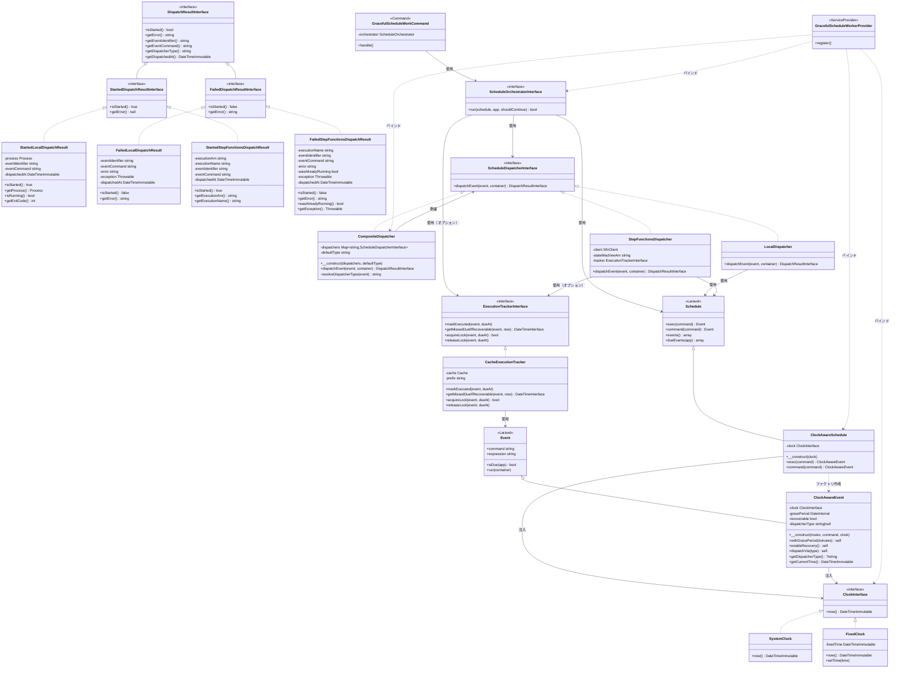
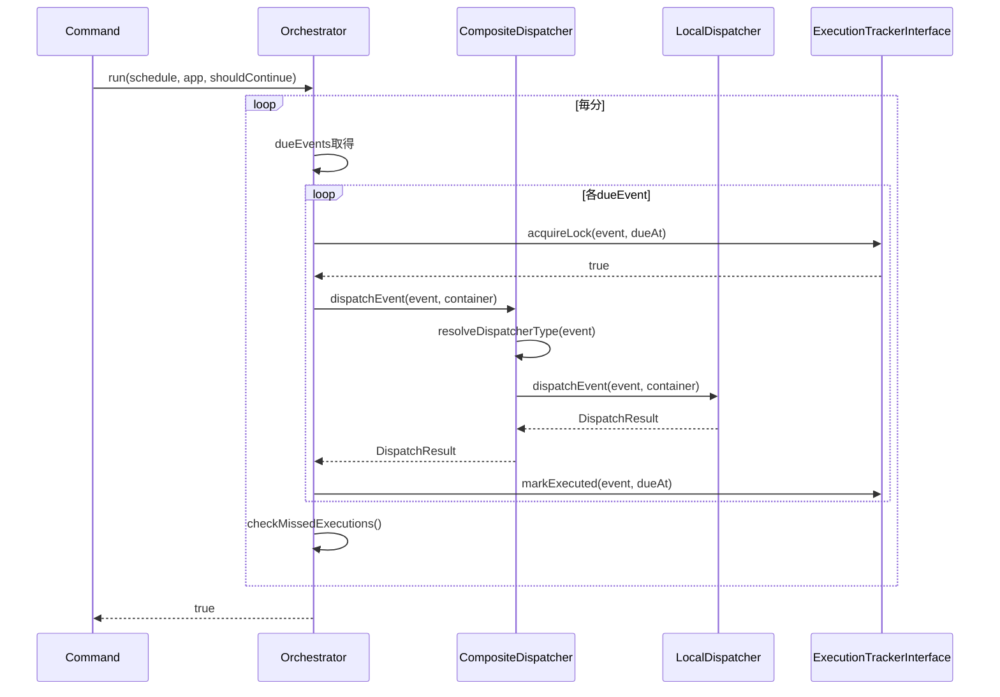
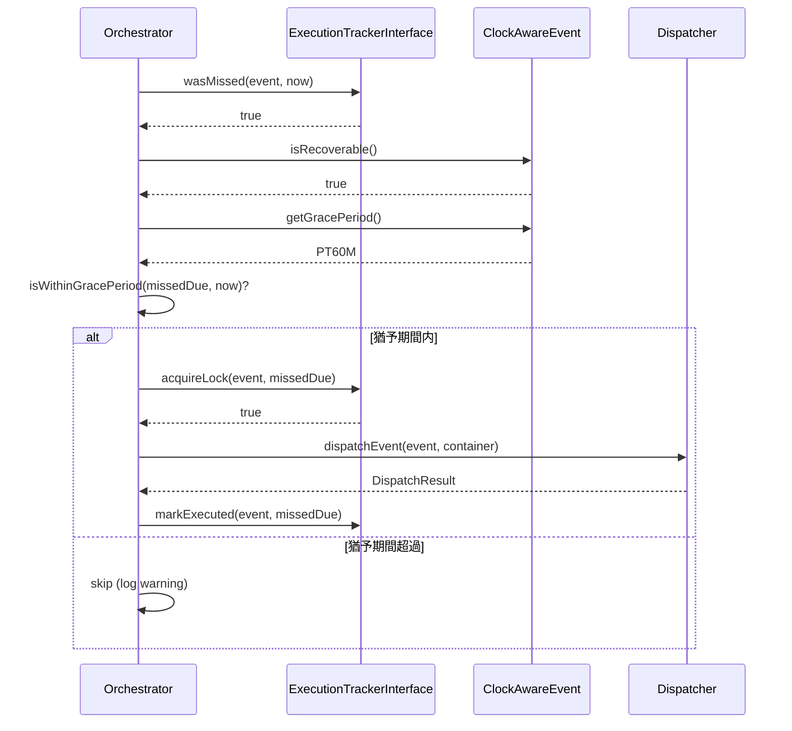
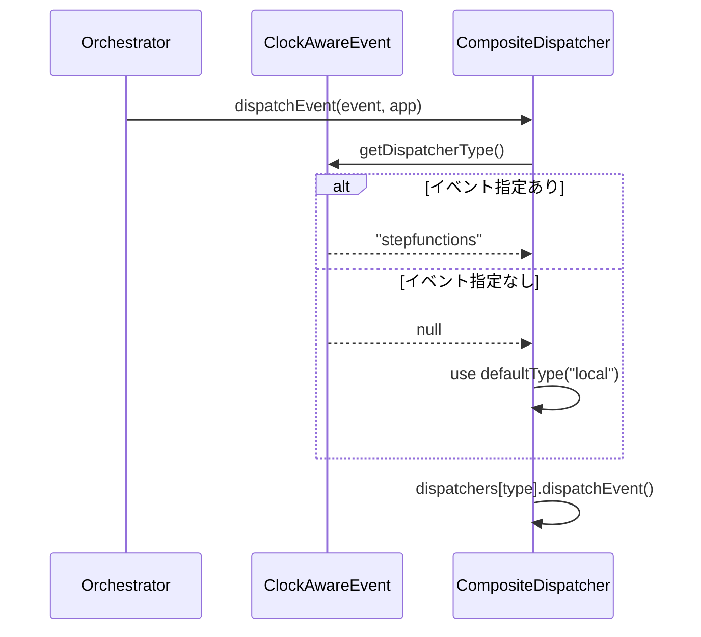

# Laravel Graceful Schedule Worker - 設計仕様書

> **Note**: アーキテクチャ設計は [ARCHITECTURE.md](./ARCHITECTURE.md)、
> Step Functions の実装詳細は [STEPFUNCTIONS_IMPLEMENTATION.md](./STEPFUNCTIONS_IMPLEMENTATION.md) を参照

## 目次

1. [概要とスコープ](#概要とスコープ)
2. [用語集](#用語集)
3. [機能要件](#機能要件)
4. [アーキテクチャ概要](#アーキテクチャ概要)
   - [オブジェクト関係図](#オブジェクト関係図)
   - [シーケンス図](#シーケンス図)
   - [レイヤー構成](#レイヤー構成)
5. [インターフェース仕様](#インターフェース仕様)
6. [TDD用テスト一覧](#tdd用テスト一覧)
7. [実装フェーズ](#実装フェーズ)
8. [設定ファイル](#設定ファイル)
9. [利用例](#利用例)

---

## 概要とスコープ

### プロジェクトの目的

**Laravel Graceful Schedule Worker** は、Laravelのスケジュールタスクを安全かつ信頼性高く実行するためのパッケージです。Dispatcherパターンにより、スケジュールイベントの `command` をバックグラウンドプロセス（LocalDispatcher）またはAWS Step Functions（StepFunctionsDispatcher）で実行し、グレースフルシャットダウンやシグナルハンドリングを可能にすることで、コンテナ環境やクラウドプラットフォームにおける運用の安全性を向上させます。

主な目的は以下の通りです:

1. **グレースフルシャットダウンの実現**: SIGTERM/SIGINTを適切にハンドリングし、実行中のタスクを正常終了させる
2. **柔軟な実行基盤の提供**: ローカルプロセス実行からAWS Step Functionsまで、環境に応じた実行方法を選択可能にする
3. **At-least-onceセマンティックのサポート**: タスクの取りこぼしを検出し、リカバリする仕組みを提供する
4. **テスト容易性の向上**: Clock抽象化により時刻依存のテストを決定論的に実行可能にする

### スコープ

#### 含まれる機能

- **グレースフルシャットダウン機能**: シグナル受信時に実行中のタスクを正常終了させる
- **Clock抽象化**: 時刻依存を外部化し、テスト時に時刻を固定できる機構
- **Dispatcherパターン**: ローカルプロセス実行とAWS Step Functions実行の切り替え機能
- **ExecutionTracker**: タスク実行履歴の追跡と取りこぼし検出機能
- **Grace Period制御**: タスクごとのリカバリ猶予期間設定機能
- **設定ファイルによる動作制御**: 環境変数や設定ファイルによる柔軟な動作設定

#### 含まれない機能

- **タスクのスケジューリング機能自体**: Laravelの標準`Schedule`/`Event`クラスをそのまま利用します
- **分散ロック機構**: Laravelの`withoutOverlapping()`を推奨します
- **タスクの優先度制御**: 実行順序はLaravelのスケジュール定義に従います
- **リアルタイムモニタリング**: ログ出力のみを提供し、専用の監視UIは提供しません
- **タスクリトライ機能**: アプリケーション側でのリトライ実装を推奨します

### このドキュメントについて

本ドキュメントは **設計仕様書** であり、Laravel Graceful Schedule Workerの要件定義とアーキテクチャ設計を記述したものです。実装の詳細なガイドではなく、以下の目的で作成されています:

- **要件の明確化**: プロジェクトが解決すべき課題と提供すべき機能を定義する
- **アーキテクチャの可視化**: システムの全体構造とコンポーネント間の関係を示す
- **実装の指針**: 開発時の判断基準となる設計思想と原則を提供する
- **TDDの基盤**: テスト駆動開発のためのテスト一覧と検証項目を整理する

実装の詳細については以下のドキュメントを参照してください:

- **[ARCHITECTURE.md](./ARCHITECTURE.md)**: アーキテクチャの詳細設計
- **[STEPFUNCTIONS_IMPLEMENTATION.md](./STEPFUNCTIONS_IMPLEMENTATION.md)**: Step Functions実装の詳細
- **[IDEMPOTENCY_GUIDE.md](./IDEMPOTENCY_GUIDE.md)**: 冪等性実装のガイドライン

---

## 用語集

このプロジェクトで使用される主要な用語を以下に定義します。

| 用語 | 定義 |
|-----|------|
| **ScheduleOrchestratorInterface** | スケジュール実行の全体調整を行うコンポーネント。Dispatcherの選択、ExecutionTrackerとの連携を担当 |
| **ScheduleDispatcherInterface** | スケジュール実行を抽象化するインターフェース。LocalDispatcherとStepFunctionsDispatcherが実装 |
| **DispatchResultInterface** | Dispatcherの実行結果を型安全に扱うインターフェース。実行状態、メタデータ、エラー情報を提供 |
| **LocalDispatchResult** | LocalDispatcher用の結果クラス。バックグラウンドプロセス（Symfony Process コンポーネント）を保持し、プロセス管理を可能にする |
| **StepFunctionsDispatchResult** | StepFunctionsDispatcher用の結果クラス。ExecutionArnやStateMachineArnを保持 |
| **Dispatcher** | 実行方法（ローカル/Step Functions）を抽象化する総称。ScheduleDispatcherInterfaceはそのインターフェース |
| **CompositeDispatcher** | 複数のDispatcherを保持し、イベントのdispatcherTypeに応じて適切なDispatcherに委譲するコンポーネント |
| **ExecutionTrackerInterface** | 実行履歴の記録・取りこぼし検出・重複防止ロックを担当 |
| **ClockAwareEvent** | Clockを注入可能なLaravel Event拡張。gracePeriod、Dispatcher指定を持つ |
| **gracePeriod** | 取りこぼし時のリカバリ猶予期間。この期間内であれば取りこぼしタスクをリカバリ |
| **dueEvent** | 現在時刻で実行予定のイベント |
| **missedEvent** | 実行予定時刻を過ぎたが未実行のイベント |
| **リカバリ（recovery）** | 取りこぼしたタスクを猶予期間内に実行すること |
| **Fire & Forget** | 実行結果を待たずに次の処理に進むパターン。Step Functions呼び出しで使用 |
| **At-least-once** | 最低1回の実行を保証するセマンティクス。重複実行の可能性あり |

---

## 機能要件

### FR-1: Clock抽象化
- FR-1.1: システム時刻を抽象化し、テスト時に任意の時刻を注入できる
- FR-1.2: ClockAwareScheduleは全てのイベントにClockを注入する

### FR-2: イベント拡張
- FR-2.1: イベント単位でリカバリ有効/無効を設定できる
- FR-2.2: イベント単位で猶予期間(gracePeriod)を設定できる
- FR-2.3: イベント単位で実行方法(local/stepfunctions)を指定できる

### FR-3: 実行方法の切り替え
- FR-3.1: デフォルトの実行方法を設定ファイルで指定できる
- FR-3.2: イベント単位でデフォルトをオーバーライドできる
- FR-3.3: ローカル実行とStep Functions実行を同一スケジュール内で混在できる
- FR-3.4: 同一分内の複数イベントを並行してディスパッチできる（完了を待たずに次のイベントを開始）

### FR-4: 実行履歴トラッキング
- FR-4.1: 各イベントの実行をタイムスタンプと共に記録できる
- FR-4.2: 取りこぼしを検出できる
- FR-4.3: リカバリ有効なイベントは猶予期間内であればリカバリする

### FR-5: 重複実行防止
- FR-5.1: 同一イベント・同一due時刻の重複実行を防止できる
- FR-5.2: ロックはタイムアウト付きで自動解放される

### 機能要件とインターフェースの対応

| 機能要件 | 対応インターフェース/クラス |
|---------|---------------------------|
| FR-1 | ClockInterface, ClockAwareSchedule |
| FR-2 | ClockAwareEvent |
| FR-3 | CompositeDispatcher, ScheduleDispatcherInterface |
| FR-4 | ExecutionTrackerInterface |
| FR-5 | ExecutionTrackerInterface.acquireLock/releaseLock |

---

## アーキテクチャ概要

### オブジェクト関係図

このセクションでは、Laravel Graceful Schedule Worker のアーキテクチャにおけるオブジェクト間の関係を可視化します。

#### クラス図



#### シーケンス図

このセクションでは、Laravel Graceful Schedule Worker の主要な処理フローをシーケンス図で可視化します。

##### 通常実行フロー



##### 取りこぼしリカバリフロー



##### Dispatcher選択フロー



#### レイヤー構成

各レイヤーの責務と含まれるオブジェクトを整理します。

| レイヤー | オブジェクト | 責務 |
|---------|-------------|------|
| **スケジューリング層** | `ClockAwareSchedule`, `ClockAwareEvent` | Laravel の `Schedule` / `Event` を継承し、Clock 注入と Grace Period 管理を提供 |
| **調整層** | `ScheduleOrchestratorInterface` | 毎分のループ制御、イベントごとのDispatcher選択、ExecutionTracker連携(オプション)、取りこぼしチェック・リカバリ |
| **時刻抽象層** | `ClockInterface`, `SystemClock`, `FixedClock` | 時刻取得の抽象化により、テスト時の時刻固定を実現 |
| **ディスパッチ層** | `ScheduleDispatcherInterface`, `LocalDispatcher`, `StepFunctionsDispatcher` | タスク実行方法の抽象化（ローカルプロセス / AWS Step Functions） |
| **トラッキング層** | `ExecutionTrackerInterface`, `CacheExecutionTracker` | 実行履歴の追跡、取りこぼし検出、ロック機構による重複実行防止 |
| **インフラ層** | `GracefulScheduleWorkCommand`, `GracefulScheduleWorkerProvider` | Artisan コマンドと DI コンテナへの登録 |

#### 主要な依存関係

##### 継承関係（extends）

- **`ClockAwareSchedule` extends `Schedule`**
  Laravel の `Schedule` クラスを継承し、`exec()` / `command()` メソッドをオーバーライドすることで、`ClockAwareEvent` を返すように拡張します。これにより、Kernel.php のタイプヒントを変更するだけで拡張機能が利用可能になります。

- **`ClockAwareEvent` extends `Event`**
  Laravel の `Event` クラスを継承し、`ClockInterface` を注入することで、テスト時の時刻固定と Grace Period 管理を実現します。

##### ファクトリパターン

- **`ClockAwareSchedule` → `ClockAwareEvent`**
  `ClockAwareSchedule` の `exec()` / `command()` メソッドは、`ClockAwareEvent` インスタンスを生成して返します。この際、コンストラクタで `ClockInterface` を注入することで、時刻依存を外部化します。

##### 依存性注入（DI）

- **`ClockInterface` → `SystemClock` / `FixedClock`**
  `GracefulScheduleWorkerProvider` で `ClockInterface` をバインドすることで、本番環境では `SystemClock`、テスト環境では `FixedClock` が注入されます。

- **`ScheduleDispatcherInterface` → `LocalDispatcher` / `StepFunctionsDispatcher`**
  設定ファイル（`config/graceful-scheduler.php`）の `dispatch` 設定に応じて、適切な Dispatcher 実装が DI コンテナから解決されます。

- **`ExecutionTrackerInterface` → `CacheExecutionTracker`**
  設定ファイルの `tracker.enabled` が `true` の場合、`StepFunctionsDispatcher` に `CacheExecutionTracker` が注入されます。

##### 制御フロー

1. **Kernel.php** が `ClockAwareSchedule` を使用してスケジュール定義を行う
2. **`GracefulScheduleWorkCommand`** が `ScheduleDispatcherInterface` を使用してタスクを実行
3. **`LocalDispatcher`** はイベントの `command` を `Process::start()` でバックグラウンドプロセスとして起動し、非同期で実行
4. **`StepFunctionsDispatcher`** は AWS Step Functions の `startExecution` API を呼び出し
5. **`ExecutionTrackerInterface`** が実行履歴を記録し、取りこぼしを検出してリカバリ

#### データフロー概要

```
┌─────────────────────────────────────────────────────────────────────┐
│                         Kernel.php                                  │
│  protected function schedule(ClockAwareSchedule $schedule)          │
│  {                                                                  │
│      $schedule->command('report:daily')                             │
│          ->dailyAt('03:00')                                         │
│          ->withGracePeriod(120)                                     │
│          ->dispatchVia('stepfunctions');  // ← Dispatcher指定      │
│  }                                                                  │
└─────────────────────┬───────────────────────────────────────────────┘
                      │
                      │ ClockAwareSchedule は ClockAwareEvent を生成
                      ↓
┌─────────────────────────────────────────────────────────────────────┐
│              GracefulScheduleWorkCommand                            │
│  - ScheduleOrchestratorInterface を注入                             │
│  - ClockAwareSchedule を注入                                        │
└─────────────────────┬───────────────────────────────────────────────┘
                      │
                      │ Orchestrator に処理を委譲
                      ↓
┌─────────────────────────────────────────────────────────────────────┐
│                 ScheduleOrchestratorInterface                       │
│  - CompositeDispatcher を使用                                       │
│  - ExecutionTrackerInterface を使用（オプション）                   │
│  - 毎分のループ制御                                                 │
│  - イベントごとに dispatcher.dispatchEvent() を呼び出し             │
│  - 取りこぼしチェック・リカバリ                                     │
└─────────────────────┬───────────────────────────────────────────────┘
                      │
                      │ CompositeDispatcher がイベントから type を解決
                      ↓
┌─────────────────────────────────────────────────────────────────────┐
│               CompositeDispatcher                                   │
│  - event.getDispatcherType() で type を取得                         │
│  - null の場合は defaultType を使用                                 │
│  - dispatchers[type].dispatchEvent() に委譲                         │
└─────────────────────┬───────────────────────────────────────────────┘
                      │
                      │ 適切な Dispatcher に委譲
                      ↓
        ┌─────────────┴─────────────┐
        │                           │
        ↓                           ↓
┌───────────────┐          ┌──────────────────────┐
│LocalDispatcher│          │StepFunctionsDispatcher│
│               │          │                      │
│ イベントを    │          │ ExecutionTrackerInterface│
│ ローカルで    │          │ ├─ markExecuted()    │
│ 実行          │          │ ├─ wasMissed()       │
│               │          │ └─ acquireLock()     │
│               │          │ （オプション）       │
└───────────────┘          └──────────┬───────────┘
                                      │
                                      │ SfnClient::startExecution()
                                      ↓
                           ┌─────────────────────┐
                           │ AWS Step Functions  │
                           │ - State Machine     │
                           │ - Execute Command   │
                           └─────────────────────┘
```

**重要なポイント**:

1. **型安全性**: `Kernel.php` のタイプヒントを `ClockAwareSchedule` にすることで、IDE 補完と静的解析が効く
2. **テスタビリティ**: `ClockInterface` により時刻を固定でき、決定論的なテストが可能
3. **拡張性**: Dispatcher パターンにより、新しい実行方法（例: Kubernetes Job）を簡単に追加可能
4. **信頼性**: ExecutionTracker により At-least-once セマンティックを実現し、取りこぼしを防止

---

## インターフェース仕様

### ClockInterface

時刻を抽出するインターフェースです。テスト時に時刻を固定できます。

```php
<?php

namespace RakkoInc\LaravelGracefulScheduleWorker\Clock;

interface ClockInterface
{
    /**
     * 現在時刻を取得する
     *
     * @return \DateTimeImmutable 現在時刻
     */
    public function now(): \DateTimeImmutable;
}
```

**実装例**:

- `SystemClock`: 本番環境で使用（実際の現在時刻を返す）
- `FixedClock`: テスト環境で使用（固定時刻を返す）

### ClockAwareEvent

拡張メソッドを提供する Event クラスです。

```php
<?php

namespace RakkoInc\LaravelGracefulScheduleWorker\Scheduling;

use Illuminate\Console\Scheduling\Event;

class ClockAwareEvent extends Event
{
    /** @var ClockInterface */
    protected $clock;

    /** @var \DateInterval|null */
    protected $gracePeriod = null;

    /** @var bool */
    protected $recoverable = false;  // デフォルトはリカバリしない（安全性優先）

    /** @var string|null */
    protected $dispatcherType = null;  // 'local' | 'stepfunctions' | null（デフォルト使用）

    /**
     * コンストラクタ
     *
     * @param \Illuminate\Console\Scheduling\Mutex $mutex
     * @param string $command
     * @param ClockInterface $clock
     * @param \DateTimeZone|string|null $timezone
     */
    public function __construct($mutex, $command, ClockInterface $clock, $timezone = null)
    {
        parent::__construct($mutex, $command, $timezone);
        $this->clock = $clock;
    }

    /**
     * リカバリを有効化（猶予期間を設定）
     *
     * @param int|null $minutes 猶予期間（分）。nullの場合は無制限
     * @return $this
     */
    public function withGracePeriod(?int $minutes = null): self
    {
        $this->recoverable = true;

        if ($minutes !== null && $minutes > 0) {
            $this->gracePeriod = new \DateInterval("PT{$minutes}M");
        } else {
            $this->gracePeriod = null;  // 無制限
        }

        return $this;
    }

    /**
     * リカバリを有効化（猶予期間なし）
     *
     * @return $this
     */
    public function enableRecovery(): self
    {
        $this->recoverable = true;
        $this->gracePeriod = null;  // 無制限
        return $this;
    }

    /**
     * 現在時刻を取得
     *
     * @return \DateTimeImmutable
     */
    public function getCurrentTime(): \DateTimeImmutable
    {
        return $this->clock->now();
    }

    /**
     * Dispatcher タイプを指定
     *
     * @param string $type 'local' または 'stepfunctions'
     * @return $this
     */
    public function dispatchVia(string $type): self
    {
        $this->dispatcherType = $type;
        return $this;
    }

    /**
     * 指定されたDispatcherタイプを取得
     *
     * @return string|null Dispatcherタイプ（未指定の場合はnull）
     */
    public function getDispatcherType()
    {
        return $this->dispatcherType;
    }
}
```

### ScheduleOrchestratorInterface

スケジュール実行の全体調整を行うインターフェースです。

```php
<?php

namespace RakkoInc\LaravelGracefulScheduleWorker\Orchestrator;

use Illuminate\Console\Scheduling\Schedule;
use Illuminate\Foundation\Application;

interface ScheduleOrchestratorInterface
{
    /**
     * スケジュールされたタスクを調整・実行する
     *
     * @param Schedule $schedule Laravel のスケジュールオブジェクト
     * @param Application $app Laravel アプリケーションインスタンス
     * @param callable $shouldContinue 実行継続の判定関数
     * @return bool 実行が成功したかどうか
     */
    public function run(Schedule $schedule, Application $app, callable $shouldContinue): bool;
}
```

### CompositeDispatcher

複数のDispatcherを保持し、イベントのdispatcherTypeに応じて適切なDispatcherに委譲するクラスです。

```php
<?php

namespace RakkoInc\LaravelGracefulScheduleWorker\Dispatcher;

use Illuminate\Console\Scheduling\Event;
use Illuminate\Container\Container;
use RakkoInc\LaravelGracefulScheduleWorker\Scheduling\ClockAwareEvent;

/**
 * 複数のDispatcherを保持し、event.typeに応じて委譲する
 */
class CompositeDispatcher implements ScheduleDispatcherInterface
{
    /** @var array<string, ScheduleDispatcherInterface> */
    private $dispatchers;

    /** @var string DIで注入（config参照はServiceProviderのみ） */
    private $defaultType;

    /**
     * @param array<string, ScheduleDispatcherInterface> $dispatchers
     * @param string $defaultType
     * @throws \InvalidArgumentException dispatchers が空または defaultType が登録されていない場合
     */
    public function __construct(array $dispatchers, string $defaultType)
    {
        if (empty($dispatchers)) {
            throw new \InvalidArgumentException('At least one dispatcher must be provided');
        }

        if (!isset($dispatchers[$defaultType])) {
            throw new \InvalidArgumentException(
                sprintf(
                    'Default dispatcher type "%s" is not registered. Available types: %s',
                    $defaultType,
                    implode(', ', array_keys($dispatchers))
                )
            );
        }

        $this->dispatchers = $dispatchers;
        $this->defaultType = $defaultType;
    }

    /**
     * 単一イベントをディスパッチする
     *
     * @param Event $event 実行するスケジュールイベント
     * @param Container $container Laravel コンテナインスタンス
     * @return DispatchResultInterface ディスパッチ結果
     */
    public function dispatchEvent(Event $event, Container $container): DispatchResultInterface
    {
        $type = $this->resolveDispatcherType($event);

        if (!isset($this->dispatchers[$type])) {
            throw new \InvalidArgumentException("Unknown dispatcher type: {$type}");
        }

        return $this->dispatchers[$type]->dispatchEvent($event, $container);
    }

    /**
     * イベントから使用するDispatcherタイプを解決する
     *
     * @param Event $event
     * @return string
     */
    private function resolveDispatcherType(Event $event): string
    {
        if ($event instanceof ClockAwareEvent && $event->getDispatcherType() !== null) {
            return $event->getDispatcherType();
        }
        return $this->defaultType;
    }
}
```

**ServiceProvider での DI**:

```php
$this->app->singleton(ScheduleDispatcherInterface::class, function ($app) {
    return new CompositeDispatcher(
        [
            'local' => $app->make(LocalDispatcher::class),
            'stepfunctions' => $app->make(StepFunctionsDispatcher::class),
        ],
        config('graceful-scheduler.dispatch', 'local')  // ここだけconfig参照
    );
});
```

### DispatchResultInterface

Dispatcher の結果を型安全に扱うためのインターフェースです。共通メタデータを定義し、各 Dispatcher 固有の情報は具象クラスで保持します。

```php
<?php

namespace RakkoInc\LaravelGracefulScheduleWorker\Dispatcher;

interface DispatchResultInterface
{
    /**
     * ディスパッチが開始されたかどうか
     *
     * @return bool 開始された場合は true
     */
    public function isStarted(): bool;

    /**
     * エラーメッセージを取得
     *
     * @return string|null エラーメッセージ（成功時は null）
     */
    public function getError();

    /**
     * イベントの識別子を取得（mutex name）
     *
     * @return string イベント識別子
     */
    public function getEventIdentifier(): string;

    /**
     * 実行コマンドを取得
     *
     * @return string 実行コマンド（例: "php artisan report:daily"）
     */
    public function getEventCommand(): string;

    /**
     * Dispatcher 種別を取得
     *
     * @return string Dispatcher 種別（'local' | 'stepfunctions'）
     */
    public function getDispatcherType(): string;

    /**
     * ディスパッチ時刻を取得
     *
     * @return \DateTimeImmutable ディスパッチ時刻
     */
    public function getDispatchedAt(): \DateTimeImmutable;
}
```

### StartedDispatchResultInterface / FailedDispatchResultInterface

成功/失敗を型で表現するサブインターフェースです。

```php
<?php

namespace RakkoInc\LaravelGracefulScheduleWorker\Dispatcher;

/**
 * 成功したディスパッチ結果を表すインターフェース
 */
interface StartedDispatchResultInterface extends DispatchResultInterface
{
    /**
     * @return true 常に true
     */
    public function isStarted(): bool;

    /**
     * @return null 成功時は常に null
     */
    public function getError(): ?string;
}

/**
 * 失敗したディスパッチ結果を表すインターフェース
 */
interface FailedDispatchResultInterface extends DispatchResultInterface
{
    /**
     * @return false 常に false
     */
    public function isStarted(): bool;

    /**
     * @return string 失敗時は常にエラーメッセージを返す
     */
    public function getError(): ?string;
}
```

### LocalDispatcher 結果クラス

LocalDispatcher 用の結果クラスです。成功時は Process オブジェクトを保持し、バックグラウンドプロセスの管理を可能にします。

```php
<?php

namespace RakkoInc\LaravelGracefulScheduleWorker\Dispatcher;

use Symfony\Component\Process\Process;

/**
 * 成功した LocalDispatcher の結果
 */
class StartedLocalDispatchResult implements StartedDispatchResultInterface
{
    /** @var Process */
    private $process;

    /** @var string */
    private $eventIdentifier;

    /** @var string */
    private $eventCommand;

    /** @var \DateTimeImmutable */
    private $dispatchedAt;

    public function __construct(
        Process $process,
        string $eventIdentifier,
        string $eventCommand,
        ?\DateTimeImmutable $dispatchedAt = null
    );

    // StartedDispatchResultInterface 実装
    public function isStarted(): bool { return true; }
    public function getError(): ?string { return null; }
    public function getEventIdentifier(): string;
    public function getEventCommand(): string;
    public function getDispatcherType(): string { return 'local'; }
    public function getDispatchedAt(): \DateTimeImmutable;

    // Local 固有メソッド
    public function getProcess(): Process;
    public function isRunning(): bool;
    public function getExitCode(): ?int;
}

/**
 * 失敗した LocalDispatcher の結果
 */
class FailedLocalDispatchResult implements FailedDispatchResultInterface
{
    /** @var string */
    private $eventIdentifier;

    /** @var string */
    private $eventCommand;

    /** @var string */
    private $error;

    /** @var \Throwable|null */
    private $exception;

    /** @var \DateTimeImmutable */
    private $dispatchedAt;

    public function __construct(
        string $eventIdentifier,
        string $eventCommand,
        string $error,
        ?\Throwable $exception = null,
        ?\DateTimeImmutable $dispatchedAt = null
    );

    // FailedDispatchResultInterface 実装
    public function isStarted(): bool { return false; }
    public function getError(): ?string { return $this->error; }
    public function getEventIdentifier(): string;
    public function getEventCommand(): string;
    public function getDispatcherType(): string { return 'local'; }
    public function getDispatchedAt(): \DateTimeImmutable;
    public function getException(): ?\Throwable;
}
```

**使用例（Orchestrator から）:**

```php
// イベントをディスパッチ
$result = $dispatcher->dispatchEvent($event, $container);

if ($result instanceof StartedLocalDispatchResult) {
    // ログ出力
    Log::info('Event dispatched', [
        'command' => $result->getEventCommand(),
        'type' => $result->getDispatcherType(),
        'identifier' => $result->getEventIdentifier(),
        'at' => $result->getDispatchedAt(),
    ]);

    // プロセス管理
    $this->runningProcesses[] = $result;
} elseif ($result->isStarted()) {
    // StepFunctions の場合
    Log::info('Event dispatched via Step Functions');
} else {
    Log::error('Event dispatch failed', [
        'command' => $result->getEventCommand(),
        'error' => $result->getError(),
    ]);
}
```

### StepFunctionsDispatcher 結果クラス

StepFunctionsDispatcher 用の結果クラスです。成功時は ExecutionArn を保持し、実行状態の追跡を可能にします。

```php
<?php

namespace RakkoInc\LaravelGracefulScheduleWorker\Dispatcher;

/**
 * 成功した StepFunctionsDispatcher の結果
 */
class StartedStepFunctionsDispatchResult implements StartedDispatchResultInterface
{
    /** @var string */
    private $executionArn;

    /** @var string */
    private $executionName;

    /** @var string */
    private $eventIdentifier;

    /** @var string */
    private $eventCommand;

    /** @var \DateTimeImmutable */
    private $dispatchedAt;

    public function __construct(
        string $executionArn,
        string $executionName,
        string $eventIdentifier,
        string $eventCommand,
        ?\DateTimeImmutable $dispatchedAt = null
    );

    // StartedDispatchResultInterface 実装
    public function isStarted(): bool { return true; }
    public function getError(): ?string { return null; }
    public function getEventIdentifier(): string;
    public function getEventCommand(): string;
    public function getDispatcherType(): string { return 'stepfunctions'; }
    public function getDispatchedAt(): \DateTimeImmutable;

    // StepFunctions 固有メソッド
    public function getExecutionArn(): string;
    public function getExecutionName(): string;
}

/**
 * 失敗した StepFunctionsDispatcher の結果
 */
class FailedStepFunctionsDispatchResult implements FailedDispatchResultInterface
{
    /** @var string */
    private $executionName;

    /** @var string */
    private $eventIdentifier;

    /** @var string */
    private $eventCommand;

    /** @var string */
    private $error;

    /** @var bool */
    private $wasAlreadyRunning;

    /** @var \Throwable|null */
    private $exception;

    /** @var \DateTimeImmutable */
    private $dispatchedAt;

    public function __construct(
        string $executionName,
        string $eventIdentifier,
        string $eventCommand,
        string $error,
        bool $wasAlreadyRunning = false,
        ?\Throwable $exception = null,
        ?\DateTimeImmutable $dispatchedAt = null
    );

    // FailedDispatchResultInterface 実装
    public function isStarted(): bool { return false; }
    public function getError(): ?string { return $this->error; }
    public function getEventIdentifier(): string;
    public function getEventCommand(): string;
    public function getDispatcherType(): string { return 'stepfunctions'; }
    public function getDispatchedAt(): \DateTimeImmutable;

    // StepFunctions 固有メソッド
    public function getExecutionName(): string;
    public function wasAlreadyRunning(): bool;
    public function getException(): ?\Throwable;
}
```

### ScheduleDispatcherInterface

スケジュールタスクの実行方法を抽象化するインターフェースです。

```php
<?php

namespace RakkoInc\LaravelGracefulScheduleWorker\Dispatcher;

use Illuminate\Console\Scheduling\Event;
use Illuminate\Container\Container;

interface ScheduleDispatcherInterface
{
    /**
     * 単一イベントをディスパッチする
     *
     * @param Event $event 実行するスケジュールイベント
     * @param Container $container Laravel コンテナインスタンス
     * @return DispatchResultInterface ディスパッチ結果
     */
    public function dispatchEvent(Event $event, Container $container): DispatchResultInterface;
}
```

**実装例**:

- `CompositeDispatcher`: 複数のDispatcherを保持し、イベントのtypeに応じて委譲
- `LocalDispatcher`: バックグラウンドプロセスとして起動（Process::start()）
- `StepFunctionsDispatcher`: AWS Step Functions 経由で実行

### ExecutionTrackerInterface

スケジュールタスクの実行履歴を追跡し、取りこぼしを検出するインターフェースです。

```php
<?php

namespace RakkoInc\LaravelGracefulScheduleWorker\Tracker;

use DateTimeInterface;
use Illuminate\Console\Scheduling\Event;

interface ExecutionTrackerInterface
{
    /**
     * タスクの実行を記録する
     *
     * @param Event $event 実行されたイベント
     * @param DateTimeInterface $dueAt 実行予定時刻
     */
    public function markExecuted(Event $event, DateTimeInterface $dueAt): void;

    /**
     * リカバリすべき取りこぼしがあれば、その実行予定時刻を返す
     *
     * 以下の条件をすべて満たす場合に missedDue を返す:
     * - 前回の実行予定時刻より後の実行予定が存在する（取りこぼしあり）
     * - grace period 内である（ClockAwareEvent の場合）
     *
     * 初回実行（実行記録なし）の場合は null を返す。
     * cron 式が不正な場合は例外を投げる。
     *
     * @param Event $event チェック対象のイベント
     * @param DateTimeInterface $now 現在時刻
     * @return DateTimeInterface|null リカバリすべき場合は missedDue、そうでなければ null
     * @throws \InvalidArgumentException cron 式が不正な場合
     */
    public function getMissedDueIfRecoverable(Event $event, DateTimeInterface $now): ?DateTimeInterface;

    /**
     * 指定時刻に対するロックを取得する
     *
     * 複数 Worker が同じタスクを重複実行しないよう、排他ロックを取得する。
     *
     * @param Event $event 対象イベント
     * @param DateTimeInterface $dueAt 実行予定時刻
     * @return bool ロック取得成功なら true
     */
    public function acquireLock(Event $event, DateTimeInterface $dueAt): bool;

    /**
     * 指定時刻に対するロックを解放する
     *
     * @param Event $event 対象イベント
     * @param DateTimeInterface $dueAt 実行予定時刻
     */
    public function releaseLock(Event $event, DateTimeInterface $dueAt): void;
}
```

**実装例**:

- `CacheExecutionTracker`: Redis や共有キャッシュを使用して実行履歴を保存

---

## TDD用テスト一覧

このセクションでは、TDD(テスト駆動開発)のためのテスト一覧を記載します。各テストは実装フェーズに対応しており、機能の正確な実装と品質保証を目的としています。

### Phase 1: Clock抽象化

#### ClockInterface

| ID | テスト名 | 期待結果 |
|----|---------|---------|
| T1.1 | SystemClock_now_returns_current_time | 現在時刻を返す |
| T1.2 | FixedClock_now_returns_fixed_time | 固定時刻を返す |
| T1.3 | FixedClock_setTime_changes_fixed_time | setTimeで時刻変更可能 |

#### ClockAwareEvent

| ID | テスト名 | 期待結果 |
|----|---------|---------|
| T1.4 | getCurrentTime_returns_injected_clock_time | 注入されたClockの時刻を返す |
| T1.5 | withGracePeriod_enables_recovery | recoverableがtrueになる |
| T1.6 | withGracePeriod_sets_interval | gracePeriodが設定される |
| T1.7 | enableRecovery_sets_unlimited_grace | 無制限猶予が設定される |

#### ClockAwareSchedule

| ID | テスト名 | 期待結果 |
|----|---------|---------|
| T1.8 | command_returns_ClockAwareEvent | ClockAwareEvent型を返す |
| T1.9 | exec_returns_ClockAwareEvent | ClockAwareEvent型を返す |
| T1.10 | events_receive_same_clock | 全イベントが同じClockを持つ |

### Phase 2: Dispatcherパターン

#### ScheduleDispatcher

| ID | テスト名 | 期待結果 |
|----|---------|---------|
| T2.1 | LocalDispatcher_dispatchEvent_executes_event | イベントが実行される |
| T2.2 | LocalDispatcher_dispatchEvent_passes_event_correctly | イベントが正しく渡される |
| T2.3 | StepFunctionsDispatcher_dispatchEvent_calls_startExecution | startExecutionが呼ばれる |
| T2.4 | StepFunctionsDispatcher_dispatchEvent_sends_correct_input | 正しいinputが送信される |

#### CompositeDispatcher

| ID | テスト名 | 期待結果 |
|----|---------|---------|
| T2.5 | CompositeDispatcher_dispatchEvent_delegates_to_event_specified_dispatcher | イベント指定のDispatcherに委譲される |
| T2.6 | CompositeDispatcher_dispatchEvent_uses_default_when_no_event_setting | 未指定時はdefaultTypeを使用 |
| T2.7 | CompositeDispatcher_dispatchEvent_throws_on_unknown_type | 未登録typeで例外 |
| T2.8 | CompositeDispatcher_constructor_receives_defaultType_via_DI | defaultTypeがDI経由で注入される |

### Phase 3: Orchestrator

#### ScheduleOrchestrator

| ID | テスト名 | 期待結果 |
|----|---------|---------|
| T3.1 | run_executes_due_events | dueなイベントが実行される |
| T3.2 | run_skips_non_due_events | dueでないイベントはスキップ |
| T3.3 | run_calls_dispatcher_dispatchEvent_for_each_event | 各イベントに対してdispatcher.dispatchEvent()を呼ぶ |
| T3.4 | run_stops_when_shouldContinue_false | falseでループ終了 |

### Phase 4: ExecutionTracker

#### CacheExecutionTracker

| ID | テスト名 | 期待結果 |
|----|---------|---------|
| T4.1 | markExecuted_stores_timestamp | Cacheにタイムスタンプ保存 |
| T4.2 | wasMissed_returns_false_on_first_run | 初回はfalse |
| T4.3 | wasMissed_returns_true_when_missed | 漏れ検出時はtrue |
| T4.4 | wasMissed_returns_false_when_on_schedule | 正常時はfalse |
| T4.5 | acquireLock_returns_true_on_success | ロック取得成功 |
| T4.6 | acquireLock_returns_false_when_locked | 重複ロックは失敗 |
| T4.7 | releaseLock_removes_lock | ロック解放される |

### Phase 5: 統合テスト

| ID | テスト名 | 期待結果 |
|----|---------|---------|
| T5.1 | mixed_dispatchers_in_same_schedule | local/sfn混在で正しく振り分け |
| T5.2 | recovery_within_grace_period | 猶予期間内のリカバリ実行 |
| T5.3 | no_recovery_after_grace_period | 猶予期間超過でスキップ |
| T5.4 | no_duplicate_execution_with_lock | ロックで重複防止 |
| T5.5 | graceful_shutdown_waits_for_running | 実行中タスク完了を待機 |
| T5.6 | cache_connection_failure_with_fail_open | キャッシュ接続失敗時にfail-openで継続 |
| T5.7 | cache_connection_failure_with_fail_close | キャッシュ接続失敗時にfail-closeで停止 |

---

## 実装詳細

> **Note**: 詳細な実装コードは [ARCHITECTURE.md](./ARCHITECTURE.md) を参照してください。
> ここでは各コンポーネントの責務と設計上の重要なポイントのみを記載します。

### ServiceProvider

**責務**:
- `ClockInterface` を DI コンテナに登録
- `ClockAwareSchedule` をシングルトンとして登録
- 本番環境では `SystemClock`、テスト環境では `FixedClock` をバインド

**重要なポイント**:
- `Kernel.php` のタイプヒントを `ClockAwareSchedule` に変更するだけで拡張機能が利用可能
- IDE 補完と静的解析ツールのサポートを維持
- 後方互換性を保ちながら段階的な移行が可能

### ClockAwareSchedule

**責務**:
- `Schedule` を継承し、`exec()` / `command()` メソッドをオーバーライド
- `ClockAwareEvent` をファクトリとして生成
- すべてのイベントに同じ `ClockInterface` を注入

**重要なポイント**:
- 既存の Laravel Schedule API との完全な互換性を維持
- `command()` の戻り値が `ClockAwareEvent` 型であることを型システムで保証

### Clock 実装（SystemClock / FixedClock）

**責務**:
- `ClockInterface` の具象実装を提供
- `SystemClock`: 実際の現在時刻を返す（本番環境用）
- `FixedClock`: 固定時刻を返し、時刻変更が可能（テスト用）

**重要なポイント**:
- テスト時に時刻を完全に制御できるため、決定論的なテストが可能
- `setTime()` メソッドで時刻を進めることで、時間経過のシミュレーションが可能

### LocalDispatcher

**責務**:
- `beforeCallbacks` を親プロセスで同期実行
- `buildCommand()` を使用して完全なコマンドを構築（出力リダイレクト、schedule:finish を含む）
- 構築されたコマンドをバックグラウンドプロセスとして起動（`Process::start()`）
- プロセスのライフサイクル管理（起動、監視、グレースフルシャットダウン）
- メモリリーク防止のための完了プロセスのクリーンアップ

**動作フロー**:
```
1. LocalDispatcher.dispatchEvent()
   ├── callBeforeCallbacks()          ← 親プロセスで同期実行
   ├── buildCommand()                 ← schedule:finish を含むコマンド構築
   └── Process::start()               ← バックグラウンド実行

2. シェルで実行
   ├── original_command > output      ← 出力がファイルにリダイレクト
   └── schedule:finish "mutex" "$?"   ← 終了コードを渡す

3. schedule:finish（別プロセス）
   └── callAfterCallbacksWithExitCode() ← onSuccess/onFailure/after を実行
```

**サポートする Laravel Event 機能**:
- `before()` / `beforeCallbacks` - 親プロセスで同期実行
- `after()` / `then()` / `afterCallbacks` - schedule:finish 経由で実行
- `onSuccess()` / `onFailure()` - schedule:finish 経由で実行
- `sendOutputTo()` / `appendOutputTo()` - buildCommand() に含まれる
- `pingBefore()` / `thenPing()` - コールバックとして動作

**重要なポイント**:
- `Process::start()` による非同期実行で並行処理を実現
- `runInBackground` を一時的に true にして buildCommand() を呼び出し、元に戻す
- Dispatcher パターンにより実行方法を抽象化

### StepFunctionsDispatcher

**責務**:
- AWS Step Functions の `startExecution` API を使用してタスクを外部実行
- Fire & Forget パターンによる非同期実行
- `ExecutionTracker` と連携した実行履歴の記録

**重要なポイント**:
- Execution Name による重複実行の防止
- 取りこぼしチェックとリカバリ機能の統合
- オプショナルな `ExecutionTracker` の注入

### CacheExecutionTracker

**責務**:
- Redis や共有キャッシュを使用した実行履歴の永続化
- 取りこぼし検出ロジックの実装
- ロック機構による重複実行の防止

**重要なポイント**:
- Cron 式パーサーを使用した次回実行時刻の計算
- タイムアウト付きロックによる自動解放
- At-least-once セマンティックの実現

---

## エラーハンドリング戦略

本番運用における信頼性を確保するため、以下のエラー処理方針を定義します。

### AWS Step Functions API失敗時の対応

**ExecutionAlreadyExists エラー**:
- 同一 ExecutionName での重複起動を検出
- ログに警告を出力し、処理をスキップ（正常系として扱う）
- ExecutionTracker で既に実行済みとマーク

**その他のAPI エラー (ThrottlingException, ServiceException等)**:
- リトライ機構: AWS SDK の標準リトライポリシーを使用（最大3回、指数バックオフ）
- リトライ失敗時はログにエラーを記録し、次回の実行でリカバリを試みる
- `SCHEDULE_TRACKER_ENABLED=true` の場合、ExecutionTracker による取りこぼし検出で対応

**ネットワークタイムアウト**:
- SDK のタイムアウト設定を使用（デフォルト: 60秒）
- タイムアウト発生時は実行失敗としてログに記録
- 次回のリカバリチェックで再実行を試みる

### Redis/Cache接続失敗時のフォールバック

**fail-open モード (デフォルト推奨)**:
- キャッシュ接続失敗時もスケジュール実行を継続
- ExecutionTracker の機能は無効化されるが、タスク実行は継続
- 重複実行の可能性があることをログに警告
- 用途: ダウンタイムを最小化したい本番環境

**fail-close モード**:
- キャッシュ接続失敗時は即座にエラーを返してワーカーを停止
- 重複実行を確実に防止したい場合に使用
- 用途: 冪等性を保証できないタスクが含まれる環境

**設定例**:
```php
'tracker' => [
    'enabled' => env('SCHEDULE_TRACKER_ENABLED', false),
    'fail_mode' => env('SCHEDULE_TRACKER_FAIL_MODE', 'open'),  // 'open' or 'close'
    'store' => env('SCHEDULE_TRACKER_STORE', 'redis'),
],
```

### ロック取得タイムアウト時の動作

**ロック取得失敗**:
- 別プロセスが同一タスクを実行中と判断
- ログに情報を出力し、処理をスキップ
- 次回のチェックで再度ロック取得を試みる

**ロックのTTL自動解放**:
- デッドロック防止のため、ロックにはTTLを設定（デフォルト: 3600秒）
- TTL経過後は自動的にロックが解放される
- 長時間実行されるタスクには適切なTTLを設定する必要がある

**設定例**:
```php
'tracker' => [
    'lock_ttl' => env('SCHEDULE_TRACKER_LOCK_TTL', 3600),  // 秒単位
],
```

### 詳細なエラーハンドリング

Step Functions実装の詳細なエラーハンドリングについては、[STEPFUNCTIONS_IMPLEMENTATION.md](./STEPFUNCTIONS_IMPLEMENTATION.md) を参照してください。

---

## ディレクトリ構成

```
src/
├── Console/
│   └── GracefulScheduleWorkCommand.php  # リファクタリング（Orchestrator を使用）
├── Clock/                               # 新規: Clock パターン
│   ├── ClockInterface.php               # 時刻抽象化
│   ├── SystemClock.php                  # 本番環境実装
│   └── FixedClock.php                   # テスト用実装
├── Scheduling/                          # 新規: ClockAware 拡張
│   ├── ClockAwareSchedule.php           # Schedule 拡張
│   └── ClockAwareEvent.php              # Event 拡張（withGracePeriod、dispatchVia等）
├── Orchestrator/                        # 新規: Orchestrator レイヤー
│   └── ScheduleOrchestratorInterface.php # スケジュール実行調整
├── Dispatcher/
│   ├── DispatchResultInterface.php           # ディスパッチ結果基底インターフェース
│   ├── StartedDispatchResultInterface.php    # 成功結果インターフェース
│   ├── FailedDispatchResultInterface.php     # 失敗結果インターフェース
│   ├── StartedLocalDispatchResult.php        # LocalDispatcher 成功結果
│   ├── FailedLocalDispatchResult.php         # LocalDispatcher 失敗結果
│   ├── StartedStepFunctionsDispatchResult.php # StepFunctionsDispatcher 成功結果
│   ├── FailedStepFunctionsDispatchResult.php  # StepFunctionsDispatcher 失敗結果
│   ├── ScheduleDispatcherInterface.php       # Dispatcher インターフェース
│   ├── CompositeDispatcher.php               # Dispatcher委譲クラス
│   ├── LocalDispatcher.php                   # バックグラウンドプロセス起動
│   ├── StepFunctionsDispatcher.php           # AWS Step Functions 統合
│   └── StepFunctions/                        # Step Functions 関連クラス
│       ├── StepFunctionsClientInterface.php  # SfnClient 抽象化
│       ├── AwsSfnClientAdapter.php           # AWS SDK アダプター
│       ├── ExecutionNameGenerator.php        # Execution Name 生成
│       ├── StartExecutionResult.php          # startExecution 結果
│       ├── StepFunctionsException.php        # 基底例外
│       └── ExecutionAlreadyExistsException.php # 重複実行例外
├── Tracker/
│   ├── ExecutionTrackerInterface.php    # インターフェース
│   └── CacheExecutionTracker.php        # Redis/Cache 実装（ロック機能追加）
└── Providers/
    └── GracefulScheduleWorkerProvider.php  # DI 設定追加

config/
└── graceful-scheduler.php               # 新規設定ファイル

tests/
├── Clock/
│   ├── SystemClockTest.php
│   └── FixedClockTest.php
├── Scheduling/
│   ├── ClockAwareScheduleTest.php
│   └── ClockAwareEventTest.php
├── Orchestrator/                        # 新規
│   └── ScheduleOrchestratorTest.php
├── Dispatcher/
│   ├── LocalDispatchResultTest.php
│   ├── StepFunctionsDispatchResultTest.php
│   ├── CompositeDispatcherTest.php
│   ├── LocalDispatcherTest.php
│   └── StepFunctionsDispatcherTest.php
└── Tracker/
    └── CacheExecutionTrackerTest.php
```

---

## 設定ファイル

### config/graceful-scheduler.php

```php
<?php

return [
    /*
    |--------------------------------------------------------------------------
    | Schedule Dispatch Method
    |--------------------------------------------------------------------------
    |
    | ディスパッチ方法を指定します。
    |
    | Supported: "local", "stepfunctions"
    |
    */
    'dispatch' => env('SCHEDULE_DISPATCH', 'local'),

    /*
    |--------------------------------------------------------------------------
    | Step Functions Configuration
    |--------------------------------------------------------------------------
    |
    | AWS Step Functions を使用する場合の設定です。
    |
    */
    'stepfunctions' => [
        'state_machine_arn' => env('SCHEDULE_STATE_MACHINE_ARN'),
        'region' => env('AWS_DEFAULT_REGION', 'ap-northeast-1'),
        'version' => 'latest',
        'credentials' => [
            'key' => env('AWS_ACCESS_KEY_ID'),
            'secret' => env('AWS_SECRET_ACCESS_KEY'),
        ],
    ],

    /*
    |--------------------------------------------------------------------------
    | Execution Tracker Configuration
    |--------------------------------------------------------------------------
    |
    | 実行履歴のトラッキング設定です。
    |
    */
    'tracker' => [
        'enabled' => env('SCHEDULE_TRACKER_ENABLED', false),
        'store' => env('SCHEDULE_TRACKER_STORE'), // redis, dynamodb, etc.
        'prefix' => env('SCHEDULE_TRACKER_PREFIX', 'schedule:executed:'),
        'fail_mode' => env('SCHEDULE_TRACKER_FAIL_MODE', 'open'),  // 'open' or 'close'
        'lock_ttl' => env('SCHEDULE_TRACKER_LOCK_TTL', 3600),      // ロックのTTL（秒）
    ],
];
```

### 環境変数の例

**ローカル環境（.env.local）**:

```env
SCHEDULE_DISPATCH=local
SCHEDULE_TRACKER_ENABLED=false
```

**本番環境（.env.production）**:

```env
SCHEDULE_DISPATCH=stepfunctions
SCHEDULE_STATE_MACHINE_ARN=arn:aws:states:ap-northeast-1:123456789012:stateMachine:ScheduleExecutor
AWS_DEFAULT_REGION=ap-northeast-1

SCHEDULE_TRACKER_ENABLED=true
SCHEDULE_TRACKER_STORE=redis
CACHE_DRIVER=redis
REDIS_HOST=your-elasticache-endpoint.cache.amazonaws.com
```

---

## 実装フェーズ

### Phase 1: 基盤リファクタリング（ClockAware 導入）

**目的**: Clock パターンを導入し、時刻依存を外部化する

**作業内容**:

1. `ClockInterface` / `SystemClock` / `FixedClock` を作成
2. `ClockAwareEvent` を実装（Event を継承）
3. `ClockAwareSchedule` を実装（Schedule を継承）
4. `ServiceProvider` で Schedule を ClockAwareSchedule にバインド
5. 既存テストの確認

**成果物**:

- `src/Clock/ClockInterface.php`
- `src/Clock/SystemClock.php`
- `src/Clock/FixedClock.php`
- `src/Scheduling/ClockAwareEvent.php`
- `src/Scheduling/ClockAwareSchedule.php`
- `tests/Clock/SystemClockTest.php`
- `tests/Clock/FixedClockTest.php`
- `tests/Scheduling/ClockAwareEventTest.php`

**検証**:

- FixedClock を使用したテストが動作すること
- 既存の動作が維持されること

### Phase 2: Dispatcher 分離（後方互換維持）

**目的**: 既存のロジックを Dispatcher パターンに移行し、後方互換性を維持する

**作業内容**:

1. `ScheduleDispatcherInterface` インターフェースを作成
2. `LocalDispatcher` を実装（既存ロジックを抽出）
3. `GracefulScheduleWorkCommand` をリファクタリング
   - `LocalDispatcher` を使用するように変更
   - 既存の動作は完全に維持
4. 設定ファイル `config/graceful-scheduler.php` を追加
5. テストを追加・更新

**成果物**:

- `src/Dispatcher/ScheduleDispatcherInterface.php`
- `src/Dispatcher/LocalDispatcher.php`
- `src/Console/GracefulScheduleWorkCommand.php` (リファクタリング)
- `config/graceful-scheduler.php`
- `tests/Dispatcher/LocalDispatcherTest.php`

**検証**:

- 既存のテストが全て通過すること
- デモアプリケーションで動作確認
- config による切り替えが動作すること

### Phase 3: Orchestrator

**目的**: スケジュール実行の調整層を導入し、責務を分離する

**作業内容**:

1. `ScheduleOrchestratorInterface` インターフェースと実装を作成
2. `CompositeDispatcher` を実装
   - 複数のDispatcherを保持
   - イベントのdispatcherTypeに応じて適切なDispatcherに委譲
   - defaultTypeをDI経由で注入（ServiceProviderでconfig参照）
3. `ClockAwareEvent` に Dispatcher 指定メソッドを追加
   - `dispatchVia(string $type)` - Dispatcher指定（'local' または 'stepfunctions'）
   - `getDispatcherType()` - 指定されたDispatcher取得
4. `GracefulScheduleWorkCommand` をリファクタリング
   - Orchestrator を使用するように変更
5. 設定ファイルでデフォルトDispatcherを指定可能に

**成果物**:

- `src/Orchestrator/ScheduleOrchestratorInterface.php`
- `src/Dispatcher/CompositeDispatcher.php`
- `src/Scheduling/ClockAwareEvent.php` (更新)
- `src/Console/GracefulScheduleWorkCommand.php` (リファクタリング)
- `src/Providers/GracefulScheduleWorkerProvider.php` (更新)
- `tests/Orchestrator/ScheduleOrchestratorTest.php`
- `tests/Dispatcher/CompositeDispatcherTest.php`

**検証**:

- 既存のテストが全て通過すること
- イベント単位でDispatcher指定が動作すること
- デフォルト設定が正しく適用されること
- local/stepfunctions混在スケジュールが動作すること

### Phase 4: Step Functions 対応

**目的**: AWS Step Functions を使用した外部実行機能を追加

**作業内容**:

1. `StepFunctionsDispatcher` を実装
2. `GracefulScheduleWorkerProvider` で DI 設定を追加
3. AWS SDK の依存関係を追加（オプショナル）
4. Execution Name による重複防止を実装

**成果物**:

- `src/Dispatcher/StepFunctionsDispatcher.php`
- `src/Providers/GracefulScheduleWorkerProvider.php` (更新)
- `tests/Dispatcher/StepFunctionsDispatcherTest.php`
- `composer.json` (aws/aws-sdk-php を suggest に追加)

**検証**:

- moto を使用した統合テスト
- モックテストでエラーハンドリングを確認
- 同じ ExecutionName での重複起動が拒否されること

### Phase 5: At-least-once 対応（ExecutionTracker）

**目的**: 取りこぼしタスクの検出とリカバリ機能を追加

**作業内容**:

1. `ExecutionTrackerInterface` インターフェースを作成（ロック機能を含む）
2. `CacheExecutionTracker` を実装（Redis ロック対応）
3. `StepFunctionsDispatcher` に Tracker 統合
4. Cron 式パーサーの統合（cron-expression ライブラリ）
5. 起動時リカバリロジックを実装
6. heartbeat 機構（オプション）

**成果物**:

- `src/Tracker/ExecutionTrackerInterface.php`
- `src/Tracker/CacheExecutionTracker.php`
- `src/Dispatcher/StepFunctionsDispatcher.php` (更新)
- `src/Console/GracefulScheduleWorkCommand.php` (更新)
- `tests/Tracker/CacheExecutionTrackerTest.php`

**検証**:

- Redis を使用した統合テスト
- 取りこぼしシナリオのテスト
- 起動時リカバリが動作すること
- ロック機構による重複実行防止が動作すること

### Phase 6: 拡張機能（Grace Period）

**目的**: リカバリ制御の拡張メソッドを実装

**作業内容**:

1. `ClockAwareEvent` に拡張メソッドを追加
   - `withGracePeriod(?int $minutes = null)` - リカバリ有効化 + 猶予期間設定
     - `$minutes` が `null` の場合は無制限
     - `$minutes > 0` の場合は指定された分数
   - `enableRecovery()` - リカバリ有効化（猶予期間なし = 無制限）
2. ExecutionTracker でリカバリ判定時に Grace Period を考慮
3. デフォルトはリカバリ無効（`$recoverable = false`）
4. ドキュメント更新（利用例を追加）

**成果物**:

- `src/Scheduling/ClockAwareEvent.php` (更新)
- `src/Tracker/CacheExecutionTracker.php` (更新)
- `tests/Scheduling/ClockAwareEventTest.php` (更新)
- `docs/DESIGN.md` (更新)

**検証**:

- デフォルトでリカバリが無効であること
- withGracePeriod(30) でリカバリが有効化され、30分の猶予期間が設定されること
- withGracePeriod(null) と enableRecovery() が同じ動作（無制限リカバリ）をすること
- リカバリはタイムスタンプ順（古い順）に実行されること

---

## テスト戦略

### 単体テスト

**LocalDispatcher**:

```php
public function testRunExecutesScheduleRunEveryMinute()
{
    // モックを使用して Process の起動を検証
}

public function testGracefulShutdownStopsRunningProcesses()
{
    // shouldContinue が false を返した際の動作を検証
}
```

**StepFunctionsDispatcher**:

```php
public function testDispatchEventStartsExecution()
{
    // SfnClient のモックを使用して startExecution が呼ばれることを検証
}

public function testMissedEventsAreDetectedAndRecovered()
{
    // Tracker のモックを使用して取りこぼし検出ロジックを検証
}
```

**CacheExecutionTracker**:

```php
public function testMarkExecutedStoresTimestamp()
{
    // Cache に正しく保存されることを検証
}

public function testWasMissedDetectsMissedSchedules()
{
    // 取りこぼし判定ロジックを検証
}
```

### 統合テスト

**moto を使用した Step Functions テスト**:

```php
public function testStepFunctionsIntegration()
{
    // moto の Step Functions エンドポイントを使用
    // 実際の startExecution を実行して結果を検証
}
```

**Redis を使用した Tracker テスト**:

```php
public function testTrackerWithRedis()
{
    // Redis コンテナを使用した実行履歴の永続化を検証
}
```

### E2E テスト

**デモアプリケーションでの検証**:

```bash
# ローカル環境
cd demo
docker compose up

# StepFunctions 環境（moto）
cd demo
docker compose up -d
```

---

## Known Limitations

### ClockAwareEvent での ManagesFrequencies の制限

Laravel の `ManagesFrequencies` トレイトには `Carbon::now()` を直接使用しているメソッドがあり、
`ClockAwareEvent` でも `ClockInterface` を使わずにシステム時刻を参照します。

**影響を受けるメソッド**:

| メソッド | 呼び出し元 | 問題 |
|---------|-----------|------|
| `inTimeInterval()` | `between()`, `unlessBetween()` | `Carbon::now()` を使用 |
| `lastDayOfMonth()` | 直接呼び出し | `Carbon::now()->endOfMonth()->day` を使用 |

**影響**:
- `between()` / `unlessBetween()` を使った時間帯制限がテスト時に固定時刻を使わない
- `lastDayOfMonth()` で月末実行するタスクがテスト時に固定時刻を使わない

**回避策**:
- これらのメソッドを使用するタスクのテストでは、実際のシステム時刻に依存することを考慮する
- または、`ClockAwareEvent` でこれらのメソッドをオーバーライドして `ClockInterface` を使うように拡張する（将来の対応）

---

## 利用例

> **Note**: At-least-once セマンティックによる冪等性の要求については
> [IDEMPOTENCY_GUIDE.md](./IDEMPOTENCY_GUIDE.md) を参照

### 基本的な使い方

```php
// app/Console/Kernel.php
use RakkoInc\LaravelGracefulScheduleWorker\Scheduling\ClockAwareSchedule;

class Kernel extends ConsoleKernel
{
    protected function schedule(ClockAwareSchedule $schedule)
    {
        // デフォルト: リカバリしない（安全）
        $schedule->command('heartbeat:send')
            ->everyMinute();

        // 重要なジョブ: リカバリ有効 + 猶予期間
        $schedule->command('metrics:aggregate')
            ->hourly()
            ->withGracePeriod(30);  // 30分以内ならリカバリ

        // 重要なジョブ: リカバリ有効 + Step Functions実行
        $schedule->command('reports:generate')
            ->dailyAt('03:00')
            ->skip(fn() => Holiday::isToday())
            ->withGracePeriod(120)  // 2時間以内ならリカバリ
            ->dispatchVia('stepfunctions');  // Step Functions で実行
    }
}
```

### 動的条件との組み合わせ

```php
use RakkoInc\LaravelGracefulScheduleWorker\Scheduling\ClockAwareSchedule;

protected function schedule(ClockAwareSchedule $schedule)
{
    // 休日はスキップ + リカバリ有効
    $schedule->command('business:process')
        ->dailyAt('09:00')
        ->skip(fn() => Holiday::isToday())
        ->withGracePeriod(60);  // リカバリ有効 + 60分の猶予期間

    // メンテナンス中はスキップ（リカバリ不要）
    $schedule->command('data:sync')
        ->everyFiveMinutes()
        ->when(fn() => ! Cache::get('maintenance_mode'));
        // → リカバリなし（デフォルト）

    // 動的条件 + リカバリ有効
    $schedule->command('critical:task')
        ->hourly()
        ->when(fn() => $this->isCritical())
        ->withGracePeriod(30);  // リカバリ有効 + 30分の猶予期間
}
```

### リカバリの制御パターン

```php
protected function schedule(ClockAwareSchedule $schedule)
{
    // パターン1: リカバリ不要（デフォルト）
    $schedule->command('heartbeat:send')
        ->everyMinute();
        // → リアルタイム性重視、リカバリ不要

    // パターン2: リカバリ有効 + 猶予期間
    $schedule->command('reports:generate')
        ->dailyAt('03:00')
        ->withGracePeriod(120);
        // → 2時間以内ならリカバリ、それ以降はスキップ

    // パターン3: リカバリ有効 + 無制限
    $schedule->command('critical:backup')
        ->dailyAt('03:00')
        ->enableRecovery();
        // → 取りこぼされた場合、次回起動時に必ずリカバリ

    // パターン4: withGracePeriod(null) = 無制限と同じ
    $schedule->command('data:import')
        ->dailyAt('04:00')
        ->withGracePeriod(null);
        // → enableRecovery() と同じ動作
}
```

### Step Functions との組み合わせ

```php
// .env
SCHEDULE_DISPATCH=stepfunctions
SCHEDULE_STATE_MACHINE_ARN=arn:aws:states:ap-northeast-1:123456789012:stateMachine:ScheduleExecutor
SCHEDULE_TRACKER_ENABLED=true
SCHEDULE_TRACKER_STORE=redis

// Kernel.php
use RakkoInc\LaravelGracefulScheduleWorker\Scheduling\ClockAwareSchedule;

protected function schedule(ClockAwareSchedule $schedule)
{
    $schedule->command('heavy:job')
        ->hourly()
        ->withGracePeriod(60);  // Step Functions で実行、リカバリあり
}
```

---

**Last Updated**: 2026-01-31
**Version**: 3.2.0 (DispatchResultInterface導入、LocalDispatcherバックグラウンド実行対応)
**Author**: Laravel Graceful Schedule Worker Team
