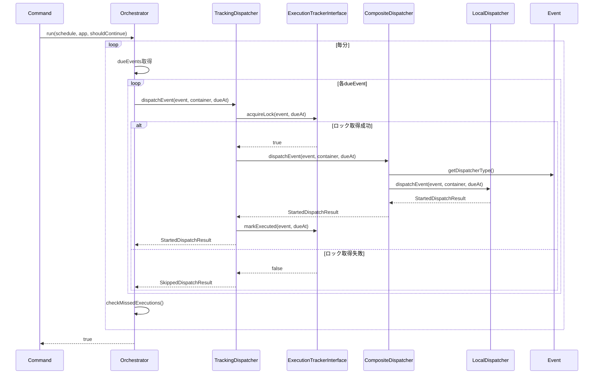
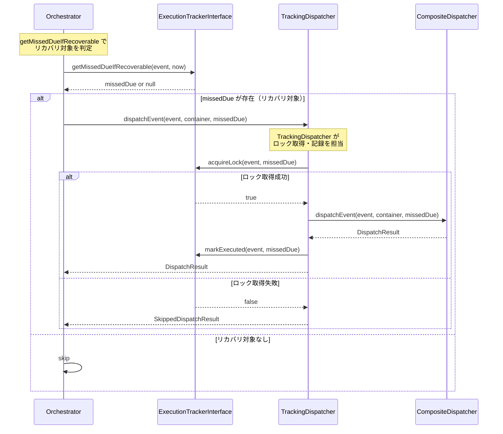
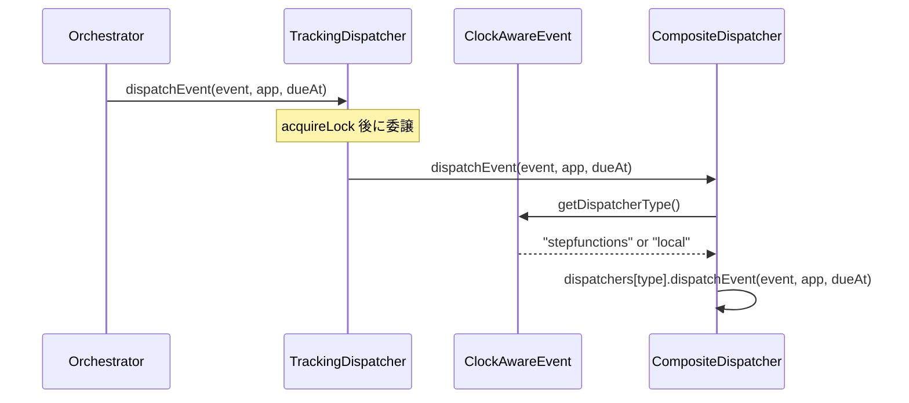

# Laravel Graceful Schedule Worker - 設計仕様書

> **Note**: アーキテクチャ設計は [ARCHITECTURE.md](./ARCHITECTURE.md)、
> Step Functions の実装詳細は [STEPFUNCTIONS_IMPLEMENTATION.md](./STEPFUNCTIONS_IMPLEMENTATION.md) を参照

## 目次

1. [概要とスコープ](#概要とスコープ)
2. [用語集](#用語集)
3. [機能要件](#機能要件)
4. [アーキテクチャ概要](#アーキテクチャ概要)
   - [オブジェクト関係図](#オブジェクト関係図)
   - [シーケンス図](#シーケンス図)
   - [レイヤー構成](#レイヤー構成)
5. [インターフェース仕様](#インターフェース仕様)
6. [TDD用テスト一覧](#tdd用テスト一覧)
7. [実装フェーズ](#実装フェーズ)
8. [設定ファイル](#設定ファイル)
9. [利用例](#利用例)

---

## 概要とスコープ

### プロジェクトの目的

**Laravel Graceful Schedule Worker** は、Laravelのスケジュールタスクを安全かつ信頼性高く実行するためのパッケージです。Dispatcherパターンにより、スケジュールイベントの `command` をバックグラウンドプロセス（LocalDispatcher）またはAWS Step Functions（StepFunctionsDispatcher）で実行し、グレースフルシャットダウンやシグナルハンドリングを可能にすることで、コンテナ環境やクラウドプラットフォームにおける運用の安全性を向上させます。

主な目的は以下の通りです:

1. **グレースフルシャットダウンの実現**: SIGTERM/SIGINTを適切にハンドリングし、実行中のタスクを正常終了させる
2. **柔軟な実行基盤の提供**: ローカルプロセス実行からAWS Step Functionsまで、環境に応じた実行方法を選択可能にする
3. **At-least-onceセマンティックのサポート**: タスクの取りこぼしを検出し、リカバリする仕組みを提供する
4. **テスト容易性の向上**: Clock抽象化により時刻依存のテストを決定論的に実行可能にする

### スコープ

#### 含まれる機能

- **グレースフルシャットダウン機能**: シグナル受信時に実行中のタスクを正常終了させる
- **Clock抽象化**: 時刻依存を外部化し、テスト時に時刻を固定できる機構
- **Dispatcherパターン**: ローカルプロセス実行とAWS Step Functions実行の切り替え機能
- **ExecutionTracker**: タスク実行履歴の追跡と取りこぼし検出機能
- **Grace Period制御**: タスクごとのリカバリ猶予期間設定機能
- **設定ファイルによる動作制御**: 環境変数や設定ファイルによる柔軟な動作設定

#### 含まれない機能

- **タスクのスケジューリング機能自体**: Laravelの標準`Schedule`/`Event`クラスをそのまま利用します
- **分散ロック機構**: Laravelの`withoutOverlapping()`を推奨します
- **タスクの優先度制御**: 実行順序はLaravelのスケジュール定義に従います
- **リアルタイムモニタリング**: ログ出力のみを提供し、専用の監視UIは提供しません
- **タスクリトライ機能**: アプリケーション側でのリトライ実装を推奨します

### このドキュメントについて

本ドキュメントは **設計仕様書** であり、Laravel Graceful Schedule Workerの要件定義とアーキテクチャ設計を記述したものです。実装の詳細なガイドではなく、以下の目的で作成されています:

- **要件の明確化**: プロジェクトが解決すべき課題と提供すべき機能を定義する
- **アーキテクチャの可視化**: システムの全体構造とコンポーネント間の関係を示す
- **実装の指針**: 開発時の判断基準となる設計思想と原則を提供する
- **TDDの基盤**: テスト駆動開発のためのテスト一覧と検証項目を整理する

実装の詳細については以下のドキュメントを参照してください:

- **[ARCHITECTURE.md](./ARCHITECTURE.md)**: アーキテクチャの詳細設計
- **[STEPFUNCTIONS_IMPLEMENTATION.md](./STEPFUNCTIONS_IMPLEMENTATION.md)**: Step Functions実装の詳細
- **[IDEMPOTENCY_GUIDE.md](../guide/IDEMPOTENCY_GUIDE.md)**: 冪等性実装のガイドライン

---

## 用語集

このプロジェクトで使用される主要な用語を以下に定義します。

| 用語 | 定義 |
|-----|------|
| **ScheduleOrchestratorInterface** | スケジュール実行の全体調整を行うコンポーネント。Dispatcherの選択、ExecutionTrackerとの連携を担当 |
| **ScheduleDispatcherInterface** | スケジュール実行を抽象化するインターフェース。LocalDispatcherとStepFunctionsDispatcherが実装 |
| **DispatchResultInterface** | Dispatcherの実行結果を型安全に扱うインターフェース。実行状態、メタデータ、エラー情報を提供 |
| **LocalDispatchResult** | LocalDispatcher用の結果クラス。バックグラウンドプロセス（Symfony Process コンポーネント）を保持し、プロセス管理を可能にする |
| **StepFunctionsDispatchResult** | StepFunctionsDispatcher用の結果クラス。ExecutionArnやStateMachineArnを保持 |
| **Dispatcher** | 実行方法（ローカル/Step Functions）を抽象化する総称。ScheduleDispatcherInterfaceはそのインターフェース |
| **CompositeDispatcher** | 複数のDispatcherを保持し、イベントのdispatcherTypeに応じて適切なDispatcherに委譲するコンポーネント |
| **ExecutionTrackerInterface** | 実行履歴の記録・取りこぼし検出・重複防止ロックを担当 |
| **ClockAwareEvent** | Clockを注入可能なLaravel Event拡張。gracePeriod、Dispatcher指定を持つ |
| **gracePeriod** | 取りこぼし時のリカバリ猶予期間。この期間内であれば取りこぼしタスクをリカバリ |
| **dueEvent** | 現在時刻で実行予定のイベント |
| **missedEvent** | 実行予定時刻を過ぎたが未実行のイベント |
| **リカバリ（recovery）** | 取りこぼしたタスクを猶予期間内に実行すること |
| **Fire & Forget** | 実行結果を待たずに次の処理に進むパターン。Step Functions呼び出しで使用 |
| **At-least-once** | 最低1回の実行を保証するセマンティクス。重複実行の可能性あり |

---

## 機能要件

### FR-1: Clock抽象化
- FR-1.1: システム時刻を抽象化し、テスト時に任意の時刻を注入できる
- FR-1.2: ClockAwareScheduleは全てのイベントにClockを注入する

### FR-2: イベント拡張
- FR-2.1: イベント単位でリカバリ有効/無効を設定できる
- FR-2.2: イベント単位で猶予期間(gracePeriod)を設定できる
- FR-2.3: イベント単位で実行方法(local/stepfunctions)を指定できる

### FR-3: 実行方法の切り替え
- FR-3.1: デフォルトの実行方法を設定ファイルで指定できる
- FR-3.2: イベント単位でデフォルトをオーバーライドできる
- FR-3.3: ローカル実行とStep Functions実行を同一スケジュール内で混在できる
- FR-3.4: 同一分内の複数イベントを並行してディスパッチできる（完了を待たずに次のイベントを開始）

### FR-4: 実行履歴トラッキング
- FR-4.1: 各イベントの実行をタイムスタンプと共に記録できる
- FR-4.2: 取りこぼしを検出できる
- FR-4.3: リカバリ有効なイベントは猶予期間内であればリカバリする

### FR-5: 重複実行防止
- FR-5.1: 同一イベント・同一due時刻の重複実行を防止できる
- FR-5.2: ロックはタイムアウト付きで自動解放される

### 機能要件とインターフェースの対応

| 機能要件 | 対応インターフェース/クラス |
|---------|---------------------------|
| FR-1 | ClockInterface, ClockAwareSchedule |
| FR-2 | ClockAwareEvent |
| FR-3 | CompositeDispatcher, ScheduleDispatcherInterface |
| FR-4 | ExecutionTrackerInterface |
| FR-5 | ExecutionTrackerInterface.acquireLock/releaseLock |

---

## アーキテクチャ概要

### オブジェクト関係図

このセクションでは、Laravel Graceful Schedule Worker のアーキテクチャにおけるオブジェクト間の関係を可視化します。

#### クラス図

```mermaid
classDiagram
    %% Laravel 基底クラス
    class Schedule {
        <<Laravel>>
        +exec(command) Event
        +command(command) Event
        +events() array
        +dueEvents(app) array
    }

    class Event {
        <<Laravel>>
        +command string
        +expression string
        +isDue(app) bool
        +run(container)
    }

    %% Clock 抽象化
    class ClockInterface {
        <<interface>>
        +now() DateTimeImmutable
    }

    class SystemClock {
        +now() DateTimeImmutable
    }

    class FixedClock {
        <<テスト用: tests/Helper>>
        -fixedTime DateTimeImmutable
        +now() DateTimeImmutable
        +setTime(time)
    }

    class SleeperInterface {
        <<interface>>
        +sleep() void
    }

    class Sleeper {
        -microseconds int
        +__construct(microseconds)
        +sleep() void
    }

    %% ClockAware 拡張
    class ClockAwareSchedule {
        -clock ClockInterface
        +__construct(clock)
        +exec(command) ClockAwareEvent
        +command(command) ClockAwareEvent
    }

    class ClockAwareEvent {
        -clock ClockInterface
        -gracePeriod DateInterval
        -recoverable bool
        -dispatcherType string|null
        +__construct(mutex, command, clock)
        +withGracePeriod(minutes) self
        +enableRecovery() self
        +dispatchVia(type) self
        +getDispatcherType() ?string
    }

    %% Orchestrator レイヤー
    class ScheduleOrchestratorInterface {
        <<interface>>
        +run(schedule, app, shouldContinue) bool
    }

    class DefaultScheduleOrchestrator {
        -dispatcher ScheduleDispatcherInterface
        -tracker ExecutionTrackerInterface
        -clock ClockInterface
        -sleeper SleeperInterface
        -logger LoggerInterface
        +run(schedule, app, shouldContinue) bool
    }

    %% Dispatcher パターン
    class DispatchResultInterface {
        <<interface>>
        +getEventIdentifier() string
        +getEventCommand() string
        +getDispatcherType() string
        +getDispatchedAt() DateTimeImmutable
    }

    class StartedDispatchResultInterface {
        <<interface>>
        %% マーカーインターフェース（新規開始）
    }

    class AlreadyRunningDispatchResultInterface {
        <<interface>>
        %% マーカーインターフェース（既存実行）
    }

    class FailedDispatchResultInterface {
        <<interface>>
        +getError() string
        +getException() Throwable
    }

    class SkippedDispatchResultInterface {
        <<interface>>
        +getReason() string
    }

    class SkippedDispatchResult {
        -eventIdentifier string
        -eventCommand string
        -reason string
        -dispatchedAt DateTimeImmutable
        +getReason() string
    }

    class StartedLocalDispatchResult {
        -process Process
        -eventIdentifier string
        -eventCommand string
        -dispatchedAt DateTimeImmutable
        +getProcess() Process
        +isRunning() bool
        +getExitCode() int
    }

    class FailedLocalDispatchResult {
        -eventIdentifier string
        -eventCommand string
        -error string
        -exception Throwable
        -dispatchedAt DateTimeImmutable
        +getError() string
        +getException() Throwable
    }

    class StartedStepFunctionsDispatchResult {
        -executionArn string
        -executionName string
        -eventIdentifier string
        -eventCommand string
        -dispatchedAt DateTimeImmutable
        +getExecutionArn() string
        +getExecutionName() string
    }

    class AlreadyRunningStepFunctionsDispatchResult {
        -executionName string
        -eventIdentifier string
        -eventCommand string
        -dispatchedAt DateTimeImmutable
        +getExecutionName() string
    }

    class FailedStepFunctionsDispatchResult {
        -executionName string
        -eventIdentifier string
        -eventCommand string
        -error string
        -exception Throwable
        -dispatchedAt DateTimeImmutable
        +getError() string
        +getException() Throwable
    }

    class ScheduleDispatcherInterface {
        <<interface>>
        +dispatchEvent(event, container, dueAt) DispatchResultInterface
        +cleanup() void
        +stopAll() void
    }

    class TrackingDispatcher {
        -inner ScheduleDispatcherInterface
        -tracker ExecutionTrackerInterface
        -logger LoggerInterface
        +dispatchEvent(event, container, dueAt) DispatchResultInterface
        +cleanup() void
        +stopAll() void
    }

    class CompositeDispatcher {
        -dispatchers Map~string,ScheduleDispatcherInterface~
        -logger LoggerInterface
        +__construct(dispatchers, logger)
        +dispatchEvent(event, container, dueAt) DispatchResultInterface
    }

    class LocalDispatcher {
        +dispatchEvent(event, container) DispatchResultInterface
    }

    class StepFunctionsDispatcher {
        -client StepFunctionsClientInterface
        -inputFactory StartExecutionInputFactoryInterface
        -clock ClockInterface
        +dispatchEvent(event, container) DispatchResultInterface
    }

    class StepFunctionsClientInterface {
        <<interface>>
        +startExecution(input) StartExecutionResult
    }

    class StartExecutionInputFactoryInterface {
        <<interface>>
        +create(event, dueAt) StartExecutionInput
    }

    class StartExecutionInputFactory {
        -nameGenerator ExecutionNameGeneratorInterface
        -payloadBuilder PayloadBuilderInterface
        -lockTtlSeconds int
        +create(event, dueAt) StartExecutionInput
    }

    class PayloadBuilderInterface {
        <<interface>>
        +build(event, dueAt, lockTtlSeconds) PayloadInterface
    }

    class PayloadBuilder {
        -lockKeyGenerator LockKeyGenerator
        +build(event, dueAt, lockTtlSeconds) PayloadInterface
    }

    class LockKeyGenerator {
        -sanitizer MutexNameSanitizer
        +generate(mutexName, dueAt, withoutOverlapping) string
    }

    class MutexNameSanitizer {
        +buildIdentifier(mutexName, timestamp) string
        +buildStableKey(mutexName) string
    }

    %% Tracker パターン
    class ExecutionTrackerInterface {
        <<interface>>
        +markExecuted(event, dueAt)
        +getMissedDueIfRecoverable(event, now) DateTimeInterface
        +acquireLock(event, dueAt) bool
        +releaseLock(event, dueAt)
    }

    class CacheExecutionTracker {
        -cache Cache
        -prefix string
        +markExecuted(event, dueAt)
        +getMissedDueIfRecoverable(event, now) DateTimeInterface
        +acquireLock(event, dueAt) bool
        +releaseLock(event, dueAt)
    }

    class NullExecutionTracker {
        +markExecuted(event, dueAt)
        +getMissedDueIfRecoverable(event, now) null
        +acquireLock(event, dueAt) true
        +releaseLock(event, dueAt)
    }

    %% インフラ層
    class GracefulScheduleWorkCommand {
        <<Command>>
        -orchestrator ScheduleOrchestrator
        +handle()
    }

    class GracefulScheduleWorkerProvider {
        <<ServiceProvider>>
        +register()
    }

    %% 継承関係
    Schedule <|-- ClockAwareSchedule
    Event <|-- ClockAwareEvent
    ClockInterface <|.. SystemClock
    ClockInterface <|.. FixedClock
    DispatchResultInterface <|-- StartedDispatchResultInterface
    DispatchResultInterface <|-- AlreadyRunningDispatchResultInterface
    DispatchResultInterface <|-- FailedDispatchResultInterface
    DispatchResultInterface <|-- SkippedDispatchResultInterface
    StartedDispatchResultInterface <|.. StartedLocalDispatchResult
    StartedDispatchResultInterface <|.. StartedStepFunctionsDispatchResult
    AlreadyRunningDispatchResultInterface <|.. AlreadyRunningStepFunctionsDispatchResult
    FailedDispatchResultInterface <|.. FailedLocalDispatchResult
    FailedDispatchResultInterface <|.. FailedStepFunctionsDispatchResult
    SkippedDispatchResultInterface <|.. SkippedDispatchResult
    ScheduleDispatcherInterface <|.. TrackingDispatcher
    ScheduleDispatcherInterface <|.. CompositeDispatcher
    ScheduleDispatcherInterface <|.. LocalDispatcher
    ScheduleDispatcherInterface <|.. StepFunctionsDispatcher
    TrackingDispatcher --> ScheduleDispatcherInterface : decorates
    ExecutionTrackerInterface <|.. CacheExecutionTracker
    ExecutionTrackerInterface <|.. NullExecutionTracker
    ScheduleOrchestratorInterface <|.. DefaultScheduleOrchestrator

    %% 依存関係
    ClockAwareSchedule --> ClockInterface : 注入
    ClockAwareSchedule ..> ClockAwareEvent : ファクトリ作成
    ClockAwareEvent --> ClockInterface : 注入

    GracefulScheduleWorkCommand --> ScheduleOrchestratorInterface : 使用
    ScheduleOrchestratorInterface --> ScheduleDispatcherInterface : 使用
    ScheduleOrchestratorInterface --> Schedule : 使用
    ScheduleOrchestratorInterface --> ExecutionTrackerInterface : 使用（オプション）
    CompositeDispatcher --> ScheduleDispatcherInterface : 委譲

    LocalDispatcher --> Schedule : 使用
    StepFunctionsDispatcher --> StepFunctionsClientInterface : 使用
    StepFunctionsDispatcher --> StartExecutionInputFactoryInterface : 使用
    StartExecutionInputFactory ..|> StartExecutionInputFactoryInterface
    StartExecutionInputFactory --> PayloadBuilderInterface : 使用
    PayloadBuilder ..|> PayloadBuilderInterface
    PayloadBuilder --> LockKeyGenerator : 使用
    LockKeyGenerator --> MutexNameSanitizer : 使用

    CacheExecutionTracker --> Event : 使用

    GracefulScheduleWorkerProvider ..> ClockInterface : バインド
    GracefulScheduleWorkerProvider ..> ClockAwareSchedule : バインド
    GracefulScheduleWorkerProvider ..> ScheduleOrchestratorInterface : バインド
    GracefulScheduleWorkerProvider ..> CompositeDispatcher : バインド
    GracefulScheduleWorkerProvider ..> ExecutionTrackerInterface : バインド

    DefaultScheduleOrchestrator --> ScheduleDispatcherInterface : 使用
    DefaultScheduleOrchestrator --> ExecutionTrackerInterface : 使用
    DefaultScheduleOrchestrator --> ClockInterface : 使用
    DefaultScheduleOrchestrator --> SleeperInterface : 使用
```



#### シーケンス図

このセクションでは、Laravel Graceful Schedule Worker の主要な処理フローをシーケンス図で可視化します。

##### 通常実行フロー



##### 取りこぼしリカバリフロー



##### Dispatcher選択フロー



#### レイヤー構成

各レイヤーの責務と含まれるオブジェクトを整理します。

| レイヤー | オブジェクト | 責務 |
|---------|-------------|------|
| **スケジューリング層** | `ClockAwareSchedule`, `ClockAwareEvent` | Laravel の `Schedule` / `Event` を継承し、Clock 注入と Grace Period 管理を提供 |
| **調整層** | `ScheduleOrchestratorInterface`, `DefaultScheduleOrchestrator` | 毎分のループ制御、イベントごとのDispatcher呼び出し、取りこぼしチェック（`getMissedDueIfRecoverable`）、dueAt の決定 |
| **時刻抽象層** | `ClockInterface`, `SystemClock`, `FixedClock`（テスト用） | 時刻取得の抽象化により、テスト時の時刻固定を実現 |
| **ディスパッチ層** | `ScheduleDispatcherInterface`, `TrackingDispatcher`, `CompositeDispatcher`, `LocalDispatcher`, `StepFunctionsDispatcher` | タスク実行方法の抽象化。`TrackingDispatcher` はロック取得・実行記録を担当するデコレーター |
| **トラッキング層** | `ExecutionTrackerInterface`, `CacheExecutionTracker`, `NullExecutionTracker` | 実行履歴の追跡、取りこぼし検出、ロック機構による重複実行防止。`NullExecutionTracker` はトラッキング無効時の Null Object |
| **インフラ層** | `GracefulScheduleWorkCommand`, `GracefulScheduleWorkerProvider` | Artisan コマンドと DI コンテナへの登録 |

#### Orchestrator と TrackingDispatcher の責務分担

| コンポーネント | 責務 |
|--------------|------|
| **Orchestrator** | スケジュール判定（毎分0秒のチェック）、リカバリ検出（`getMissedDueIfRecoverable`）、`dueAt` 決定、Dispatcher 呼び出し |
| **TrackingDispatcher** | ロック取得（`acquireLock`）、実行記録（`markExecuted`）、失敗時のログ出力、内部 Dispatcher への委譲 |

#### 主要な依存関係

##### 継承関係（extends）

- **`ClockAwareSchedule` extends `Schedule`**
  Laravel の `Schedule` クラスを継承し、`exec()` / `command()` メソッドをオーバーライドすることで、`ClockAwareEvent` を返すように拡張します。利用側は `Kernel.php` で `UsesClockAwareSchedule` trait を使用し、`gracefulSchedule(ClockAwareSchedule $schedule)` を実装することで拡張機能が利用可能になります。

- **`ClockAwareEvent` extends `Event`**
  Laravel の `Event` クラスを継承し、`ClockInterface` を注入することで、テスト時の時刻固定と Grace Period 管理を実現します。

##### ファクトリパターン

- **`ClockAwareSchedule` → `ClockAwareEvent`**
  `ClockAwareSchedule` の `exec()` / `command()` メソッドは、`ClockAwareEvent` インスタンスを生成して返します。この際、コンストラクタで `ClockInterface` を注入することで、時刻依存を外部化します。

##### 依存性注入（DI）

- **`ClockInterface` → `SystemClock` / `FixedClock`**
  `GracefulScheduleWorkerProvider` で `ClockInterface` を `SystemClock` にバインドします。テスト環境では `tests/Helper/FixedClock` をバインドして時刻を固定します。

- **`ScheduleDispatcherInterface` → `LocalDispatcher` / `StepFunctionsDispatcher`**
  設定ファイル（`config/graceful-scheduler.php`）の `dispatch` 設定に応じて、適切な Dispatcher 実装が DI コンテナから解決されます。

- **`ExecutionTrackerInterface` → `CacheExecutionTracker` / `NullExecutionTracker`**
  設定ファイルの `tracker.enabled` が `true` の場合は `CacheExecutionTracker` が、`false` の場合は `NullExecutionTracker` が注入されます。

##### 制御フロー

1. **Kernel.php** が `ClockAwareSchedule` を使用してスケジュール定義を行う
2. **`GracefulScheduleWorkCommand`** が `ScheduleDispatcherInterface` を使用してタスクを実行
3. **`LocalDispatcher`** はイベントの `command` を `Process::start()` でバックグラウンドプロセスとして起動し、非同期で実行
4. **`StepFunctionsDispatcher`** は AWS Step Functions の `startExecution` API を呼び出し
5. **`ExecutionTrackerInterface`** が実行履歴を記録し、取りこぼしを検出してリカバリ

#### データフロー概要

```
+---------------------------------------------------------------------+
|                         Kernel.php                                    |
|  use UsesClockAwareSchedule;  // trait が自動登録を担当              |
|                                                                       |
|  protected function gracefulSchedule(ClockAwareSchedule $schedule)    |
|  {                                                                    |
|      $schedule->command('report:daily')                               |
|          ->dailyAt('03:00')                                           |
|          ->withGracePeriod(120)                                       |
|          ->dispatchVia('stepfunctions');  // <- Dispatcher指定        |
|  }                                                                    |
+---------------------+---------------------------------------------+
                      |
                      | ClockAwareSchedule は ClockAwareEvent を生成
                      v
+---------------------------------------------------------------------+
|              GracefulScheduleWorkCommand                              |
|  - ScheduleOrchestratorInterface を注入                               |
|  - ClockAwareSchedule を注入                                         |
+---------------------+---------------------------------------------+
                      |
                      | Orchestrator に処理を委譲
                      v
+---------------------------------------------------------------------+
|                 ScheduleOrchestratorInterface                         |
|  - CompositeDispatcher を使用                                        |
|  - ExecutionTrackerInterface を使用（オプション）                     |
|  - 毎分のループ制御                                                  |
|  - イベントごとに dispatcher.dispatchEvent() を呼び出し              |
|  - 取りこぼしチェック・リカバリ                                      |
+---------------------+---------------------------------------------+
                      |
                      | CompositeDispatcher がイベントから type を解決
                      v
+---------------------------------------------------------------------+
|               CompositeDispatcher                                     |
|  - event.getDispatcherType() で type を取得                          |
|  - dispatchers[type] にディスパッチ                                  |
|  - dispatchers[type].dispatchEvent() に委譲                          |
+---------------------+---------------------------------------------+
                      |
                      | 適切な Dispatcher に委譲
                      v
        +-------------+-------------+
        |                           |
        v                           v
+---------------+          +----------------------+
|LocalDispatcher|          |StepFunctionsDispatcher|
|               |          |                      |
| イベントを    |          | ExecutionTrackerInterface|
| ローカルで    |          | +-- markExecuted()   |
| 実行          |          | +-- wasMissed()      |
|               |          | +-- acquireLock()    |
|               |          | （オプション）       |
+---------------+          +----------+-----------+
                                      |
                                      | SfnClient::startExecution()
                                      v
                           +---------------------+
                           | AWS Step Functions  |
                           | - State Machine     |
                           | - Execute Command   |
                           +---------------------+
```

**重要なポイント**:

1. **型安全性**: `UsesClockAwareSchedule` trait が `defineConsoleSchedule()` を自動オーバーライドし `ClockAwareSchedule` を登録。`gracefulSchedule(ClockAwareSchedule $schedule)` メソッドにより完全な型ヒントで IDE 補完と静的解析が効く
2. **テスタビリティ**: `ClockInterface` により時刻を固定でき、決定論的なテストが可能
3. **拡張性**: Dispatcher パターンにより、新しい実行方法（例: Kubernetes Job）を簡単に追加可能
4. **信頼性**: ExecutionTracker により At-least-once セマンティックを実現し、取りこぼしを防止

---

## インターフェース仕様

### ClockInterface

時刻を抽象化するインターフェースです。テスト時に時刻を固定できます。

**主要メソッド**:

| メソッド | パラメータ | 戻り値 | 説明 |
|---|---|---|---|
| `now` | — | `DateTimeImmutable` | 現在時刻を取得する |

→ ソース: `src/Clock/ClockInterface.php`

**実装**:

- `SystemClock`（`src/Clock/`）: 本番環境で使用（実際の現在時刻を返す）
- `FixedClock`（`tests/Helper/`）: テスト環境で使用（固定時刻を返す）。ライブラリの配布対象には含めない

### ClockAwareEvent

拡張メソッドを提供する Event クラスです。`Illuminate\Console\Scheduling\Event` を継承し、Clock 対応、リカバリ設定、Dispatcher タイプ選択機能を追加します。

**主要メソッド**:

| メソッド | パラメータ | 戻り値 | 説明 |
|---|---|---|---|
| `withGracePeriod` | `(?int $minutes = null)` | `$this` | リカバリを有効化（猶予期間を設定）。`null` で無制限 |
| `enableRecovery` | — | `$this` | リカバリを有効化（猶予期間なし = 無制限） |
| `dispatchVia` | `(string $type)` | `$this` | Dispatcher タイプを指定（`'local'` または `'stepfunctions'`） |
| `getDispatcherType` | — | `?string` | 指定された Dispatcher タイプを取得（未指定の場合は `null`） |

→ ソース: `src/Scheduling/ClockAwareEvent.php`

### ScheduleOrchestratorInterface

スケジュール実行の全体調整を行うインターフェースです。

**主要メソッド**:

| メソッド | パラメータ | 戻り値 | 説明 |
|---|---|---|---|
| `run` | `(ClockAwareSchedule $schedule, Application $app, callable $shouldContinue)` | `bool` | スケジュールされたタスクを調整・実行する。実行成功なら true |

→ ソース: `src/Orchestrator/ScheduleOrchestratorInterface.php`

### CompositeDispatcher

複数のDispatcherを保持し、イベントの `dispatcherType` に応じて適切なDispatcherに委譲するクラスです。`ScheduleDispatcherInterface` を実装します。

**主要メソッド**:

| メソッド | パラメータ | 戻り値 | 説明 |
|---|---|---|---|
| `dispatchEvent` | `(ClockAwareEvent $event, Container $container, DateTimeInterface $dueAt)` | `DispatchResultInterface` | `event->getDispatcherType()` に基づいて適切な Dispatcher に委譲 |
| `cleanup` | — | `void` | 全 Dispatcher の完了プロセスをクリーンアップ |
| `stopAll` | — | `void` | 全 Dispatcher の実行中プロセスを停止 |

コンストラクタに少なくとも1つの Dispatcher が必要です。空の Dispatcher 配列や不明な Dispatcher タイプに対して `InvalidArgumentException` をスローします。

DI 登録は Registrar パターンで行われます（`src/Providers/` 参照）。`ScheduleDispatcherInterface` のバインディングは `TrackingDispatcher` でデコレータとしてラップされます。

→ ソース: `src/Dispatcher/CompositeDispatcher.php`

### DispatchResultInterface

Dispatcher の結果を型安全に扱うためのインターフェースです。共通メタデータを定義し、各 Dispatcher 固有の情報は具象クラスで保持します。

**主要メソッド**:

| メソッド | パラメータ | 戻り値 | 説明 |
|---|---|---|---|
| `getEventIdentifier` | — | `string` | イベント識別子を取得（mutex name） |
| `getEventCommand` | — | `string` | 実行コマンドを取得（例: `"php artisan report:daily"`） |
| `getDispatcherType` | — | `string` | Dispatcher 種別を取得（`'local'` \| `'stepfunctions'`） |
| `getDispatchedAt` | — | `DateTimeImmutable` | ディスパッチ時刻を取得 |

→ ソース: `src/Dispatcher/Result/DispatchResultInterface.php`

### StartedDispatchResultInterface / AlreadyRunningDispatchResultInterface / FailedDispatchResultInterface

結果の種類を型で表現するサブインターフェースです。`instanceof` 演算子で型安全に判定できます。

- **`StartedDispatchResultInterface`**: マーカーインターフェース（追加メソッドなし）。ディスパッチ成功を表す
- **`AlreadyRunningDispatchResultInterface`**: マーカーインターフェース（追加メソッドなし）。重複実行の検出を表す（例: Step Functions `ExecutionAlreadyExists`）
- **`FailedDispatchResultInterface`**: ディスパッチ失敗を表す。`getError(): string` と `getException(): ?Throwable` を追加

→ ソース: `src/Dispatcher/Result/` ディレクトリ

### LocalDispatcher 結果クラス

LocalDispatcher 用の結果クラスです。成功時は `Process` オブジェクトを保持し、バックグラウンドプロセスの管理を可能にします。

| クラス | 実装インターフェース | Dispatcher 固有メソッド |
|---|---|---|
| `StartedLocalDispatchResult` | `StartedDispatchResultInterface` | `getProcess(): Process`, `isRunning(): bool`, `getExitCode(): ?int` |
| `FailedLocalDispatchResult` | `FailedDispatchResultInterface` | — （基底の `getError()` / `getException()` を使用） |

両クラスとも `getDispatcherType()` は `'local'` を返します。

→ ソース: `src/Dispatcher/Result/StartedLocalDispatchResult.php`, `src/Dispatcher/Result/FailedLocalDispatchResult.php`

### StepFunctionsDispatcher 結果クラス

StepFunctionsDispatcher 用の結果クラスです。新規開始時は `StartedStepFunctionsDispatchResult`、既存実行時は `AlreadyRunningStepFunctionsDispatchResult`、失敗時は `FailedStepFunctionsDispatchResult` を使用します。

| クラス | 実装インターフェース | StepFunctions 固有メソッド |
|---|---|---|
| `StartedStepFunctionsDispatchResult` | `StartedDispatchResultInterface` | `getExecutionArn(): string`, `getExecutionName(): string` |
| `AlreadyRunningStepFunctionsDispatchResult` | `AlreadyRunningDispatchResultInterface` | `getExecutionName(): string` |
| `FailedStepFunctionsDispatchResult` | `FailedDispatchResultInterface` | `getExecutionName(): string`, ファクトリメソッド `failed(...)` |

全クラスとも `getDispatcherType()` は `'stepfunctions'` を返します。

→ ソース: `src/Dispatcher/Result/` ディレクトリ

### ScheduleDispatcherInterface

スケジュールタスクの実行方法を抽象化するインターフェースです。

**主要メソッド**:

| メソッド | パラメータ | 戻り値 | 説明 |
|---|---|---|---|
| `dispatchEvent` | `(ClockAwareEvent $event, Container $container, DateTimeInterface $dueAt)` | `DispatchResultInterface` | 単一イベントをディスパッチ。`$dueAt` はトラッキングとリカバリに使用 |
| `cleanup` | — | `void` | 完了したプロセスのクリーンアップ |
| `stopAll` | — | `void` | 全ての実行中プロセスを停止 |

→ ソース: `src/Dispatcher/ScheduleDispatcherInterface.php`

**実装**:

- `TrackingDispatcher`: ロック取得・実行記録を行うデコレーター
- `CompositeDispatcher`: 複数のDispatcherを保持し、イベントのtypeに応じて委譲
- `LocalDispatcher`: バックグラウンドプロセスとして起動（`Process::start()`）
- `StepFunctionsDispatcher`: AWS Step Functions 経由で実行

### SkippedDispatchResultInterface

ロック取得失敗などでスキップされた結果を表すインターフェースです。

**主要メソッド**:

| メソッド | パラメータ | 戻り値 | 説明 |
|---|---|---|---|
| `getReason` | — | `string` | スキップされた理由を取得（例: `'lock_not_acquired'`） |

→ ソース: `src/Dispatcher/Result/SkippedDispatchResultInterface.php`

### TrackingDispatcher

トラッキングロジック（ロック取得、実行記録）を担当するデコレーターです。`ScheduleDispatcherInterface` を実装します。

**主要メソッド**:

| メソッド | パラメータ | 戻り値 | 説明 |
|---|---|---|---|
| `dispatchEvent` | `(ClockAwareEvent $event, Container $container, DateTimeInterface $dueAt)` | `DispatchResultInterface` | トラッキング付きでディスパッチ（以下のフロー参照） |
| `cleanup` | — | `void` | 内部 Dispatcher に委譲 |
| `stopAll` | — | `void` | 内部 Dispatcher に委譲 |

**処理フロー**: (1) `ExecutionTrackerInterface::acquireLock()` でロック取得 — 取得失敗時は `SkippedDispatchResult` を返す; (2) 内部の `ScheduleDispatcherInterface` に委譲; (3) `handleResult()` で結果をトラッキング（実行記録、失敗ログ）。

→ ソース: `src/Dispatcher/TrackingDispatcher.php`

### ExecutionTrackerInterface

スケジュールタスクの実行履歴を追跡し、取りこぼしを検出するインターフェースです。

**主要メソッド**:

| メソッド | パラメータ | 戻り値 | 説明 |
|---|---|---|---|
| `markExecuted` | `(ClockAwareEvent $event, DateTimeInterface $dueAt)` | `void` | タスクの実行を記録する |
| `getMissedDueIfRecoverable` | `(ClockAwareEvent $event, DateTimeInterface $now)` | `?DateTimeInterface` | リカバリすべき取りこぼしの実行予定時刻を返す。初回実行時は `null`。不正な cron 式に対して `InvalidArgumentException` をスロー |
| `acquireLock` | `(ClockAwareEvent $event, DateTimeInterface $dueAt)` | `bool` | 排他ロックを取得して重複実行を防止 |
| `releaseLock` | `(ClockAwareEvent $event, DateTimeInterface $dueAt)` | `void` | ロックを解放する |

→ ソース: `src/Tracker/ExecutionTrackerInterface.php`

**実装例**:

- `CacheExecutionTracker`: Redis や共有キャッシュを使用して実行履歴を保存

---

## TDD用テスト一覧

このセクションでは、TDD(テスト駆動開発)のためのテスト一覧を記載します。各テストは実装フェーズに対応しており、機能の正確な実装と品質保証を目的としています。

### Phase 1: Clock 抽象化・スケジューリング層

#### SystemClock

| ID | テスト名 | 期待結果 |
|----|---------|---------|
| T1.1 | testReturnsCurrentTime | 現在時刻を返す |
| T1.2 | testAdvancesTimeOnConsecutiveCalls | 連続呼び出しで時刻が進む |

> **Note**: `FixedClock` は `tests/Helper/` に配置されるテスト専用クラスのため、TDD テスト一覧からは除外。他のテストで間接的に検証される。

#### ClockAwareEvent

| ID | テスト名 | 期待結果 |
|----|---------|---------|
| T1.4 | testCanInjectClock | Clock が注入可能 |
| T1.5 | testCanSetGracePeriod | gracePeriod 設定可能 |
| T1.5.1 | testWithGracePeriodSetsRecoverableToTrue | recoverable が true になる |
| T1.5.2 | testWithGracePeriodSetsCorrectInterval | 正しい interval が設定される |
| T1.5.3 | testWithGracePeriodWithNullSetsUnlimited | null で無制限設定 |
| T1.6 | testCanEnableRecovery | enableRecovery が動作する |
| T1.6.1 | testEnableRecoverySetsRecoverableWithUnlimitedGrace | 無制限猶予で recoverable 設定 |
| T1.8 | testRecoverableIsFalseByDefault | デフォルトは recoverable=false |
| T1.9 | testDispatchViaReturnsSelfForMethodChaining | メソッドチェーン可能 |
| T1.10 | testGetDispatcherTypeReturnsNullByDefault | デフォルトは null |
| T1.11 | testDispatchViaSetsDispatcherType | dispatcherType 設定可能 |
| T1.12.1 | testBuildProcessCommandIncludesScheduleFinish | buildProcessCommand に schedule:finish 含む |
| T1.12.2 | testBuildProcessCommandDoesNotEndWithAmpersand | & で終わらない |

#### ClockAwareSchedule

| ID | テスト名 | 期待結果 |
|----|---------|---------|
| T1.12 | testReturnsClockAwareEventFromCommand | command() が ClockAwareEvent 型を返す |
| T1.13 | testReturnsClockAwareEventFromExec | exec() が ClockAwareEvent 型を返す |
| T1.14 | testCreatesClockAwareEventsFromMultipleMethods | 複数メソッドで ClockAwareEvent を生成 |
| T1.15 | testExecHandlesParametersCorrectly | exec() のパラメータが正しく処理される |
| T1.16 | testCommandHandlesParametersCorrectly | command() のパラメータが正しく処理される |

### Phase 2: Dispatcher パターン

#### LocalDispatcher

| ID | テスト名 | 期待結果 |
|----|---------|---------|
| T2.1 | testReturnsLocalDispatchResult | LocalDispatchResult を返す |
| T2.2 | testReturnsStartedDispatchResultInterfaceOnSuccess | 成功時に StartedDispatchResultInterface |
| T2.3 | testReturnsCorrectEventIdentifier | 正しいイベント識別子 |
| T2.4 | testReturnsCorrectEventCommand | 正しいコマンド |
| T2.5 | testReturnsCorrectDispatcherType | dispatcherType が 'local' |
| T2.6 | testStartsProcessInBackground | バックグラウンドプロセスとして起動 |
| T2.7 | testReturnsDispatchedAtTimestamp | dispatchedAt タイムスタンプ |
| T2.10 | testHasRunningProcessImmediatelyAfterDispatch | dispatch 直後に running |
| T2.11 | testBeforeCallbacksAreCalledBeforeDispatch | beforeCallbacks が先に実行 |
| T2.12 | testBuildCommandIncludesScheduleFinish | schedule:finish を含む |
| T2.13 | testRunInBackgroundIsPreservedAfterDispatch | runInBackground が保持される |
| T2.14 | testOutputRedirectionIsIncludedInCommand | 出力リダイレクション含む |
| T2.15 | testReturnsFailedWhenBeforeCallbackThrows | beforeCallback 例外で Failed |
| T2.16 | testRethrowsErrorFromBeforeCallback | Error は再スロー |
| T2.17 | testCleanupRemovesCompletedProcesses | cleanup で完了プロセス除去 |
| T2.18 | testStopAllStopsAllRunningProcesses | stopAll で全プロセス停止 |
| T2.19 | testStopAllHandlesAlreadyStoppedProcesses | 停止済みプロセスの graceful 処理 |
| T2.20 | testDispatchEventAddsResultToRunningProcesses | 結果が running list に追加 |
| T2.21 | testStopAllSendsSignalToAllProcesses | SIGTERM 送信 |
| T2.22 | testStopAllSendsKillToProcessesThatDontStop | SIGKILL フォールバック |
| T2.23 | testStopAllHandlesSignalExceptionGracefully | シグナル例外の graceful 処理 |
| T2.24 | testStopAllSkipsSignalForNonRunningProcesses | 非 running プロセスをスキップ |
| T2.25 | testForegroundEventRunsSynchronously | Foreground は同期実行 |
| T2.26 | testForegroundEventCallsAfterCallbacks | Foreground で afterCallbacks 実行 |
| T2.27 | testForegroundEventResultNotAddedToRunningProcesses | Foreground は running に追加しない |
| T2.28 | testBackgroundEventRunsAsynchronously | Background は非同期実行 |
| T2.29 | testClockAwareEventUseBuildProcessCommandInBackground | ClockAwareEvent で buildProcessCommand 使用 |
| T2.30 | testForegroundNonZeroExitCodePassedToAfterCallbacks | 非ゼロ exit code が afterCallbacks に渡る |
| T2.31 | testForegroundAfterCallbackExceptionReturnsStartedResult | afterCallback 例外でも StartedResult |

#### CompositeDispatcher

| ID | テスト名 | 期待結果 |
|----|---------|---------|
| T2.11 | testDelegatesToEventSpecifiedDispatcher | イベント指定の Dispatcher に委譲 |
| T2.12 | testDefaultDispatcherTypeUsesLocalDispatcher | デフォルト dispatcher type は local を使用 |
| T2.14 | testThrowsOnUnknownType | 未登録 type で例外 |
| T2.16 | testThrowsWhenDispatchersArrayIsEmpty | 空配列で例外 |
| T2.18 | testCleanupDelegatesToAllChildDispatchers | cleanup が全子に委譲 |
| T2.19 | testStopAllDelegatesToAllChildDispatchers | stopAll が全子に委譲 |
| T2.20 | testCleanupContinuesWhenChildThrows | 子の例外でも他の子に委譲 |
| T2.21 | testStopAllContinuesWhenChildThrows | 子の例外でも他の子に委譲 |
| T2.22 | testCleanupLogsWarningWhenChildThrows | 例外時に警告ログ |
| T2.23 | testStopAllLogsWarningWhenChildThrows | 例外時に警告ログ |

#### TrackingDispatcher

| ID | テスト名 | 期待結果 |
|----|---------|---------|
| TD.1 | testDelegatesToInnerDispatcherWhenLockAcquired | ロック成功で内部に委譲 |
| TD.2 | testReturnsSkippedWhenLockNotAcquired | ロック失敗で SkippedDispatchResult |
| TD.3 | testMarksExecutedOnStartedResult | Started で markExecuted 呼出 |
| TD.4 | testMarksExecutedOnAlreadyRunningResult | AlreadyRunning で markExecuted 呼出 |
| TD.5 | testLogsErrorOnFailedResult | Failed でエラーログ |
| TD.6 | testLogsExceptionInContextOnFailedResult | 例外がコンテキストに含まれる |
| TD.7 | testThrowsLogicExceptionOnUnexpectedResultType | 予期しない型で LogicException |
| TD.8 | testCleanupDelegatesToInnerDispatcher | cleanup が内部に委譲 |
| TD.9 | testStopAllDelegatesToInnerDispatcher | stopAll が内部に委譲 |
| TD.10 | testSkippedDispatchResultReturnsTrackingType | dispatcherType が 'tracking' |
| TD.11 | testLogsDebugWhenLockNotAcquired | ロック失敗時に DEBUG ログ |

#### StepFunctionsDispatcher

| ID | テスト名 | 期待結果 |
|----|---------|---------|
| T5.1 | testReturnsStepFunctionsDispatchResultOnSuccess | 成功時に StartedStepFunctionsDispatchResult |
| T5.2 | testReturnsAlreadyRunningOnExecutionAlreadyExists | 重複で AlreadyRunning |
| T5.3 | testExecutionNameIsGeneratedFromMutexAndTimestamp | Execution Name 生成 |
| T5.4 | testInputContainsRequiredFields | input に command, mutexName, dueAt |
| T5.5 | testGetDispatcherTypeReturnsStepfunctions | dispatcherType が 'stepfunctions' |
| T5.6 | testReturnsFailedOnGeneralError | 一般エラーで Failed |
| T5.7 | testUsesCorrectStateMachineArn | 正しい stateMachineArn 使用 |
| T5.8 | testReturnsExecutionArnOnSuccess | executionArn 取得可能 |
| T5.9 | testReturnsCorrectEventIdentifier | 正しいイベント識別子 |
| T5.10 | testReturnsCorrectEventCommand | 正しいコマンド |
| T5.11 | testReturnsExceptionOnGeneralError | 例外取得可能 |
| T5.12 | testCleanupIsNoOp | cleanup は no-op |
| T5.13 | testStopAllIsNoOp | stopAll は no-op |

### Phase 3: Orchestrator

#### DefaultScheduleOrchestrator

| ID | テスト名 | 期待結果 |
|----|---------|---------|
| T3.1 | testRunExecutesDueEvents | due なイベントが実行される |
| T3.2 | testRunSkipsNonDueEvents | due でないイベントはスキップ |
| T3.3 | testRunCallsDispatcherDispatchEventForEachEvent | 各イベントに対して dispatchEvent 呼出 |
| T3.4 | testRunStopsWhenShouldContinueFalse | false でループ終了 |
| T3.6 | testOnlyDispatchesOncePerMinute | 同一分で1回のみディスパッチ |
| T3.7 | testSkipsDispatchWhenSecondIsNotZero | 秒≠0 でスキップ |
| T3.8 | testPassesDueAtToDispatcher | dueAt が渡される |
| T3.23 | testChecksMissedExecutionsAtStartupAndRecovers | 起動時に取りこぼしリカバリ |
| T3.24 | testSkipsMissedEventWhenGetMissedDueIfRecoverableReturnsNull | null でスキップ |
| T3.25 | testDoesNotRecoverNonRecoverableEvent | 非 recoverable イベントはリカバリしない |
| T3.29 | testLogsInfoWhenRecoveringMissedEvent | リカバリ時に INFO ログ |

### Phase 4: ExecutionTracker

#### CacheExecutionTracker

| ID | テスト名 | 期待結果 |
|----|---------|---------|
| T4.1 | testMarkExecutedStoresTimestamp | Cache にタイムスタンプ保存 |
| T4.2 | testConstructorThrowsExceptionForNonPositiveLockTtl | 不正な lockTtl で例外 |
| T4.3 | testGetMissedDueIfRecoverableReturnsNullOnFirstRun | 初回は null |
| T4.4 | testGetMissedDueIfRecoverableReturnsMissedDue | 取りこぼし検出時に missedDue |
| T4.5 | testGetMissedDueIfRecoverableReturnsNullWhenOnSchedule | 正常時は null |
| T4.6 | testGetMissedDueIfRecoverableReturnsNullWhenGracePeriodExceeded | 猶予期間超過で null |
| T4.7 | testGetMissedDueIfRecoverableReturnsMissedDueWithinGracePeriod | 猶予期間内で missedDue |
| T4.8 | testGetMissedDueIfRecoverableThrowsOnInvalidCron | 不正 cron 式で例外 |
| T4.9 | testAcquireLockReturnsTrueOnSuccess | ロック取得成功 |
| T4.10 | testAcquireLockReturnsFalseWhenLocked | 重複ロックは失敗 |
| T4.11 | testReleaseLockRemovesLock | ロック解放される |
| T4.13 | testMarkExecutedUsesGracePeriodForTtl | gracePeriod で TTL 計算 |
| T4.14 | testGetMissedDueIfRecoverableWorksWithNonClockAwareEvent | 非 ClockAwareEvent でも動作 |
| T4.15 | testGetMissedDueIfRecoverableReturnsMissedDueWhenNoGracePeriod | gracePeriod 未設定でも missedDue |

#### NullExecutionTracker

| ID | テスト名 | 期待結果 |
|----|---------|---------|
| T6.1 | testMarkExecutedDoesNothing | 例外なしで何もしない |
| T6.2 | testGetMissedDueIfRecoverableAlwaysReturnsNull | 常に null |
| T6.3 | testAcquireLockAlwaysReturnsTrue | 常に true |
| T6.4 | testReleaseLockDoesNothing | 例外なしで何もしない |

### Phase 5: 統合テスト・E2E テスト

#### 統合テスト

| ID | テスト名 | 期待結果 |
|----|---------|---------|
| TI.1 | testNormalDispatchFlow | Orchestrator → TrackingDispatcher → Dispatcher で markExecuted |
| TI.2 | testRecoveryDispatchFlow | 取りこぼしイベント検出 → ロック → dispatch → markExecuted |
| TI.3 | testCompositeRoutingFlow | dispatchVia による正しいルーティング |
| TI.4 | testShutdownPropagation | shouldContinue=false で全 Dispatcher に stopAll |
| T7.1-T7.7 | CacheExecutionTrackerRedis* | Redis を使用した統合テスト（ロック、TTL、並行アクセス） |
| T8.1-T8.6 | TrackingDispatcherRedis* | Redis を使用した TrackingDispatcher 統合テスト |
| T6.1-T6.3 | StepFunctionsDispatcherIntegration* | moto を使用した Step Functions 統合テスト |
| T13.1-T13.4 | ProviderWiringIntegration* | ServiceProvider の DI 結線テスト |

#### E2E テスト

| ID | テスト名 | 期待結果 |
|----|---------|---------|
| T4.1 | testGracefulShutdownStopsGracefullyOnSigterm | SIGTERM で graceful shutdown |

---

## 実装詳細

> **Note**: 詳細な実装コードは [ARCHITECTURE.md](./ARCHITECTURE.md) を参照してください。
> ここでは各コンポーネントの責務と設計上の重要なポイントのみを記載します。

### ServiceProvider

**責務**:
- `ClockInterface` を `SystemClock` として DI コンテナに登録
- `ClockAwareSchedule` をシングルトンとして登録
- `ExecutionTrackerInterface` を設定に応じて `CacheExecutionTracker` または `NullExecutionTracker` としてバインド
- `ScheduleDispatcherInterface` を `TrackingDispatcher` でラップして登録
- `ScheduleOrchestratorInterface` を `DefaultScheduleOrchestrator` として登録

**重要なポイント**:
- 利用側は `Kernel.php` で `UsesClockAwareSchedule` trait を使用し、`gracefulSchedule(ClockAwareSchedule $schedule)` を実装する
- trait が `defineConsoleSchedule()` をオーバーライドし `ClockAwareSchedule` を `Schedule` シングルトンとして自動登録する
- 完全な型ヒントで IDE 補完と静的解析ツールのサポートを維持
- 後方互換性を保ちながら段階的な移行が可能

### ClockAwareSchedule

**責務**:
- `Schedule` を継承し、`exec()` / `command()` メソッドをオーバーライド
- `ClockAwareEvent` をファクトリとして生成
- すべてのイベントに同じ `ClockInterface` を注入

**重要なポイント**:
- 既存の Laravel Schedule API との完全な互換性を維持
- `command()` の戻り値が `ClockAwareEvent` 型であることを型システムで保証

### Clock 実装

**責務**:
- `ClockInterface` の具象実装を提供
- `SystemClock`（`src/Clock/`）: 実際の現在時刻を返す（本番環境用）
- `FixedClock`（`tests/Helper/`）: 固定時刻を返し、時刻変更が可能（テスト用ヘルパー）
- `AdvancingClock`（`tests/Helper/`）: 呼び出しごとに時刻を進める（Orchestrator テスト用）

**重要なポイント**:
- テスト時に時刻を完全に制御できるため、決定論的なテストが可能
- `FixedClock.setTime()` メソッドで時刻を進めることで、時間経過のシミュレーションが可能
- `FixedClock` / `AdvancingClock` はライブラリの配布対象には含めない（`tests/Helper/` に配置）

### LocalDispatcher

**責務**:
- `beforeCallbacks` を親プロセスで同期実行
- `buildCommand()` を使用して完全なコマンドを構築（出力リダイレクト、schedule:finish を含む）
- 構築されたコマンドをバックグラウンドプロセスとして起動（`Process::start()`）
- プロセスのライフサイクル管理（起動、監視、グレースフルシャットダウン）
- メモリリーク防止のための完了プロセスのクリーンアップ

**動作フロー**:
```
1. LocalDispatcher.dispatchEvent()
   +-- callBeforeCallbacks()          <- 親プロセスで同期実行
   +-- buildCommand()                 <- schedule:finish を含むコマンド構築
   +-- Process::start()               <- バックグラウンド実行

2. シェルで実行
   +-- original_command > output      <- 出力がファイルにリダイレクト
   +-- schedule:finish "mutex" "$?"   <- 終了コードを渡す

3. schedule:finish（別プロセス）
   +-- callAfterCallbacksWithExitCode() <- onSuccess/onFailure/after を実行
```

**サポートする Laravel Event 機能**:
- `before()` / `beforeCallbacks` - 親プロセスで同期実行
- `after()` / `then()` / `afterCallbacks` - schedule:finish 経由で実行
- `onSuccess()` / `onFailure()` - schedule:finish 経由で実行
- `sendOutputTo()` / `appendOutputTo()` - buildCommand() に含まれる
- `pingBefore()` / `thenPing()` - コールバックとして動作

**重要なポイント**:
- `Process::start()` による非同期実行で並行処理を実現
- `runInBackground` を一時的に true にして buildCommand() を呼び出し、元に戻す
- Dispatcher パターンにより実行方法を抽象化

### StepFunctionsDispatcher

**責務**:
- AWS Step Functions の `startExecution` API を使用してタスクを外部実行
- Fire & Forget パターンによる非同期実行
- `ExecutionTracker` と連携した実行履歴の記録

**重要なポイント**:
- Execution Name による重複実行の防止
- 取りこぼしチェックとリカバリ機能の統合
- オプショナルな `ExecutionTracker` の注入

### CacheExecutionTracker

**責務**:
- Redis や共有キャッシュを使用した実行履歴の永続化
- 取りこぼし検出ロジックの実装
- ロック機構による重複実行の防止

**重要なポイント**:
- Cron 式パーサーを使用した次回実行時刻の計算
- タイムアウト付きロックによる自動解放
- At-least-once セマンティックの実現

### NullExecutionTracker

**責務**:
- `ExecutionTrackerInterface` の Null Object 実装を提供
- トラッキング無効時（`tracker.enabled = false`）に使用

**動作**:
- `markExecuted()` / `releaseLock()`: 何もしない
- `getMissedDueIfRecoverable()`: 常に `null`（取りこぼしなし）
- `acquireLock()`: 常に `true`（常に成功）

**重要なポイント**:
- ServiceProvider でのトラッキング有効/無効の分岐を `NullExecutionTracker` により簡潔に実装
- `TrackingDispatcher` が常に同じインターフェースで動作できる

---

## エラーハンドリング戦略

本番運用における信頼性を確保するため、以下のエラー処理方針を定義します。

### AWS Step Functions API失敗時の対応

**ExecutionAlreadyExists エラー**:
- 同一 ExecutionName での重複起動を検出
- ログに警告を出力し、処理をスキップ（正常系として扱う）
- ExecutionTracker で既に実行済みとマーク

**その他のAPI エラー (ThrottlingException, ServiceException等)**:
- リトライ機構: AWS SDK の標準リトライポリシーを使用（最大3回、指数バックオフ）
- リトライ失敗時はログにエラーを記録し、次回の実行でリカバリを試みる
- `SCHEDULE_TRACKER_ENABLED=true` の場合、ExecutionTracker による取りこぼし検出で対応

**ネットワークタイムアウト**:
- SDK のタイムアウト設定を使用（デフォルト: 60秒）
- タイムアウト発生時は実行失敗としてログに記録
- 次回のリカバリチェックで再実行を試みる

### Redis/Cache接続失敗時の動作

キャッシュ接続失敗時は例外がそのまま伝播し、ワーカーが停止します。
これにより、キャッシュ障害時のトラッキングなし実行（重複実行リスク）を防ぎます。

### ロック取得タイムアウト時の動作

**ロック取得失敗**:
- 別プロセスが同一タスクを実行中と判断
- ログに情報を出力し、処理をスキップ
- 次回のチェックで再度ロック取得を試みる

**ロックのTTL自動解放**:
- デッドロック防止のため、ロックにはTTLを設定（デフォルト: 3600秒）
- TTL経過後は自動的にロックが解放される
- 長時間実行されるタスクには適切なTTLを設定する必要がある

**設定例**:
```php
'tracker' => [
    'lock_ttl' => env('SCHEDULE_TRACKER_LOCK_TTL', 3600),  // 秒単位
],
```

### 詳細なエラーハンドリング

Step Functions実装の詳細なエラーハンドリングについては、[STEPFUNCTIONS_IMPLEMENTATION.md](./STEPFUNCTIONS_IMPLEMENTATION.md) を参照してください。

---

## ディレクトリ構成

```
src/
+-- Clock/
|   +-- ClockInterface.php               # 時刻抽象化インターフェース
|   +-- SystemClock.php                  # 本番環境実装
|   +-- FreezableClock.php               # フリーズ可能な Clock（テスト/デバッグ用）
|   +-- SleeperInterface.php             # スリープ抽象化
|   +-- Sleeper.php                      # 本番環境実装
+-- Console/
|   +-- GracefulScheduleWorkCommand.php  # Artisan コマンド（Orchestrator を使用）
|   +-- ExceptionReporterInterface.php   # 例外レポーターインターフェース
|   +-- ExceptionReporter.php            # 例外レポーター（Laravel 7+）
|   +-- LegacyExceptionReporter.php      # 例外レポーター（Laravel 5/6）
|   +-- UsesClockAwareSchedule.php       # Kernel で ClockAwareSchedule を使用する trait
+-- Dispatcher/
|   +-- ScheduleDispatcherInterface.php       # Dispatcher インターフェース
|   +-- DispatcherType.php                    # Dispatcher タイプ列挙
|   +-- TrackingDispatcher.php                # トラッキングデコレーター
|   +-- CompositeDispatcher.php               # Dispatcher 委譲クラス
|   +-- LocalDispatcher.php                   # バックグラウンドプロセス起動
|   +-- StepFunctionsDispatcher.php           # AWS Step Functions 統合
|   +-- RunningProcessManager.php             # 実行中プロセス管理
|   +-- Result/                               # ディスパッチ結果型
|   |   +-- DispatchResultInterface.php                  # ディスパッチ結果基底インターフェース
|   |   +-- StartedDispatchResultInterface.php           # 成功結果インターフェース（新規開始）
|   |   +-- AlreadyRunningDispatchResultInterface.php    # 既存実行インターフェース
|   |   +-- FailedDispatchResultInterface.php            # 失敗結果インターフェース
|   |   +-- SkippedDispatchResultInterface.php           # スキップ結果インターフェース
|   |   +-- AbstractDispatchResult.php                   # ディスパッチ結果の抽象基底
|   |   +-- SkippedDispatchResult.php                    # スキップ結果実装
|   |   +-- StartedLocalDispatchResult.php               # LocalDispatcher 成功結果
|   |   +-- FailedLocalDispatchResult.php                # LocalDispatcher 失敗結果
|   |   +-- StartedStepFunctionsDispatchResult.php       # StepFunctionsDispatcher 成功結果
|   |   +-- AlreadyRunningStepFunctionsDispatchResult.php # StepFunctionsDispatcher 既存実行結果
|   |   +-- FailedStepFunctionsDispatchResult.php        # StepFunctionsDispatcher 失敗結果
|   +-- StepFunctions/                        # Step Functions 関連クラス
|       +-- StepFunctionsClientInterface.php  # SfnClient 抽象化
|       +-- AwsSfnClientAdapter.php           # AWS SDK アダプター
|       +-- ExecutionNameGeneratorInterface.php # Execution Name 生成インターフェース
|       +-- ExecutionNameGenerator.php        # Execution Name 生成
|       +-- StartExecutionResult.php          # startExecution 結果
|       +-- StartExecutionInputFactoryInterface.php # Input ファクトリインターフェース
|       +-- StartExecutionInputFactory.php    # Input ファクトリ実装
|       +-- StartExecutionInput.php           # Input 値オブジェクト
|       +-- PayloadInterface.php              # Payload インターフェース
|       +-- Payload.php                       # Payload 値オブジェクト
|       +-- PayloadBuilderInterface.php       # Payload ビルダーインターフェース
|       +-- PayloadBuilder.php                # Payload ビルダー実装
|       +-- LockKeyGenerator.php              # ロックキー生成
|       +-- MutexNameSanitizer.php            # Mutex 名サニタイズ
|       +-- StepFunctionsException.php        # 基底例外
|       +-- PayloadEncodingException.php      # Payload エンコード例外
|       +-- ExecutionAlreadyExistsException.php # 重複実行例外
+-- Logging/
|   +-- PrefixedLogger.php               # プレフィックス付きロガー
+-- Orchestrator/
|   +-- ScheduleOrchestratorInterface.php # スケジュール実行調整インターフェース
|   +-- DefaultScheduleOrchestrator.php   # デフォルト実装
+-- Providers/
|   +-- GracefulScheduleWorkerProvider.php  # DI 設定
|   +-- DispatcherServiceRegistrar.php      # Dispatcher 登録
|   +-- OrchestratorServiceRegistrar.php    # Orchestrator 登録
|   +-- TrackerServiceRegistrar.php         # Tracker 登録
|   +-- StepFunctionsServiceProvider.php    # Step Functions サービスプロバイダー
+-- Scheduling/
|   +-- ClockAwareSchedule.php           # Schedule 拡張
|   +-- ClockAwareEvent.php              # Event 拡張（withGracePeriod、dispatchVia 等）
|   +-- ClockAwareTimeFilter.php         # Clock 対応の時刻フィルタリング
|   +-- ProcessCommandBuilder.php        # プロセスコマンド構築
|   +-- TimezoneResolver.php             # タイムゾーン解決
+-- Tracker/
    +-- ExecutionTrackerInterface.php    # インターフェース
    +-- CacheExecutionTracker.php        # Redis/Cache 実装（ロック機能付き）
    +-- NullExecutionTracker.php         # Null Object 実装（トラッキング無効時）

config/
+-- graceful-scheduler.php               # 設定ファイル

tests/
+-- E2E/
|   +-- GracefulScheduleWorkerCommandTest.php  # SIGTERM グレースフルシャットダウン
|   +-- BackgroundCommandOutputTest.php        # バックグラウンドコマンド出力検証
+-- Helper/                                    # テスト用ヘルパークラス
|   +-- AdvancingClock.php                     # 自動進行 Clock
|   +-- FixedClock.php                         # 固定時刻 Clock
|   +-- NullSleeper.php                        # no-op Sleeper
|   +-- FakeDispatcher.php                     # Dispatcher Fake
|   +-- FakeExecutionTracker.php               # Tracker Fake
|   +-- FakeStepFunctionsClient.php            # Step Functions Client Fake
|   +-- SpyLogger.php                          # Logger Spy
|   +-- ...                                    # その他 Fake/Stub/Spy
+-- Integration/
|   +-- Dispatcher/
|   |   +-- StepFunctionsDispatcherIntegrationTest.php  # moto 統合テスト
|   |   +-- TrackingDispatcherRedisIntegrationTest.php  # Redis 統合テスト
|   +-- Orchestrator/
|   |   +-- OrchestratorFlowIntegrationTest.php         # フロー統合テスト
|   |   +-- OrchestratorFiltersPassIntegrationTest.php  # フィルターパス統合テスト
|   +-- Providers/
|   |   +-- ProviderBootIntegrationTest.php             # プロバイダー起動統合テスト
|   |   +-- ProviderWiringIntegrationTest.php           # DI 結線テスト
|   +-- Scheduling/
|   |   +-- ScheduleRunCompatibilityIntegrationTest.php # Schedule 実行互換テスト
|   +-- Tracker/
|       +-- CacheExecutionTrackerRedisTest.php          # Redis 統合テスト
+-- Unit/
    +-- Clock/
    |   +-- SystemClockTest.php
    |   +-- SleeperTest.php
    |   +-- FreezableClockTest.php
    +-- Console/
    |   +-- GracefulScheduleWorkCommandTest.php
    |   +-- ExceptionReporterTest.php
    |   +-- LegacyExceptionReporterTest.php
    |   +-- UsesClockAwareScheduleTest.php
    +-- Dispatcher/
    |   +-- LocalDispatcherTest.php
    |   +-- CompositeDispatcherTest.php
    |   +-- TrackingDispatcherTest.php
    |   +-- StepFunctionsDispatcherTest.php
    |   +-- RunningProcessManagerTest.php
    |   +-- Result/
    |   |   +-- AbstractDispatchResultTest.php
    |   |   +-- StartedLocalDispatchResultTest.php
    |   |   +-- FailedLocalDispatchResultTest.php
    |   |   +-- StartedStepFunctionsDispatchResultTest.php
    |   |   +-- AlreadyRunningStepFunctionsDispatchResultTest.php
    |   |   +-- FailedStepFunctionsDispatchResultTest.php
    |   |   +-- SkippedDispatchResultTest.php
    |   +-- StepFunctions/
    |       +-- AwsSfnClientAdapterTest.php
    |       +-- ExecutionNameGeneratorTest.php
    |       +-- MutexNameSanitizerTest.php
    |       +-- LockKeyGeneratorTest.php
    |       +-- PayloadTest.php
    |       +-- PayloadBuilderTest.php
    |       +-- StartExecutionInputFactoryTest.php
    |       +-- StartExecutionInputTest.php
    |       +-- StartExecutionResultTest.php
    +-- Logging/
    |   +-- PrefixedLoggerTest.php
    +-- Orchestrator/
    |   +-- DefaultScheduleOrchestratorTest.php
    +-- Providers/
    |   +-- GracefulScheduleWorkerProviderTest.php
    |   +-- DispatcherServiceRegistrarTest.php
    |   +-- OrchestratorServiceRegistrarTest.php
    |   +-- TrackerServiceRegistrarTest.php
    |   +-- StepFunctionsServiceProviderTest.php
    +-- Scheduling/
    |   +-- ClockAwareScheduleTest.php
    |   +-- ClockAwareEventTest.php
    |   +-- ClockAwareEventCompatibilityTest.php
    |   +-- ClockAwareScheduleCompatibilityTest.php
    |   +-- ClockAwareTimeFilterTest.php
    |   +-- ProcessCommandBuilderTest.php
    |   +-- TimezoneResolverTest.php
    +-- Tracker/
        +-- CacheExecutionTrackerTest.php
        +-- NullExecutionTrackerTest.php
```

---

## 設定ファイル

### config/graceful-scheduler.php

```php
<?php

return [
    /*
    |--------------------------------------------------------------------------
    | Schedule Dispatch Method
    |--------------------------------------------------------------------------
    |
    | ディスパッチ方法を指定します。
    |
    | Supported: "local", "stepfunctions"
    |
    */
    'dispatch' => env('SCHEDULE_DISPATCH', 'local'),

    /*
    |--------------------------------------------------------------------------
    | Step Functions Configuration
    |--------------------------------------------------------------------------
    |
    | AWS Step Functions を使用する場合の設定です。
    |
    */
    'stepfunctions' => [
        'state_machine_arn' => env('SCHEDULE_STATE_MACHINE_ARN'),
        'region' => env('AWS_DEFAULT_REGION', 'ap-northeast-1'),
        'version' => 'latest',
        'credentials' => [
            'key' => env('AWS_ACCESS_KEY_ID'),
            'secret' => env('AWS_SECRET_ACCESS_KEY'),
        ],
        'lock_ttl' => env('SCHEDULE_SF_LOCK_TTL', 3600),
    ],

    /*
    |--------------------------------------------------------------------------
    | Execution Tracker Configuration
    |--------------------------------------------------------------------------
    |
    | 実行履歴のトラッキング設定です。
    |
    */
    'tracker' => [
        'enabled' => env('SCHEDULE_TRACKER_ENABLED', false),
        'store' => env('SCHEDULE_TRACKER_STORE'), // redis, dynamodb, etc.
        'lock_ttl' => env('SCHEDULE_TRACKER_LOCK_TTL', 3600),      // ロックのTTL（秒）
    ],
];
```

### 環境変数の例

**ローカル環境（.env.local）**:

```env
SCHEDULE_DISPATCH=local
SCHEDULE_TRACKER_ENABLED=false
```

**本番環境（.env.production）**:

```env
SCHEDULE_DISPATCH=stepfunctions
SCHEDULE_STATE_MACHINE_ARN=arn:aws:states:ap-northeast-1:123456789012:stateMachine:ScheduleExecutor
AWS_DEFAULT_REGION=ap-northeast-1

SCHEDULE_TRACKER_ENABLED=true
SCHEDULE_TRACKER_STORE=redis
CACHE_DRIVER=redis
REDIS_HOST=your-elasticache-endpoint.cache.amazonaws.com
```

---

## 実装フェーズ

### Phase 1: 基盤リファクタリング（ClockAware 導入） -- 完了

**目的**: Clock パターンを導入し、時刻依存を外部化する

**成果物**:

- `src/Clock/ClockInterface.php`
- `src/Clock/SystemClock.php`
- `src/Clock/SleeperInterface.php`
- `src/Clock/Sleeper.php`
- `src/Scheduling/ClockAwareEvent.php`
- `src/Scheduling/ClockAwareSchedule.php`
- `tests/Helper/FixedClock.php`（テスト専用、src/ には配置しない）
- `tests/Helper/AdvancingClock.php`（テスト専用）
- `tests/Helper/NullSleeper.php`（テスト専用）
- `tests/Unit/Clock/SystemClockTest.php`
- `tests/Unit/Clock/SleeperTest.php`
- `tests/Unit/Scheduling/ClockAwareEventTest.php`
- `tests/Unit/Scheduling/ClockAwareScheduleTest.php`

### Phase 2: Dispatcher 分離（後方互換維持） -- 完了

**目的**: 既存のロジックを Dispatcher パターンに移行し、後方互換性を維持する

**成果物**:

- `src/Dispatcher/ScheduleDispatcherInterface.php`
- `src/Dispatcher/DispatchResultInterface.php` + サブインターフェース
- `src/Dispatcher/LocalDispatcher.php`
- `src/Dispatcher/StartedLocalDispatchResult.php`
- `src/Dispatcher/FailedLocalDispatchResult.php`
- `src/Dispatcher/TrackingDispatcher.php`
- `src/Dispatcher/SkippedDispatchResult.php`
- `config/graceful-scheduler.php`
- `tests/Unit/Dispatcher/LocalDispatcherTest.php`
- `tests/Unit/Dispatcher/TrackingDispatcherTest.php`
- 各 DispatchResult のユニットテスト

### Phase 3: Orchestrator -- 完了

**目的**: スケジュール実行の調整層を導入し、責務を分離する

**成果物**:

- `src/Orchestrator/ScheduleOrchestratorInterface.php`
- `src/Orchestrator/DefaultScheduleOrchestrator.php`
- `src/Dispatcher/CompositeDispatcher.php`
- `src/Console/GracefulScheduleWorkCommand.php`（Orchestrator を使用）
- `src/Providers/GracefulScheduleWorkerProvider.php`
- `tests/Unit/Orchestrator/DefaultScheduleOrchestratorTest.php`
- `tests/Unit/Dispatcher/CompositeDispatcherTest.php`
- `tests/Unit/Console/GracefulScheduleWorkCommandTest.php`
- `tests/Integration/Orchestrator/OrchestratorFlowIntegrationTest.php`
- `tests/Integration/Providers/ProviderWiringIntegrationTest.php`

### Phase 4: Step Functions 対応 -- 完了

**目的**: AWS Step Functions を使用した外部実行機能を追加

**成果物**:

- `src/Dispatcher/StepFunctionsDispatcher.php`
- `src/Dispatcher/Result/StartedStepFunctionsDispatchResult.php`
- `src/Dispatcher/Result/AlreadyRunningStepFunctionsDispatchResult.php`
- `src/Dispatcher/Result/FailedStepFunctionsDispatchResult.php`
- `src/Dispatcher/StepFunctions/StepFunctionsClientInterface.php`
- `src/Dispatcher/StepFunctions/AwsSfnClientAdapter.php`
- `src/Dispatcher/StepFunctions/ExecutionNameGeneratorInterface.php`
- `src/Dispatcher/StepFunctions/ExecutionNameGenerator.php`
- `src/Dispatcher/StepFunctions/StartExecutionResult.php`
- `src/Dispatcher/StepFunctions/StartExecutionInputFactoryInterface.php`
- `src/Dispatcher/StepFunctions/StartExecutionInputFactory.php`
- `src/Dispatcher/StepFunctions/StartExecutionInput.php`
- `src/Dispatcher/StepFunctions/PayloadInterface.php`
- `src/Dispatcher/StepFunctions/Payload.php`
- `src/Dispatcher/StepFunctions/PayloadBuilderInterface.php`
- `src/Dispatcher/StepFunctions/PayloadBuilder.php`
- `src/Dispatcher/StepFunctions/LockKeyGenerator.php`
- `src/Dispatcher/StepFunctions/MutexNameSanitizer.php`
- `src/Dispatcher/StepFunctions/StepFunctionsException.php`
- `src/Dispatcher/StepFunctions/PayloadEncodingException.php`
- `src/Dispatcher/StepFunctions/ExecutionAlreadyExistsException.php`
- `tests/Unit/Dispatcher/StepFunctionsDispatcherTest.php`
- `tests/Unit/Dispatcher/StepFunctions/AwsSfnClientAdapterTest.php`
- `tests/Unit/Dispatcher/StepFunctions/ExecutionNameGeneratorTest.php`
- `tests/Unit/Dispatcher/StepFunctions/MutexNameSanitizerTest.php`
- `tests/Unit/Dispatcher/StepFunctions/LockKeyGeneratorTest.php`
- `tests/Unit/Dispatcher/StepFunctions/PayloadTest.php`
- `tests/Unit/Dispatcher/StepFunctions/PayloadBuilderTest.php`
- `tests/Unit/Dispatcher/StepFunctions/StartExecutionInputFactoryTest.php`
- `tests/Unit/Dispatcher/StepFunctions/StartExecutionInputTest.php`
- `tests/Integration/Dispatcher/StepFunctionsDispatcherIntegrationTest.php`（moto 使用）

### Phase 5: At-least-once 対応（ExecutionTracker） -- 完了

**目的**: 取りこぼしタスクの検出とリカバリ機能を追加

**成果物**:

- `src/Tracker/ExecutionTrackerInterface.php`
- `src/Tracker/CacheExecutionTracker.php`
- `src/Tracker/NullExecutionTracker.php`
- `tests/Unit/Tracker/CacheExecutionTrackerTest.php`
- `tests/Unit/Tracker/NullExecutionTrackerTest.php`
- `tests/Integration/Tracker/CacheExecutionTrackerRedisTest.php`
- `tests/Integration/Dispatcher/TrackingDispatcherRedisIntegrationTest.php`

### Phase 6: 拡張機能（Grace Period） -- 完了

**目的**: リカバリ制御の拡張メソッドを実装

**成果物**:

- `src/Scheduling/ClockAwareEvent.php`（withGracePeriod、enableRecovery）
- `src/Tracker/CacheExecutionTracker.php`（Grace Period 判定）
- `tests/Unit/Scheduling/ClockAwareEventTest.php`

### E2E テスト -- 完了

- `tests/E2E/GracefulScheduleWorkerCommandTest.php`（SIGTERM graceful shutdown）

---

## テスト戦略

### テスト方針

- **Mock 禁止**: Interface には Fake、実クラスには Stub/Spy を使用
- **テスト用ヘルパー**: `tests/Helper/` に配置（1ファイル1クラス）
- **テストID**: `@testdox` アノテーションで設計のテストIDと紐付け

### テスト構成

| カテゴリ | テスト数 | 検証対象 |
|---------|---------|---------|
| Unit/Clock | 13 | SystemClock、Sleeper、FreezableClock |
| Unit/Scheduling | 111 | ClockAwareEvent、ClockAwareSchedule、ClockAwareTimeFilter、ProcessCommandBuilder、TimezoneResolver、Compatibility |
| Unit/Console | 24 | GracefulScheduleWorkCommand、ExceptionReporter、LegacyExceptionReporter、UsesClockAwareSchedule |
| Unit/Dispatcher | 247 | LocalDispatcher、CompositeDispatcher、TrackingDispatcher、StepFunctionsDispatcher、RunningProcessManager、各 DispatchResult、StepFunctions サブクラス |
| Unit/Orchestrator | 28 | DefaultScheduleOrchestrator |
| Unit/Tracker | 26 | CacheExecutionTracker、NullExecutionTracker |
| Unit/Providers | 46 | GracefulScheduleWorkerProvider、DispatcherServiceRegistrar、OrchestratorServiceRegistrar、TrackerServiceRegistrar、StepFunctionsServiceProvider |
| Unit/Logging | 4 | PrefixedLogger |
| Integration | 45 | Redis 統合、moto 統合、DI 結線、フロー統合、フィルターパス、Schedule 互換 |
| E2E | 3 | SIGTERM graceful shutdown、バックグラウンドコマンド出力 |
| **合計** | **547** | |

### 統合テスト環境

- **moto**: Step Functions の統合テスト（Docker コンテナ、`composer test` で自動起動）
- **Redis**: CacheExecutionTracker と TrackingDispatcher の統合テスト（Docker コンテナ）
- **skeleton**: Laravel アプリケーションとしての統合テスト

---

## Known Limitations

### ClockAwareEvent での ManagesFrequencies の制限

Laravel の `ManagesFrequencies` トレイトには `Carbon::now()` を直接使用しているメソッドがあり、
`ClockAwareEvent` でも `ClockInterface` を使わずにシステム時刻を参照します。

**影響を受けるメソッド**:

| メソッド | 呼び出し元 | 問題 |
|---------|-----------|------|
| `inTimeInterval()` | `between()`, `unlessBetween()` | `Carbon::now()` を使用 |
| `lastDayOfMonth()` | 直接呼び出し | `Carbon::now()->endOfMonth()->day` を使用 |

**影響**:
- `between()` / `unlessBetween()` を使った時間帯制限がテスト時に固定時刻を使わない
- `lastDayOfMonth()` で月末実行するタスクがテスト時に固定時刻を使わない

**回避策**:
- これらのメソッドを使用するタスクのテストでは、実際のシステム時刻に依存することを考慮する
- または、`ClockAwareEvent` でこれらのメソッドをオーバーライドして `ClockInterface` を使うように拡張する（将来の対応）

---

## 利用例

> **Note**: At-least-once セマンティックによる冪等性の要求については
> [IDEMPOTENCY_GUIDE.md](../guide/IDEMPOTENCY_GUIDE.md) を参照

### 基本的な使い方

`UsesClockAwareSchedule` trait を使うと、`defineConsoleSchedule()` のボイラープレートが不要になります。
`gracefulSchedule(ClockAwareSchedule $schedule)` を実装するだけで完全な型ヒント付きスケジュール定義が可能です。

```php
// app/Console/Kernel.php
use RakkoInc\LaravelGracefulScheduleWorker\Console\UsesClockAwareSchedule;
use RakkoInc\LaravelGracefulScheduleWorker\Scheduling\ClockAwareSchedule;

class Kernel extends ConsoleKernel
{
    use UsesClockAwareSchedule;

    protected function gracefulSchedule(ClockAwareSchedule $schedule)
    {
        // デフォルト: リカバリしない（安全）
        $schedule->command('heartbeat:send')
            ->everyMinute();

        // 重要なジョブ: リカバリ有効 + 猶予期間
        $schedule->command('metrics:aggregate')
            ->hourly()
            ->withGracePeriod(30);  // 30分以内ならリカバリ

        // 重要なジョブ: リカバリ有効 + Step Functions実行
        $schedule->command('reports:generate')
            ->dailyAt('03:00')
            ->skip(fn() => Holiday::isToday())
            ->withGracePeriod(120)  // 2時間以内ならリカバリ
            ->dispatchVia('stepfunctions');  // Step Functions で実行
    }
}
```

### 動的条件との組み合わせ

```php
protected function gracefulSchedule(ClockAwareSchedule $schedule)
{
    // 休日はスキップ + リカバリ有効
    $schedule->command('business:process')
        ->dailyAt('09:00')
        ->skip(fn() => Holiday::isToday())
        ->withGracePeriod(60);  // リカバリ有効 + 60分の猶予期間

    // メンテナンス中はスキップ（リカバリ不要）
    $schedule->command('data:sync')
        ->everyFiveMinutes()
        ->when(fn() => ! Cache::get('maintenance_mode'));
        // → リカバリなし（デフォルト）

    // 動的条件 + リカバリ有効
    $schedule->command('critical:task')
        ->hourly()
        ->when(fn() => $this->isCritical())
        ->withGracePeriod(30);  // リカバリ有効 + 30分の猶予期間
}
```

### リカバリの制御パターン

```php
protected function gracefulSchedule(ClockAwareSchedule $schedule)
{
    // パターン1: リカバリ不要（デフォルト）
    $schedule->command('heartbeat:send')
        ->everyMinute();
        // → リアルタイム性重視、リカバリ不要

    // パターン2: リカバリ有効 + 猶予期間
    $schedule->command('reports:generate')
        ->dailyAt('03:00')
        ->withGracePeriod(120);
        // → 2時間以内ならリカバリ、それ以降はスキップ

    // パターン3: リカバリ有効 + 無制限
    $schedule->command('critical:backup')
        ->dailyAt('03:00')
        ->enableRecovery();
        // → 取りこぼされた場合、次回起動時に必ずリカバリ

    // パターン4: withGracePeriod(null) = 無制限と同じ
    $schedule->command('data:import')
        ->dailyAt('04:00')
        ->withGracePeriod(null);
        // → enableRecovery() と同じ動作
}
```

### Step Functions との組み合わせ

```php
// .env
SCHEDULE_DISPATCH=stepfunctions
SCHEDULE_STATE_MACHINE_ARN=arn:aws:states:ap-northeast-1:123456789012:stateMachine:ScheduleExecutor
SCHEDULE_TRACKER_ENABLED=true
SCHEDULE_TRACKER_STORE=redis

// Kernel.php（use UsesClockAwareSchedule は「基本的な使い方」と同じ）

protected function gracefulSchedule(ClockAwareSchedule $schedule)
{
    $schedule->command('heavy:job')
        ->hourly()
        ->withGracePeriod(60);  // Step Functions で実行、リカバリあり
}
```

---

**Last Updated**: 2026-02-08
**Version**: 3.6.0 (UsesClockAwareSchedule trait 追加、defineConsoleSchedule ボイラープレート削減)
**Author**: Laravel Graceful Schedule Worker Team
