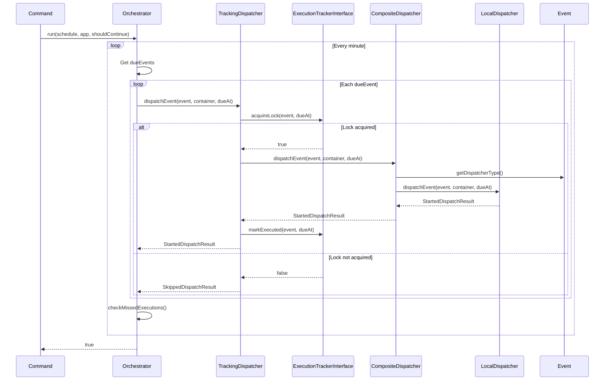
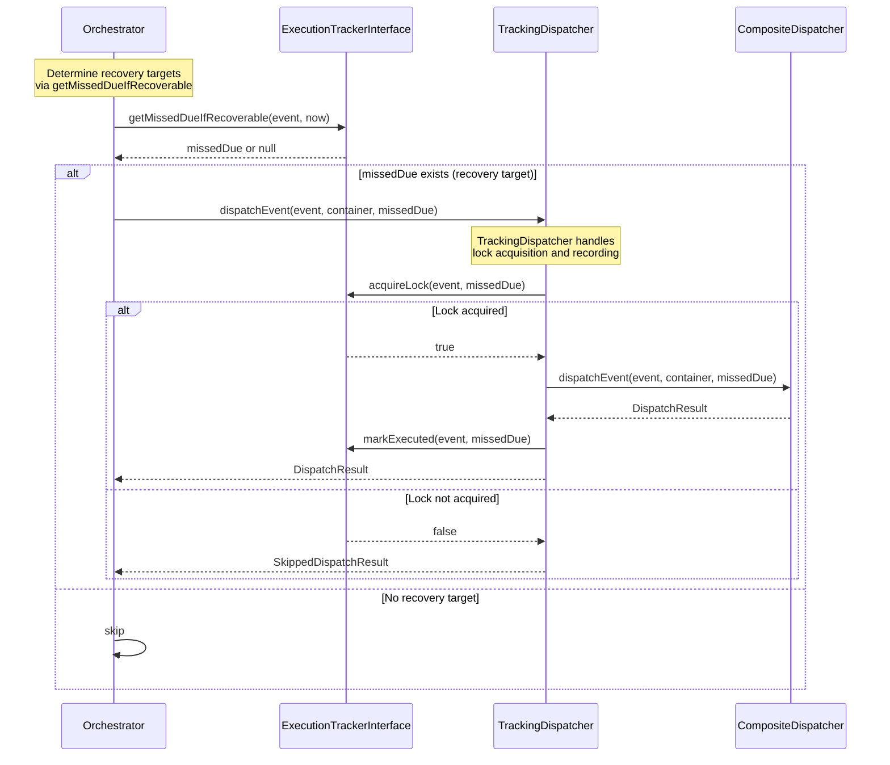
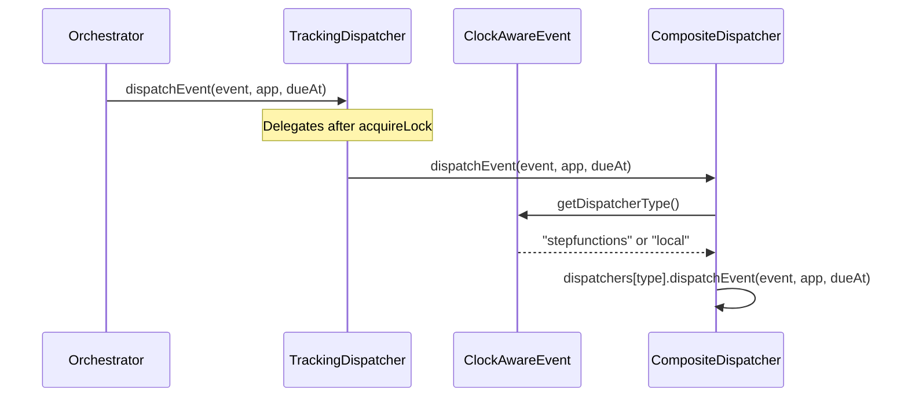

# Laravel Graceful Schedule Worker - Design Specification

> **Note**: See [ARCHITECTURE.md](./ARCHITECTURE.md) for the architecture design,
> and [STEPFUNCTIONS_IMPLEMENTATION.md](./STEPFUNCTIONS_IMPLEMENTATION.md) for Step Functions implementation details

## Table of Contents

1. [Overview and Scope](#overview-and-scope)
2. [Glossary](#glossary)
3. [Functional Requirements](#functional-requirements)
4. [Architecture Overview](#architecture-overview)
   - [Object Relationship Diagram](#object-relationship-diagram)
   - [Sequence Diagrams](#sequence-diagrams)
   - [Layer Composition](#layer-composition)
5. [Interface Specifications](#interface-specifications)
6. [TDD Test List](#tdd-test-list)
7. [Implementation Phases](#implementation-phases)
8. [Configuration File](#configuration-file)
9. [Usage Examples](#usage-examples)

---

## Overview and Scope

### Project Purpose

**Laravel Graceful Schedule Worker** is a package for safely and reliably executing Laravel's scheduled tasks. Through the Dispatcher pattern, it executes schedule event `command`s as background processes (LocalDispatcher) or via AWS Step Functions (StepFunctionsDispatcher), enabling graceful shutdown and signal handling to improve operational safety in container environments and cloud platforms.

The main objectives are:

1. **Graceful shutdown**: Properly handle SIGTERM/SIGINT and allow running tasks to complete normally
2. **Flexible execution infrastructure**: Enable choosing execution methods ranging from local process execution to AWS Step Functions, depending on the environment
3. **At-least-once semantics support**: Provide a mechanism to detect and recover from missed executions
4. **Improved testability**: Enable deterministic testing of time-dependent code through Clock abstraction

### Scope

#### Included Features

- **Graceful shutdown**: Safely complete running tasks upon signal reception
- **Clock abstraction**: Externalize time dependency, enabling time injection during tests
- **Dispatcher pattern**: Switching between local process execution and AWS Step Functions execution
- **ExecutionTracker**: Task execution history tracking and missed execution detection
- **Grace period control**: Per-task recovery grace period configuration
- **Configuration-driven behavior**: Flexible behavior configuration through environment variables and configuration files

#### Excluded Features

- **Task scheduling itself**: Uses Laravel's standard `Schedule`/`Event` classes as-is
- **Distributed locking**: Recommends Laravel's `withoutOverlapping()`
- **Task priority control**: Execution order follows Laravel's schedule definition
- **Real-time monitoring**: Provides log output only; no dedicated monitoring UI
- **Task retry**: Recommends retry implementation on the application side

### About This Document

This document is a **design specification** that describes the requirements definition and architecture design of Laravel Graceful Schedule Worker. It is not a detailed implementation guide, but was created for the following purposes:

- **Requirements clarification**: Define the problems the project should solve and the features it should provide
- **Architecture visualization**: Show the overall system structure and relationships between components
- **Implementation guidelines**: Provide design philosophy and principles as decision criteria during development
- **TDD foundation**: Organize the test list and verification items for test-driven development

For implementation details, see the following documents:

- **[ARCHITECTURE.md](./ARCHITECTURE.md)**: Detailed architecture design
- **[STEPFUNCTIONS_IMPLEMENTATION.md](./STEPFUNCTIONS_IMPLEMENTATION.md)**: Step Functions implementation details
- **[IDEMPOTENCY_GUIDE.md](../guide/IDEMPOTENCY_GUIDE.md)**: Idempotency implementation guidelines

---

## Glossary

The main terms used in this project are defined below.

| Term | Definition |
|------|-----------|
| **ScheduleOrchestratorInterface** | Component that coordinates overall schedule execution. Responsible for Dispatcher selection and ExecutionTracker integration |
| **ScheduleDispatcherInterface** | Interface that abstracts schedule execution. Implemented by LocalDispatcher and StepFunctionsDispatcher |
| **DispatchResultInterface** | Interface for type-safe handling of Dispatcher execution results. Provides execution state, metadata, and error information |
| **LocalDispatchResult** | Result class for LocalDispatcher. Holds a background process (Symfony Process component), enabling process management |
| **StepFunctionsDispatchResult** | Result class for StepFunctionsDispatcher. Holds ExecutionArn and StateMachineArn |
| **Dispatcher** | General term for abstraction of execution methods (local/Step Functions). ScheduleDispatcherInterface is its interface |
| **CompositeDispatcher** | Component that holds multiple Dispatchers and delegates to the appropriate Dispatcher based on the event's dispatcherType |
| **ExecutionTrackerInterface** | Responsible for execution history recording, missed execution detection, and duplicate prevention locking |
| **ClockAwareEvent** | Laravel Event extension with Clock injection. Has gracePeriod and Dispatcher specification |
| **gracePeriod** | Recovery grace period for missed executions. Missed tasks are recovered within this period |
| **dueEvent** | An event scheduled for execution at the current time |
| **missedEvent** | An event whose scheduled execution time has passed but was not executed |
| **recovery** | Executing a missed task within the grace period |
| **Fire & Forget** | Pattern of proceeding to the next operation without waiting for execution results. Used in Step Functions invocations |
| **At-least-once** | Semantics guaranteeing at least one execution. May result in duplicate execution |

---

## Functional Requirements

### FR-1: Clock Abstraction
- FR-1.1: Abstract system time, allowing arbitrary time injection during tests
- FR-1.2: ClockAwareSchedule injects Clock into all events

### FR-2: Event Extension
- FR-2.1: Enable/disable recovery per event
- FR-2.2: Set grace period per event
- FR-2.3: Specify execution method (local/stepfunctions) per event

### FR-3: Execution Method Switching
- FR-3.1: Specify default execution method via configuration file
- FR-3.2: Override default per event
- FR-3.3: Mix local execution and Step Functions execution within the same schedule
- FR-3.4: Dispatch multiple events within the same minute concurrently (start next event without waiting for completion)

### FR-4: Execution History Tracking
- FR-4.1: Record each event's execution with timestamp
- FR-4.2: Detect missed executions
- FR-4.3: Recover recovery-enabled events within grace period

### FR-5: Duplicate Execution Prevention
- FR-5.1: Prevent duplicate execution for the same event at the same due time
- FR-5.2: Locks have timeouts and are automatically released

### Functional Requirements to Interface Mapping

| Functional Requirement | Corresponding Interface/Class |
|----------------------|------------------------------|
| FR-1 | ClockInterface, ClockAwareSchedule |
| FR-2 | ClockAwareEvent |
| FR-3 | CompositeDispatcher, ScheduleDispatcherInterface |
| FR-4 | ExecutionTrackerInterface |
| FR-5 | ExecutionTrackerInterface.acquireLock/releaseLock |

---

## Architecture Overview

### Object Relationship Diagram

This section visualizes the relationships between objects in the Laravel Graceful Schedule Worker architecture.

#### Class Diagram

```mermaid
classDiagram
    %% Laravel base classes
    class Schedule {
        <<Laravel>>
        +exec(command) Event
        +command(command) Event
        +events() array
        +dueEvents(app) array
    }

    class Event {
        <<Laravel>>
        +command string
        +expression string
        +isDue(app) bool
        +run(container)
    }

    %% Clock abstraction
    class ClockInterface {
        <<interface>>
        +now() DateTimeImmutable
    }

    class SystemClock {
        +now() DateTimeImmutable
    }

    class FixedClock {
        <<Test only: tests/Helper>>
        -fixedTime DateTimeImmutable
        +now() DateTimeImmutable
        +setTime(time)
    }

    class SleeperInterface {
        <<interface>>
        +sleep() void
    }

    class Sleeper {
        -microseconds int
        +__construct(microseconds)
        +sleep() void
    }

    %% ClockAware extensions
    class ClockAwareSchedule {
        -clock ClockInterface
        +__construct(clock)
        +exec(command) ClockAwareEvent
        +command(command) ClockAwareEvent
    }

    class ClockAwareEvent {
        -clock ClockInterface
        -gracePeriod DateInterval
        -recoverable bool
        -dispatcherType string|null
        +__construct(mutex, command, clock)
        +withGracePeriod(minutes) self
        +enableRecovery() self
        +dispatchVia(type) self
        +getDispatcherType() ?string
    }

    %% Orchestrator layer
    class ScheduleOrchestratorInterface {
        <<interface>>
        +run(schedule, app, shouldContinue) bool
    }

    class DefaultScheduleOrchestrator {
        -dispatcher ScheduleDispatcherInterface
        -tracker ExecutionTrackerInterface
        -clock ClockInterface
        -sleeper SleeperInterface
        -logger LoggerInterface
        +run(schedule, app, shouldContinue) bool
    }

    %% Dispatcher pattern
    class DispatchResultInterface {
        <<interface>>
        +getEventIdentifier() string
        +getEventCommand() string
        +getDispatcherType() string
        +getDispatchedAt() DateTimeImmutable
    }

    class StartedDispatchResultInterface {
        <<interface>>
        %% Marker interface (new start)
    }

    class AlreadyRunningDispatchResultInterface {
        <<interface>>
        %% Marker interface (existing execution)
    }

    class FailedDispatchResultInterface {
        <<interface>>
        +getError() string
        +getException() Throwable
    }

    class SkippedDispatchResultInterface {
        <<interface>>
        +getReason() string
    }

    class SkippedDispatchResult {
        -eventIdentifier string
        -eventCommand string
        -reason string
        -dispatchedAt DateTimeImmutable
        +getReason() string
    }

    class StartedLocalDispatchResult {
        -process Process
        -eventIdentifier string
        -eventCommand string
        -dispatchedAt DateTimeImmutable
        +getProcess() Process
        +isRunning() bool
        +getExitCode() int
    }

    class FailedLocalDispatchResult {
        -eventIdentifier string
        -eventCommand string
        -error string
        -exception Throwable
        -dispatchedAt DateTimeImmutable
        +getError() string
        +getException() Throwable
    }

    class StartedStepFunctionsDispatchResult {
        -executionArn string
        -executionName string
        -eventIdentifier string
        -eventCommand string
        -dispatchedAt DateTimeImmutable
        +getExecutionArn() string
        +getExecutionName() string
    }

    class AlreadyRunningStepFunctionsDispatchResult {
        -executionName string
        -eventIdentifier string
        -eventCommand string
        -dispatchedAt DateTimeImmutable
        +getExecutionName() string
    }

    class FailedStepFunctionsDispatchResult {
        -executionName string
        -eventIdentifier string
        -eventCommand string
        -error string
        -exception Throwable
        -dispatchedAt DateTimeImmutable
        +getError() string
        +getException() Throwable
    }

    class ScheduleDispatcherInterface {
        <<interface>>
        +dispatchEvent(event, container, dueAt) DispatchResultInterface
        +cleanup() void
        +stopAll() void
    }

    class TrackingDispatcher {
        -inner ScheduleDispatcherInterface
        -tracker ExecutionTrackerInterface
        -logger LoggerInterface
        +dispatchEvent(event, container, dueAt) DispatchResultInterface
        +cleanup() void
        +stopAll() void
    }

    class CompositeDispatcher {
        -dispatchers Map~string,ScheduleDispatcherInterface~
        -logger LoggerInterface
        +__construct(dispatchers, logger)
        +dispatchEvent(event, container, dueAt) DispatchResultInterface
    }

    class LocalDispatcher {
        +dispatchEvent(event, container) DispatchResultInterface
    }

    class StepFunctionsDispatcher {
        -client StepFunctionsClientInterface
        -inputFactory StartExecutionInputFactoryInterface
        -clock ClockInterface
        +dispatchEvent(event, container) DispatchResultInterface
    }

    class StepFunctionsClientInterface {
        <<interface>>
        +startExecution(input) StartExecutionResult
    }

    class StartExecutionInputFactoryInterface {
        <<interface>>
        +create(event, dueAt) StartExecutionInput
    }

    class StartExecutionInputFactory {
        -nameGenerator ExecutionNameGeneratorInterface
        -payloadBuilder PayloadBuilderInterface
        -lockTtlSeconds int
        +create(event, dueAt) StartExecutionInput
    }

    class PayloadBuilderInterface {
        <<interface>>
        +build(event, dueAt, lockTtlSeconds) PayloadInterface
    }

    class PayloadBuilder {
        -lockKeyGenerator LockKeyGenerator
        +build(event, dueAt, lockTtlSeconds) PayloadInterface
    }

    class LockKeyGenerator {
        -sanitizer MutexNameSanitizer
        +generate(mutexName, dueAt, withoutOverlapping) string
    }

    class MutexNameSanitizer {
        +buildIdentifier(mutexName, timestamp) string
        +buildStableKey(mutexName) string
    }

    %% Tracker pattern
    class ExecutionTrackerInterface {
        <<interface>>
        +markExecuted(event, dueAt)
        +getMissedDueIfRecoverable(event, now) DateTimeInterface
        +acquireLock(event, dueAt) bool
        +releaseLock(event, dueAt)
    }

    class CacheExecutionTracker {
        -cache Cache
        -prefix string
        +markExecuted(event, dueAt)
        +getMissedDueIfRecoverable(event, now) DateTimeInterface
        +acquireLock(event, dueAt) bool
        +releaseLock(event, dueAt)
    }

    class NullExecutionTracker {
        +markExecuted(event, dueAt)
        +getMissedDueIfRecoverable(event, now) null
        +acquireLock(event, dueAt) true
        +releaseLock(event, dueAt)
    }

    %% Infrastructure layer
    class GracefulScheduleWorkCommand {
        <<Command>>
        -orchestrator ScheduleOrchestrator
        +handle()
    }

    class GracefulScheduleWorkerProvider {
        <<ServiceProvider>>
        +register()
    }

    %% Inheritance
    Schedule <|-- ClockAwareSchedule
    Event <|-- ClockAwareEvent
    ClockInterface <|.. SystemClock
    ClockInterface <|.. FixedClock
    DispatchResultInterface <|-- StartedDispatchResultInterface
    DispatchResultInterface <|-- AlreadyRunningDispatchResultInterface
    DispatchResultInterface <|-- FailedDispatchResultInterface
    DispatchResultInterface <|-- SkippedDispatchResultInterface
    StartedDispatchResultInterface <|.. StartedLocalDispatchResult
    StartedDispatchResultInterface <|.. StartedStepFunctionsDispatchResult
    AlreadyRunningDispatchResultInterface <|.. AlreadyRunningStepFunctionsDispatchResult
    FailedDispatchResultInterface <|.. FailedLocalDispatchResult
    FailedDispatchResultInterface <|.. FailedStepFunctionsDispatchResult
    SkippedDispatchResultInterface <|.. SkippedDispatchResult
    ScheduleDispatcherInterface <|.. TrackingDispatcher
    ScheduleDispatcherInterface <|.. CompositeDispatcher
    ScheduleDispatcherInterface <|.. LocalDispatcher
    ScheduleDispatcherInterface <|.. StepFunctionsDispatcher
    TrackingDispatcher --> ScheduleDispatcherInterface : decorates
    ExecutionTrackerInterface <|.. CacheExecutionTracker
    ExecutionTrackerInterface <|.. NullExecutionTracker
    ScheduleOrchestratorInterface <|.. DefaultScheduleOrchestrator

    %% Dependencies
    ClockAwareSchedule --> ClockInterface : injects
    ClockAwareSchedule ..> ClockAwareEvent : factory creates
    ClockAwareEvent --> ClockInterface : injects

    GracefulScheduleWorkCommand --> ScheduleOrchestratorInterface : uses
    ScheduleOrchestratorInterface --> ScheduleDispatcherInterface : uses
    ScheduleOrchestratorInterface --> Schedule : uses
    ScheduleOrchestratorInterface --> ExecutionTrackerInterface : uses (optional)
    CompositeDispatcher --> ScheduleDispatcherInterface : delegates

    LocalDispatcher --> Schedule : uses
    StepFunctionsDispatcher --> StepFunctionsClientInterface : uses
    StepFunctionsDispatcher --> StartExecutionInputFactoryInterface : uses
    StartExecutionInputFactory ..|> StartExecutionInputFactoryInterface
    StartExecutionInputFactory --> PayloadBuilderInterface : uses
    PayloadBuilder ..|> PayloadBuilderInterface
    PayloadBuilder --> LockKeyGenerator : uses
    LockKeyGenerator --> MutexNameSanitizer : uses

    CacheExecutionTracker --> Event : uses

    GracefulScheduleWorkerProvider ..> ClockInterface : binds
    GracefulScheduleWorkerProvider ..> ClockAwareSchedule : binds
    GracefulScheduleWorkerProvider ..> ScheduleOrchestratorInterface : binds
    GracefulScheduleWorkerProvider ..> CompositeDispatcher : binds
    GracefulScheduleWorkerProvider ..> ExecutionTrackerInterface : binds

    DefaultScheduleOrchestrator --> ScheduleDispatcherInterface : uses
    DefaultScheduleOrchestrator --> ExecutionTrackerInterface : uses
    DefaultScheduleOrchestrator --> ClockInterface : uses
    DefaultScheduleOrchestrator --> SleeperInterface : uses
```



#### Sequence Diagrams

This section visualizes the main processing flows of Laravel Graceful Schedule Worker using sequence diagrams.

##### Normal Execution Flow



##### Missed Execution Recovery Flow



##### Dispatcher Selection Flow



#### Layer Composition

Organizing the responsibilities and contained objects of each layer.

| Layer | Objects | Responsibility |
|-------|---------|---------------|
| **Scheduling layer** | `ClockAwareSchedule`, `ClockAwareEvent` | Inherits Laravel's `Schedule` / `Event`, providing Clock injection and Grace Period management |
| **Coordination layer** | `ScheduleOrchestratorInterface`, `DefaultScheduleOrchestrator` | Per-minute loop control, Dispatcher invocation per event, missed execution checking (`getMissedDueIfRecoverable`), dueAt determination |
| **Time abstraction layer** | `ClockInterface`, `SystemClock`, `FixedClock` (test only) | Abstracts time retrieval, enabling time fixing during tests |
| **Dispatch layer** | `ScheduleDispatcherInterface`, `TrackingDispatcher`, `CompositeDispatcher`, `LocalDispatcher`, `StepFunctionsDispatcher` | Abstracts task execution method. `TrackingDispatcher` is a decorator handling lock acquisition and execution recording |
| **Tracking layer** | `ExecutionTrackerInterface`, `CacheExecutionTracker`, `NullExecutionTracker` | Execution history tracking, missed execution detection, duplicate execution prevention via locking. `NullExecutionTracker` is the Null Object for when tracking is disabled |
| **Infrastructure layer** | `GracefulScheduleWorkCommand`, `GracefulScheduleWorkerProvider` | Artisan command and DI container registration |

#### Orchestrator and TrackingDispatcher Responsibility Distribution

| Component | Responsibility |
|-----------|---------------|
| **Orchestrator** | Schedule determination (per-minute checks at second 0), recovery detection (`getMissedDueIfRecoverable`), `dueAt` determination, Dispatcher invocation |
| **TrackingDispatcher** | Lock acquisition (`acquireLock`), execution recording (`markExecuted`), failure logging, delegation to inner Dispatcher |

#### Key Dependencies

##### Inheritance (extends)

- **`ClockAwareSchedule` extends `Schedule`**
  Inherits Laravel's `Schedule` class and overrides `exec()` / `command()` methods to return `ClockAwareEvent`. Users use the `UsesClockAwareSchedule` trait in `Kernel.php` and implement `gracefulSchedule(ClockAwareSchedule $schedule)` to access the extended features.

- **`ClockAwareEvent` extends `Event`**
  Inherits Laravel's `Event` class and injects `ClockInterface`, enabling time fixing during tests and Grace Period management.

##### Factory Pattern

- **`ClockAwareSchedule` -> `ClockAwareEvent`**
  The `exec()` / `command()` methods of `ClockAwareSchedule` create and return `ClockAwareEvent` instances. `ClockInterface` is injected via the constructor, externalizing the time dependency.

##### Dependency Injection (DI)

- **`ClockInterface` -> `SystemClock` / `FixedClock`**
  `GracefulScheduleWorkerProvider` binds `ClockInterface` to `SystemClock`. In test environments, `tests/Helper/FixedClock` is bound to fix the time.

- **`ScheduleDispatcherInterface` -> `LocalDispatcher` / `StepFunctionsDispatcher`**
  The appropriate Dispatcher implementation is resolved from the DI container based on the `dispatch` setting in the configuration file (`config/graceful-scheduler.php`).

- **`ExecutionTrackerInterface` -> `CacheExecutionTracker` / `NullExecutionTracker`**
  When `tracker.enabled` is `true` in the configuration file, `CacheExecutionTracker` is injected; when `false`, `NullExecutionTracker` is injected.

##### Control Flow

1. **Kernel.php** uses `ClockAwareSchedule` to define the schedule
2. **`GracefulScheduleWorkCommand`** uses `ScheduleDispatcherInterface` to execute tasks
3. **`LocalDispatcher`** starts the event's `command` as a background process via `Process::start()`, executing asynchronously
4. **`StepFunctionsDispatcher`** calls the AWS Step Functions `startExecution` API
5. **`ExecutionTrackerInterface`** records execution history, detects missed executions, and performs recovery

#### Data Flow Overview

```
+---------------------------------------------------------------------+
|                         Kernel.php                                    |
|  use UsesClockAwareSchedule;  // trait handles auto-registration     |
|                                                                       |
|  protected function gracefulSchedule(ClockAwareSchedule $schedule)    |
|  {                                                                    |
|      $schedule->command('report:daily')                               |
|          ->dailyAt('03:00')                                           |
|          ->withGracePeriod(120)                                       |
|          ->dispatchVia('stepfunctions');  // <- Dispatcher spec       |
|  }                                                                    |
+---------------------+---------------------------------------------+
                      |
                      | ClockAwareSchedule creates ClockAwareEvent
                      v
+---------------------------------------------------------------------+
|              GracefulScheduleWorkCommand                              |
|  - Injects ScheduleOrchestratorInterface                             |
|  - Injects ClockAwareSchedule                                        |
+---------------------+---------------------------------------------+
                      |
                      | Delegates processing to Orchestrator
                      v
+---------------------------------------------------------------------+
|                 ScheduleOrchestratorInterface                         |
|  - Uses CompositeDispatcher                                          |
|  - Uses ExecutionTrackerInterface (optional)                         |
|  - Per-minute loop control                                           |
|  - Calls dispatcher.dispatchEvent() per event                        |
|  - Missed execution check and recovery                               |
+---------------------+---------------------------------------------+
                      |
                      | CompositeDispatcher resolves type from event
                      v
+---------------------------------------------------------------------+
|               CompositeDispatcher                                     |
|  - Gets type via event.getDispatcherType()                           |
|  - Dispatches via dispatchers[type]                                   |
|  - Delegates to dispatchers[type].dispatchEvent()                    |
+---------------------+---------------------------------------------+
                      |
                      | Delegates to appropriate Dispatcher
                      v
        +-------------+-------------+
        |                           |
        v                           v
+---------------+          +----------------------+
|LocalDispatcher|          |StepFunctionsDispatcher|
|               |          |                      |
| Execute event |          | ExecutionTrackerInterface|
| locally       |          | +-- markExecuted()   |
|               |          | +-- wasMissed()      |
|               |          | +-- acquireLock()    |
|               |          | (optional)           |
+---------------+          +----------+-----------+
                                      |
                                      | SfnClient::startExecution()
                                      v
                           +---------------------+
                           | AWS Step Functions  |
                           | - State Machine     |
                           | - Execute Command   |
                           +---------------------+
```

**Key points**:

1. **Type safety**: The `UsesClockAwareSchedule` trait auto-overrides `defineConsoleSchedule()` to register `ClockAwareSchedule`. The `gracefulSchedule(ClockAwareSchedule $schedule)` method provides full type hints for IDE completion and static analysis
2. **Testability**: `ClockInterface` enables fixing time, allowing deterministic tests
3. **Extensibility**: The Dispatcher pattern makes it easy to add new execution methods (e.g., Kubernetes Job)
4. **Reliability**: ExecutionTracker provides at-least-once semantics, preventing missed executions

---

## Interface Specifications

### ClockInterface

Interface for abstracting time. Enables fixing time during tests.

**Key methods**:

| Method | Parameters | Return | Description |
|---|---|---|---|
| `now` | — | `DateTimeImmutable` | Get the current time |

→ Source: `src/Clock/ClockInterface.php`

**Implementations**:

- `SystemClock` (`src/Clock/`): Used in production (returns actual current time)
- `FixedClock` (`tests/Helper/`): Used in tests (returns fixed time). Not included in library distribution

### ClockAwareEvent

Event class providing extension methods. Extends `Illuminate\Console\Scheduling\Event` with clock-aware capabilities, recovery settings, and dispatcher type selection.

**Key methods**:

| Method | Parameters | Return | Description |
|---|---|---|---|
| `withGracePeriod` | `(?int $minutes = null)` | `$this` | Enable recovery with optional grace period (minutes). `null` for unlimited |
| `enableRecovery` | — | `$this` | Enable recovery with no grace period (unlimited) |
| `dispatchVia` | `(string $type)` | `$this` | Specify Dispatcher type (`'local'` or `'stepfunctions'`) |
| `getDispatcherType` | — | `?string` | Get the specified Dispatcher type (`null` if not specified) |

→ Source: `src/Scheduling/ClockAwareEvent.php`

### ScheduleOrchestratorInterface

Interface for coordinating overall schedule execution.

**Key methods**:

| Method | Parameters | Return | Description |
|---|---|---|---|
| `run` | `(ClockAwareSchedule $schedule, Application $app, callable $shouldContinue)` | `bool` | Coordinate and execute scheduled tasks. Returns whether execution was successful |

→ Source: `src/Orchestrator/ScheduleOrchestratorInterface.php`

### CompositeDispatcher

Class that holds multiple Dispatchers and delegates to the appropriate Dispatcher based on the event's `dispatcherType`. Implements `ScheduleDispatcherInterface`.

**Key methods**:

| Method | Parameters | Return | Description |
|---|---|---|---|
| `dispatchEvent` | `(ClockAwareEvent $event, Container $container, DateTimeInterface $dueAt)` | `DispatchResultInterface` | Delegate to the appropriate dispatcher based on `event->getDispatcherType()` |
| `cleanup` | — | `void` | Clean up completed processes across all dispatchers |
| `stopAll` | — | `void` | Stop all running processes across all dispatchers |

Requires at least one dispatcher in the constructor. Throws `InvalidArgumentException` for empty dispatchers or unknown dispatcher types.

DI registration is handled via the Registrar pattern (see `src/Providers/`). The `ScheduleDispatcherInterface` binding is wrapped with `TrackingDispatcher` as a decorator.

→ Source: `src/Dispatcher/CompositeDispatcher.php`

### DispatchResultInterface

Interface for type-safe handling of Dispatcher results. Defines common metadata, with Dispatcher-specific information held in concrete classes.

**Key methods**:

| Method | Parameters | Return | Description |
|---|---|---|---|
| `getEventIdentifier` | — | `string` | Get event identifier (mutex name) |
| `getEventCommand` | — | `string` | Get execution command (e.g., `"php artisan report:daily"`) |
| `getDispatcherType` | — | `string` | Get Dispatcher type (`'local'` \| `'stepfunctions'`) |
| `getDispatchedAt` | — | `DateTimeImmutable` | Get dispatch time |

→ Source: `src/Dispatcher/Result/DispatchResultInterface.php`

### StartedDispatchResultInterface / AlreadyRunningDispatchResultInterface / FailedDispatchResultInterface

Sub-interfaces that express result types through the type system. Type-safe determination is possible using the `instanceof` operator.

- **`StartedDispatchResultInterface`**: Marker interface (no additional methods) representing a successful dispatch
- **`AlreadyRunningDispatchResultInterface`**: Marker interface (no additional methods) representing a duplicate execution detection (e.g., Step Functions `ExecutionAlreadyExists`)
- **`FailedDispatchResultInterface`**: Represents a failed dispatch. Adds `getError(): string` and `getException(): ?Throwable`

→ Source: `src/Dispatcher/Result/` directory

### LocalDispatcher Result Classes

Result classes for LocalDispatcher. On success, holds the `Process` object enabling background process management.

| Class | Implements | Dispatcher-specific methods |
|---|---|---|
| `StartedLocalDispatchResult` | `StartedDispatchResultInterface` | `getProcess(): Process`, `isRunning(): bool`, `getExitCode(): ?int` |
| `FailedLocalDispatchResult` | `FailedDispatchResultInterface` | — (uses base `getError()` / `getException()`) |

Both classes return `'local'` from `getDispatcherType()`.

→ Source: `src/Dispatcher/Result/StartedLocalDispatchResult.php`, `src/Dispatcher/Result/FailedLocalDispatchResult.php`

### StepFunctionsDispatcher Result Classes

Result classes for StepFunctionsDispatcher. Uses `StartedStepFunctionsDispatchResult` for new starts, `AlreadyRunningStepFunctionsDispatchResult` for existing executions, and `FailedStepFunctionsDispatchResult` for failures.

| Class | Implements | StepFunctions-specific methods |
|---|---|---|
| `StartedStepFunctionsDispatchResult` | `StartedDispatchResultInterface` | `getExecutionArn(): string`, `getExecutionName(): string` |
| `AlreadyRunningStepFunctionsDispatchResult` | `AlreadyRunningDispatchResultInterface` | `getExecutionName(): string` |
| `FailedStepFunctionsDispatchResult` | `FailedDispatchResultInterface` | `getExecutionName(): string`, factory method `failed(...)` |

All classes return `'stepfunctions'` from `getDispatcherType()`.

→ Source: `src/Dispatcher/Result/` directory

### ScheduleDispatcherInterface

Interface abstracting schedule task execution methods.

**Key methods**:

| Method | Parameters | Return | Description |
|---|---|---|---|
| `dispatchEvent` | `(ClockAwareEvent $event, Container $container, DateTimeInterface $dueAt)` | `DispatchResultInterface` | Dispatch a single event. `$dueAt` is used for tracking and recovery |
| `cleanup` | — | `void` | Clean up completed processes |
| `stopAll` | — | `void` | Stop all running processes |

→ Source: `src/Dispatcher/ScheduleDispatcherInterface.php`

**Implementations**:

- `TrackingDispatcher`: Decorator handling lock acquisition and execution recording
- `CompositeDispatcher`: Holds multiple Dispatchers and delegates based on event type
- `LocalDispatcher`: Starts as background process (`Process::start()`)
- `StepFunctionsDispatcher`: Executes via AWS Step Functions

### SkippedDispatchResultInterface

Interface representing a result that was skipped, such as due to lock acquisition failure.

**Key methods**:

| Method | Parameters | Return | Description |
|---|---|---|---|
| `getReason` | — | `string` | Get the reason for skipping (e.g., `'lock_not_acquired'`) |

→ Source: `src/Dispatcher/Result/SkippedDispatchResultInterface.php`

### TrackingDispatcher

Decorator responsible for tracking logic (lock acquisition, execution recording). Implements `ScheduleDispatcherInterface`.

**Key methods**:

| Method | Parameters | Return | Description |
|---|---|---|---|
| `dispatchEvent` | `(ClockAwareEvent $event, Container $container, DateTimeInterface $dueAt)` | `DispatchResultInterface` | Dispatch with tracking (see flow below) |
| `cleanup` | — | `void` | Delegate to inner dispatcher |
| `stopAll` | — | `void` | Delegate to inner dispatcher |

**Processing flow**: (1) Acquire lock via `ExecutionTrackerInterface::acquireLock()` — returns `SkippedDispatchResult` if lock not acquired; (2) Delegate to inner `ScheduleDispatcherInterface`; (3) Track result via `handleResult()` (mark executed, log failures).

→ Source: `src/Dispatcher/TrackingDispatcher.php`

### ExecutionTrackerInterface

Interface for tracking schedule task execution history and detecting missed executions.

**Key methods**:

| Method | Parameters | Return | Description |
|---|---|---|---|
| `markExecuted` | `(ClockAwareEvent $event, DateTimeInterface $dueAt)` | `void` | Record a task execution |
| `getMissedDueIfRecoverable` | `(ClockAwareEvent $event, DateTimeInterface $now)` | `?DateTimeInterface` | Return missed execution time if recovery needed. Returns `null` for first executions. Throws `InvalidArgumentException` for invalid cron expressions |
| `acquireLock` | `(ClockAwareEvent $event, DateTimeInterface $dueAt)` | `bool` | Acquire exclusive lock to prevent concurrent execution |
| `releaseLock` | `(ClockAwareEvent $event, DateTimeInterface $dueAt)` | `void` | Release the lock |

→ Source: `src/Tracker/ExecutionTrackerInterface.php`

**Implementation example**:

- `CacheExecutionTracker`: Stores execution history using Redis or shared cache

---

## TDD Test List

This section lists the tests for TDD (Test-Driven Development). Each test corresponds to an implementation phase and aims to ensure accurate implementation and quality assurance.

### Phase 1: Clock Abstraction / Scheduling Layer

#### SystemClock

| ID | Test Name | Expected Result |
|----|-----------|----------------|
| T1.1 | testReturnsCurrentTime | Returns current time |
| T1.2 | testAdvancesTimeOnConsecutiveCalls | Time advances on consecutive calls |

> **Note**: `FixedClock` is a test-only class in `tests/Helper/`, so it is excluded from the TDD test list. It is indirectly verified through other tests.

#### ClockAwareEvent

| ID | Test Name | Expected Result |
|----|-----------|----------------|
| T1.4 | testCanInjectClock | Clock is injectable |
| T1.5 | testCanSetGracePeriod | gracePeriod can be set |
| T1.5.1 | testWithGracePeriodSetsRecoverableToTrue | recoverable becomes true |
| T1.5.2 | testWithGracePeriodSetsCorrectInterval | Correct interval is set |
| T1.5.3 | testWithGracePeriodWithNullSetsUnlimited | null sets unlimited |
| T1.6 | testCanEnableRecovery | enableRecovery works |
| T1.6.1 | testEnableRecoverySetsRecoverableWithUnlimitedGrace | Sets recoverable with unlimited grace |
| T1.8 | testRecoverableIsFalseByDefault | Default is recoverable=false |
| T1.9 | testDispatchViaReturnsSelfForMethodChaining | Method chaining supported |
| T1.10 | testGetDispatcherTypeReturnsNullByDefault | Default is null |
| T1.11 | testDispatchViaSetsDispatcherType | dispatcherType can be set |
| T1.12.1 | testBuildProcessCommandIncludesScheduleFinish | buildProcessCommand includes schedule:finish |
| T1.12.2 | testBuildProcessCommandDoesNotEndWithAmpersand | Does not end with & |

#### ClockAwareSchedule

| ID | Test Name | Expected Result |
|----|-----------|----------------|
| T1.12 | testReturnsClockAwareEventFromCommand | command() returns ClockAwareEvent type |
| T1.13 | testReturnsClockAwareEventFromExec | exec() returns ClockAwareEvent type |
| T1.14 | testCreatesClockAwareEventsFromMultipleMethods | Creates ClockAwareEvent from multiple methods |
| T1.15 | testExecHandlesParametersCorrectly | exec() parameters processed correctly |
| T1.16 | testCommandHandlesParametersCorrectly | command() parameters processed correctly |

### Phase 2: Dispatcher Pattern

#### LocalDispatcher

| ID | Test Name | Expected Result |
|----|-----------|----------------|
| T2.1 | testReturnsLocalDispatchResult | Returns LocalDispatchResult |
| T2.2 | testReturnsStartedDispatchResultInterfaceOnSuccess | StartedDispatchResultInterface on success |
| T2.3 | testReturnsCorrectEventIdentifier | Correct event identifier |
| T2.4 | testReturnsCorrectEventCommand | Correct command |
| T2.5 | testReturnsCorrectDispatcherType | dispatcherType is 'local' |
| T2.6 | testStartsProcessInBackground | Starts as background process |
| T2.7 | testReturnsDispatchedAtTimestamp | dispatchedAt timestamp |
| T2.10 | testHasRunningProcessImmediatelyAfterDispatch | Running immediately after dispatch |
| T2.11 | testBeforeCallbacksAreCalledBeforeDispatch | beforeCallbacks called first |
| T2.12 | testBuildCommandIncludesScheduleFinish | Includes schedule:finish |
| T2.13 | testRunInBackgroundIsPreservedAfterDispatch | runInBackground preserved |
| T2.14 | testOutputRedirectionIsIncludedInCommand | Output redirection included |
| T2.15 | testReturnsFailedWhenBeforeCallbackThrows | Failed on beforeCallback exception |
| T2.16 | testRethrowsErrorFromBeforeCallback | Error is rethrown |
| T2.17 | testCleanupRemovesCompletedProcesses | cleanup removes completed processes |
| T2.18 | testStopAllStopsAllRunningProcesses | stopAll stops all processes |
| T2.19 | testStopAllHandlesAlreadyStoppedProcesses | Graceful handling of stopped processes |
| T2.20 | testDispatchEventAddsResultToRunningProcesses | Result added to running list |
| T2.21 | testStopAllSendsSignalToAllProcesses | SIGTERM sent |
| T2.22 | testStopAllSendsKillToProcessesThatDontStop | SIGKILL fallback |
| T2.23 | testStopAllHandlesSignalExceptionGracefully | Graceful signal exception handling |
| T2.24 | testStopAllSkipsSignalForNonRunningProcesses | Skips non-running processes |
| T2.25 | testForegroundEventRunsSynchronously | Foreground runs synchronously |
| T2.26 | testForegroundEventCallsAfterCallbacks | Foreground calls afterCallbacks |
| T2.27 | testForegroundEventResultNotAddedToRunningProcesses | Foreground not added to running |
| T2.28 | testBackgroundEventRunsAsynchronously | Background runs asynchronously |
| T2.29 | testClockAwareEventUseBuildProcessCommandInBackground | ClockAwareEvent uses buildProcessCommand |
| T2.30 | testForegroundNonZeroExitCodePassedToAfterCallbacks | Non-zero exit code passed to afterCallbacks |
| T2.31 | testForegroundAfterCallbackExceptionReturnsStartedResult | afterCallback exception still returns StartedResult |

#### CompositeDispatcher

| ID | Test Name | Expected Result |
|----|-----------|----------------|
| T2.11 | testDelegatesToEventSpecifiedDispatcher | Delegates to event-specified Dispatcher |
| T2.12 | testDefaultDispatcherTypeUsesLocalDispatcher | Default dispatcher type uses local dispatcher |
| T2.14 | testThrowsOnUnknownType | Exception on unregistered type |
| T2.16 | testThrowsWhenDispatchersArrayIsEmpty | Exception on empty array |
| T2.18 | testCleanupDelegatesToAllChildDispatchers | cleanup delegates to all children |
| T2.19 | testStopAllDelegatesToAllChildDispatchers | stopAll delegates to all children |
| T2.20 | testCleanupContinuesWhenChildThrows | Continues to other children on exception |
| T2.21 | testStopAllContinuesWhenChildThrows | Continues to other children on exception |
| T2.22 | testCleanupLogsWarningWhenChildThrows | Warning log on exception |
| T2.23 | testStopAllLogsWarningWhenChildThrows | Warning log on exception |

#### TrackingDispatcher

| ID | Test Name | Expected Result |
|----|-----------|----------------|
| TD.1 | testDelegatesToInnerDispatcherWhenLockAcquired | Delegates to inner on lock success |
| TD.2 | testReturnsSkippedWhenLockNotAcquired | SkippedDispatchResult on lock failure |
| TD.3 | testMarksExecutedOnStartedResult | markExecuted called on Started |
| TD.4 | testMarksExecutedOnAlreadyRunningResult | markExecuted called on AlreadyRunning |
| TD.5 | testLogsErrorOnFailedResult | Error log on Failed |
| TD.6 | testLogsExceptionInContextOnFailedResult | Exception in log context |
| TD.7 | testThrowsLogicExceptionOnUnexpectedResultType | LogicException on unexpected type |
| TD.8 | testCleanupDelegatesToInnerDispatcher | cleanup delegates to inner |
| TD.9 | testStopAllDelegatesToInnerDispatcher | stopAll delegates to inner |
| TD.10 | testSkippedDispatchResultReturnsTrackingType | dispatcherType is 'tracking' |
| TD.11 | testLogsDebugWhenLockNotAcquired | DEBUG log on lock failure |

#### StepFunctionsDispatcher

| ID | Test Name | Expected Result |
|----|-----------|----------------|
| T5.1 | testReturnsStepFunctionsDispatchResultOnSuccess | StartedStepFunctionsDispatchResult on success |
| T5.2 | testReturnsAlreadyRunningOnExecutionAlreadyExists | AlreadyRunning on duplicate |
| T5.3 | testExecutionNameIsGeneratedFromMutexAndTimestamp | Execution Name generation |
| T5.4 | testInputContainsRequiredFields | input contains command, mutexName, dueAt |
| T5.5 | testGetDispatcherTypeReturnsStepfunctions | dispatcherType is 'stepfunctions' |
| T5.6 | testReturnsFailedOnGeneralError | Failed on general error |
| T5.7 | testUsesCorrectStateMachineArn | Correct stateMachineArn used |
| T5.8 | testReturnsExecutionArnOnSuccess | executionArn retrievable |
| T5.9 | testReturnsCorrectEventIdentifier | Correct event identifier |
| T5.10 | testReturnsCorrectEventCommand | Correct command |
| T5.11 | testReturnsExceptionOnGeneralError | Exception retrievable |
| T5.12 | testCleanupIsNoOp | cleanup is no-op |
| T5.13 | testStopAllIsNoOp | stopAll is no-op |

### Phase 3: Orchestrator

#### DefaultScheduleOrchestrator

| ID | Test Name | Expected Result |
|----|-----------|----------------|
| T3.1 | testRunExecutesDueEvents | Due events are executed |
| T3.2 | testRunSkipsNonDueEvents | Non-due events are skipped |
| T3.3 | testRunCallsDispatcherDispatchEventForEachEvent | dispatchEvent called for each event |
| T3.4 | testRunStopsWhenShouldContinueFalse | Loop exits on false |
| T3.6 | testOnlyDispatchesOncePerMinute | Dispatches only once per minute |
| T3.7 | testSkipsDispatchWhenSecondIsNotZero | Skips when second != 0 |
| T3.8 | testPassesDueAtToDispatcher | dueAt is passed |
| T3.23 | testChecksMissedExecutionsAtStartupAndRecovers | Missed execution recovery at startup |
| T3.24 | testSkipsMissedEventWhenGetMissedDueIfRecoverableReturnsNull | Skips on null |
| T3.25 | testDoesNotRecoverNonRecoverableEvent | Does not recover non-recoverable events |
| T3.29 | testLogsInfoWhenRecoveringMissedEvent | INFO log on recovery |

### Phase 4: ExecutionTracker

#### CacheExecutionTracker

| ID | Test Name | Expected Result |
|----|-----------|----------------|
| T4.1 | testMarkExecutedStoresTimestamp | Stores timestamp in Cache |
| T4.2 | testConstructorThrowsExceptionForNonPositiveLockTtl | Exception on invalid lockTtl |
| T4.3 | testGetMissedDueIfRecoverableReturnsNullOnFirstRun | null on first run |
| T4.4 | testGetMissedDueIfRecoverableReturnsMissedDue | missedDue on missed execution detection |
| T4.5 | testGetMissedDueIfRecoverableReturnsNullWhenOnSchedule | null when on schedule |
| T4.6 | testGetMissedDueIfRecoverableReturnsNullWhenGracePeriodExceeded | null when grace period exceeded |
| T4.7 | testGetMissedDueIfRecoverableReturnsMissedDueWithinGracePeriod | missedDue within grace period |
| T4.8 | testGetMissedDueIfRecoverableThrowsOnInvalidCron | Exception on invalid cron expression |
| T4.9 | testAcquireLockReturnsTrueOnSuccess | Lock acquisition success |
| T4.10 | testAcquireLockReturnsFalseWhenLocked | Duplicate lock fails |
| T4.11 | testReleaseLockRemovesLock | Lock is released |
| T4.13 | testMarkExecutedUsesGracePeriodForTtl | TTL calculated from gracePeriod |
| T4.14 | testGetMissedDueIfRecoverableWorksWithNonClockAwareEvent | Works with non-ClockAwareEvent |
| T4.15 | testGetMissedDueIfRecoverableReturnsMissedDueWhenNoGracePeriod | missedDue even without gracePeriod |

#### NullExecutionTracker

| ID | Test Name | Expected Result |
|----|-----------|----------------|
| T6.1 | testMarkExecutedDoesNothing | Does nothing without exception |
| T6.2 | testGetMissedDueIfRecoverableAlwaysReturnsNull | Always returns null |
| T6.3 | testAcquireLockAlwaysReturnsTrue | Always returns true |
| T6.4 | testReleaseLockDoesNothing | Does nothing without exception |

### Phase 5: Integration / E2E Tests

#### Integration Tests

| ID | Test Name | Expected Result |
|----|-----------|----------------|
| TI.1 | testNormalDispatchFlow | Orchestrator -> TrackingDispatcher -> Dispatcher with markExecuted |
| TI.2 | testRecoveryDispatchFlow | Missed event detection -> lock -> dispatch -> markExecuted |
| TI.3 | testCompositeRoutingFlow | Correct routing via dispatchVia |
| TI.4 | testShutdownPropagation | stopAll to all Dispatchers on shouldContinue=false |
| T7.1-T7.7 | CacheExecutionTrackerRedis* | Integration tests with Redis (locks, TTL, concurrent access) |
| T8.1-T8.6 | TrackingDispatcherRedis* | TrackingDispatcher integration tests with Redis |
| T6.1-T6.3 | StepFunctionsDispatcherIntegration* | Step Functions integration tests using moto |
| T13.1-T13.4 | ProviderWiringIntegration* | ServiceProvider DI wiring tests |

#### E2E Tests

| ID | Test Name | Expected Result |
|----|-----------|----------------|
| T4.1 | testGracefulShutdownStopsGracefullyOnSigterm | Graceful shutdown on SIGTERM |

---

## Implementation Details

> **Note**: See [ARCHITECTURE.md](./ARCHITECTURE.md) for detailed implementation code.
> Only the responsibilities and key design points for each component are listed here.

### ServiceProvider

**Responsibilities**:
- Register `ClockInterface` as `SystemClock` in the DI container
- Register `ClockAwareSchedule` as a singleton
- Bind `ExecutionTrackerInterface` as `CacheExecutionTracker` or `NullExecutionTracker` based on configuration
- Register `ScheduleDispatcherInterface` wrapped with `TrackingDispatcher`
- Register `ScheduleOrchestratorInterface` as `DefaultScheduleOrchestrator`

**Key points**:
- Users use the `UsesClockAwareSchedule` trait in `Kernel.php` and implement `gracefulSchedule(ClockAwareSchedule $schedule)`
- The trait overrides `defineConsoleSchedule()` to auto-register `ClockAwareSchedule` as the `Schedule` singleton
- Maintains full type hints for IDE completion and static analysis tool support
- Enables gradual migration while preserving backward compatibility

### ClockAwareSchedule

**Responsibilities**:
- Inherit `Schedule` and override `exec()` / `command()` methods
- Act as factory to create `ClockAwareEvent`
- Inject the same `ClockInterface` into all events

**Key points**:
- Maintains full compatibility with existing Laravel Schedule API
- Type system guarantees that `command()` return type is `ClockAwareEvent`

### Clock Implementations

**Responsibilities**:
- Provide concrete implementations of `ClockInterface`
- `SystemClock` (`src/Clock/`): Returns actual current time (production)
- `FixedClock` (`tests/Helper/`): Returns fixed time with time change capability (test helper)
- `AdvancingClock` (`tests/Helper/`): Advances time on each call (Orchestrator test)

**Key points**:
- Full time control during tests enables deterministic testing
- `FixedClock.setTime()` method simulates time progression
- `FixedClock` / `AdvancingClock` are not included in library distribution (placed in `tests/Helper/`)

### LocalDispatcher

**Responsibilities**:
- Execute `beforeCallbacks` synchronously in the parent process
- Build complete command using `buildCommand()` (including output redirection, schedule:finish)
- Start built command as background process (`Process::start()`)
- Process lifecycle management (start, monitor, graceful shutdown)
- Clean up completed processes to prevent memory leaks

**Operation flow**:
```
1. LocalDispatcher.dispatchEvent()
   +-- callBeforeCallbacks()          <- Synchronous in parent process
   +-- buildCommand()                 <- Command construction including schedule:finish
   +-- Process::start()               <- Background execution

2. Executed in shell
   +-- original_command > output      <- Output redirected to file
   +-- schedule:finish "mutex" "$?"   <- Passes exit code

3. schedule:finish (separate process)
   +-- callAfterCallbacksWithExitCode() <- Executes onSuccess/onFailure/after
```

**Supported Laravel Event features**:
- `before()` / `beforeCallbacks` - Synchronous execution in parent process
- `after()` / `then()` / `afterCallbacks` - Executed via schedule:finish
- `onSuccess()` / `onFailure()` - Executed via schedule:finish
- `sendOutputTo()` / `appendOutputTo()` - Included in buildCommand()
- `pingBefore()` / `thenPing()` - Operates as callbacks

**Key points**:
- Asynchronous execution via `Process::start()` for concurrent processing
- Temporarily sets `runInBackground` to true, calls buildCommand(), then restores
- Dispatcher pattern abstracts execution method

### StepFunctionsDispatcher

**Responsibilities**:
- Execute tasks externally using AWS Step Functions `startExecution` API
- Asynchronous execution via Fire & Forget pattern
- Execution history recording in coordination with `ExecutionTracker`

**Key points**:
- Duplicate execution prevention via Execution Name
- Integration of missed execution check and recovery features
- Optional `ExecutionTracker` injection

### CacheExecutionTracker

**Responsibilities**:
- Persistent execution history using Redis or shared cache
- Implementation of missed execution detection logic
- Duplicate execution prevention via locking mechanism

**Key points**:
- Calculation of next execution time using Cron expression parser
- Automatic release via timeout-based locks
- Achieving at-least-once semantics

### NullExecutionTracker

**Responsibilities**:
- Provide Null Object implementation of `ExecutionTrackerInterface`
- Used when tracking is disabled (`tracker.enabled = false`)

**Behavior**:
- `markExecuted()` / `releaseLock()`: Does nothing
- `getMissedDueIfRecoverable()`: Always returns `null` (no missed executions)
- `acquireLock()`: Always returns `true` (always succeeds)

**Key points**:
- Simplifies tracking enable/disable branching in ServiceProvider through `NullExecutionTracker`
- Allows `TrackingDispatcher` to always operate with the same interface

---

## Error Handling Strategy

The following error handling policies are defined to ensure reliability in production operations.

### AWS Step Functions API Failure Response

**ExecutionAlreadyExists error**:
- Detects duplicate invocation with the same ExecutionName
- Outputs warning to log and skips processing (treated as normal)
- Marks as already executed in ExecutionTracker

**Other API errors (ThrottlingException, ServiceException, etc.)**:
- Retry mechanism: Uses AWS SDK standard retry policy (max 3 times, exponential backoff)
- On retry failure, records error in log and attempts recovery on next execution
- When `SCHEDULE_TRACKER_ENABLED=true`, handled via ExecutionTracker missed execution detection

**Network timeout**:
- Uses SDK timeout settings (default: 60 seconds)
- On timeout, records as execution failure in log
- Attempts re-execution on next recovery check

### Redis/Cache Connection Failure Behavior

On cache connection failure, the exception propagates as-is and the worker stops.
This prevents execution without tracking during cache failures (which would risk duplicate execution).

### Lock Acquisition Timeout Behavior

**Lock acquisition failure**:
- Determines that another process is executing the same task
- Outputs information to log and skips processing
- Attempts lock acquisition again on next check

**Lock TTL auto-release**:
- Locks have TTL to prevent deadlocks (default: 3600 seconds)
- Locks are automatically released after TTL expires
- Long-running tasks need appropriate TTL settings

**Configuration example**:
```php
'tracker' => [
    'lock_ttl' => env('SCHEDULE_TRACKER_LOCK_TTL', 3600),  // In seconds
],
```

### Detailed Error Handling

For detailed error handling of the Step Functions implementation, see [STEPFUNCTIONS_IMPLEMENTATION.md](./STEPFUNCTIONS_IMPLEMENTATION.md).

---

## Directory Structure

```
src/
+-- Clock/
|   +-- ClockInterface.php               # Time abstraction interface
|   +-- SystemClock.php                  # Production implementation
|   +-- FreezableClock.php               # Freezable clock (for testing/debugging)
|   +-- SleeperInterface.php             # Sleep abstraction
|   +-- Sleeper.php                      # Production implementation
+-- Console/
|   +-- GracefulScheduleWorkCommand.php  # Artisan command (uses Orchestrator)
|   +-- ExceptionReporterInterface.php   # Exception reporter interface
|   +-- ExceptionReporter.php            # Exception reporter (Laravel 7+)
|   +-- LegacyExceptionReporter.php      # Exception reporter (Laravel 5/6)
|   +-- UsesClockAwareSchedule.php       # Trait for Kernel to use ClockAwareSchedule
+-- Dispatcher/
|   +-- ScheduleDispatcherInterface.php       # Dispatcher interface
|   +-- DispatcherType.php                    # Dispatcher type enum
|   +-- TrackingDispatcher.php                # Tracking decorator
|   +-- CompositeDispatcher.php               # Dispatcher delegation class
|   +-- LocalDispatcher.php                   # Background process start
|   +-- StepFunctionsDispatcher.php           # AWS Step Functions integration
|   +-- RunningProcessManager.php             # Running process management
|   +-- Result/                               # Dispatch result types
|   |   +-- DispatchResultInterface.php                  # Dispatch result base interface
|   |   +-- StartedDispatchResultInterface.php           # Success result interface (new start)
|   |   +-- AlreadyRunningDispatchResultInterface.php    # Existing execution interface
|   |   +-- FailedDispatchResultInterface.php            # Failure result interface
|   |   +-- SkippedDispatchResultInterface.php           # Skipped result interface
|   |   +-- AbstractDispatchResult.php                   # Abstract base for dispatch results
|   |   +-- SkippedDispatchResult.php                    # Skipped result implementation
|   |   +-- StartedLocalDispatchResult.php               # LocalDispatcher success result
|   |   +-- FailedLocalDispatchResult.php                # LocalDispatcher failure result
|   |   +-- StartedStepFunctionsDispatchResult.php       # StepFunctionsDispatcher success result
|   |   +-- AlreadyRunningStepFunctionsDispatchResult.php # StepFunctionsDispatcher existing execution result
|   |   +-- FailedStepFunctionsDispatchResult.php        # StepFunctionsDispatcher failure result
|   +-- StepFunctions/                        # Step Functions related classes
|       +-- StepFunctionsClientInterface.php  # SfnClient abstraction
|       +-- AwsSfnClientAdapter.php           # AWS SDK adapter
|       +-- ExecutionNameGeneratorInterface.php # Execution Name generation interface
|       +-- ExecutionNameGenerator.php        # Execution Name generation
|       +-- StartExecutionResult.php          # startExecution result
|       +-- StartExecutionInputFactoryInterface.php # Input factory interface
|       +-- StartExecutionInputFactory.php    # Input factory implementation
|       +-- StartExecutionInput.php           # Input value object
|       +-- PayloadInterface.php              # Payload interface
|       +-- Payload.php                       # Payload value object
|       +-- PayloadBuilderInterface.php       # Payload builder interface
|       +-- PayloadBuilder.php                # Payload builder implementation
|       +-- LockKeyGenerator.php              # Lock key generation
|       +-- MutexNameSanitizer.php            # Mutex name sanitization
|       +-- StepFunctionsException.php        # Base exception
|       +-- PayloadEncodingException.php      # Payload encoding exception
|       +-- ExecutionAlreadyExistsException.php # Duplicate execution exception
+-- Logging/
|   +-- PrefixedLogger.php               # Logger with prefix
+-- Orchestrator/
|   +-- ScheduleOrchestratorInterface.php # Schedule execution coordination interface
|   +-- DefaultScheduleOrchestrator.php   # Default implementation
+-- Providers/
|   +-- GracefulScheduleWorkerProvider.php  # DI configuration
|   +-- DispatcherServiceRegistrar.php      # Dispatcher registration
|   +-- OrchestratorServiceRegistrar.php    # Orchestrator registration
|   +-- TrackerServiceRegistrar.php         # Tracker registration
|   +-- StepFunctionsServiceProvider.php    # Step Functions service provider
+-- Scheduling/
|   +-- ClockAwareSchedule.php           # Schedule extension
|   +-- ClockAwareEvent.php              # Event extension (withGracePeriod, dispatchVia, etc.)
|   +-- ClockAwareTimeFilter.php         # Clock-aware time filtering
|   +-- ProcessCommandBuilder.php        # Process command building
|   +-- TimezoneResolver.php             # Timezone resolution
+-- Tracker/
    +-- ExecutionTrackerInterface.php    # Interface
    +-- CacheExecutionTracker.php        # Redis/Cache implementation (with locking)
    +-- NullExecutionTracker.php         # Null Object implementation (when tracking disabled)

config/
+-- graceful-scheduler.php               # Configuration file

tests/
+-- E2E/
|   +-- GracefulScheduleWorkerCommandTest.php  # SIGTERM graceful shutdown
|   +-- BackgroundCommandOutputTest.php        # Background command output verification
+-- Helper/                                    # Test helper classes
|   +-- AdvancingClock.php                     # Auto-advancing Clock
|   +-- FixedClock.php                         # Fixed-time Clock
|   +-- NullSleeper.php                        # no-op Sleeper
|   +-- FakeDispatcher.php                     # Dispatcher Fake
|   +-- FakeExecutionTracker.php               # Tracker Fake
|   +-- FakeStepFunctionsClient.php            # Step Functions Client Fake
|   +-- SpyLogger.php                          # Logger Spy
|   +-- ...                                    # Other Fake/Stub/Spy
+-- Integration/
|   +-- Dispatcher/
|   |   +-- StepFunctionsDispatcherIntegrationTest.php  # moto integration test
|   |   +-- TrackingDispatcherRedisIntegrationTest.php  # Redis integration test
|   +-- Orchestrator/
|   |   +-- OrchestratorFlowIntegrationTest.php         # Flow integration test
|   |   +-- OrchestratorFiltersPassIntegrationTest.php  # Filters pass integration test
|   +-- Providers/
|   |   +-- ProviderBootIntegrationTest.php             # Provider boot integration test
|   |   +-- ProviderWiringIntegrationTest.php           # DI wiring test
|   +-- Scheduling/
|   |   +-- ScheduleRunCompatibilityIntegrationTest.php # Schedule run compatibility test
|   +-- Tracker/
|       +-- CacheExecutionTrackerRedisTest.php          # Redis integration test
+-- Unit/
    +-- Clock/
    |   +-- SystemClockTest.php
    |   +-- SleeperTest.php
    |   +-- FreezableClockTest.php
    +-- Console/
    |   +-- GracefulScheduleWorkCommandTest.php
    |   +-- ExceptionReporterTest.php
    |   +-- LegacyExceptionReporterTest.php
    |   +-- UsesClockAwareScheduleTest.php
    +-- Dispatcher/
    |   +-- LocalDispatcherTest.php
    |   +-- CompositeDispatcherTest.php
    |   +-- TrackingDispatcherTest.php
    |   +-- StepFunctionsDispatcherTest.php
    |   +-- RunningProcessManagerTest.php
    |   +-- Result/
    |   |   +-- AbstractDispatchResultTest.php
    |   |   +-- StartedLocalDispatchResultTest.php
    |   |   +-- FailedLocalDispatchResultTest.php
    |   |   +-- StartedStepFunctionsDispatchResultTest.php
    |   |   +-- AlreadyRunningStepFunctionsDispatchResultTest.php
    |   |   +-- FailedStepFunctionsDispatchResultTest.php
    |   |   +-- SkippedDispatchResultTest.php
    |   +-- StepFunctions/
    |       +-- AwsSfnClientAdapterTest.php
    |       +-- ExecutionNameGeneratorTest.php
    |       +-- MutexNameSanitizerTest.php
    |       +-- LockKeyGeneratorTest.php
    |       +-- PayloadTest.php
    |       +-- PayloadBuilderTest.php
    |       +-- StartExecutionInputFactoryTest.php
    |       +-- StartExecutionInputTest.php
    |       +-- StartExecutionResultTest.php
    +-- Logging/
    |   +-- PrefixedLoggerTest.php
    +-- Orchestrator/
    |   +-- DefaultScheduleOrchestratorTest.php
    +-- Providers/
    |   +-- GracefulScheduleWorkerProviderTest.php
    |   +-- DispatcherServiceRegistrarTest.php
    |   +-- OrchestratorServiceRegistrarTest.php
    |   +-- TrackerServiceRegistrarTest.php
    |   +-- StepFunctionsServiceProviderTest.php
    +-- Scheduling/
    |   +-- ClockAwareScheduleTest.php
    |   +-- ClockAwareEventTest.php
    |   +-- ClockAwareEventCompatibilityTest.php
    |   +-- ClockAwareScheduleCompatibilityTest.php
    |   +-- ClockAwareTimeFilterTest.php
    |   +-- ProcessCommandBuilderTest.php
    |   +-- TimezoneResolverTest.php
    +-- Tracker/
        +-- CacheExecutionTrackerTest.php
        +-- NullExecutionTrackerTest.php
```

---

## Configuration File

### config/graceful-scheduler.php

```php
<?php

return [
    /*
    |--------------------------------------------------------------------------
    | Schedule Dispatch Method
    |--------------------------------------------------------------------------
    |
    | Specifies the dispatch method.
    |
    | Supported: "local", "stepfunctions"
    |
    */
    'dispatch' => env('SCHEDULE_DISPATCH', 'local'),

    /*
    |--------------------------------------------------------------------------
    | Step Functions Configuration
    |--------------------------------------------------------------------------
    |
    | Configuration for using AWS Step Functions.
    |
    */
    'stepfunctions' => [
        'state_machine_arn' => env('SCHEDULE_STATE_MACHINE_ARN'),
        'region' => env('AWS_DEFAULT_REGION', 'ap-northeast-1'),
        'version' => 'latest',
        'credentials' => [
            'key' => env('AWS_ACCESS_KEY_ID'),
            'secret' => env('AWS_SECRET_ACCESS_KEY'),
        ],
        'lock_ttl' => env('SCHEDULE_SF_LOCK_TTL', 3600),
        'lock_release_buffer' => env('SCHEDULE_SF_LOCK_RELEASE_BUFFER', 60),  // Lock-release margin in seconds
        'min_task_timeout' => env('SCHEDULE_SF_MIN_TASK_TIMEOUT', 60),  // Floor for the derived timeout
    ],

    /*
    |--------------------------------------------------------------------------
    | Execution Tracker Configuration
    |--------------------------------------------------------------------------
    |
    | Execution tracking configuration.
    |
    */
    'tracker' => [
        'enabled' => env('SCHEDULE_TRACKER_ENABLED', false),
        'store' => env('SCHEDULE_TRACKER_STORE'), // redis, dynamodb, etc.
        'lock_ttl' => env('SCHEDULE_TRACKER_LOCK_TTL', 3600),      // Lock TTL in seconds
    ],
];
```

### Environment Variable Examples

**Local environment (.env.local)**:

```env
SCHEDULE_DISPATCH=local
SCHEDULE_TRACKER_ENABLED=false
```

**Production environment (.env.production)**:

```env
SCHEDULE_DISPATCH=stepfunctions
SCHEDULE_STATE_MACHINE_ARN=arn:aws:states:ap-northeast-1:123456789012:stateMachine:ScheduleExecutor
AWS_DEFAULT_REGION=ap-northeast-1

SCHEDULE_TRACKER_ENABLED=true
SCHEDULE_TRACKER_STORE=redis
CACHE_DRIVER=redis
REDIS_HOST=your-elasticache-endpoint.cache.amazonaws.com
```

---

## Implementation Phases

### Phase 1: Foundation Refactoring (ClockAware Introduction) -- Complete

**Purpose**: Introduce Clock pattern and externalize time dependency

**Deliverables**:

- `src/Clock/ClockInterface.php`
- `src/Clock/SystemClock.php`
- `src/Clock/SleeperInterface.php`
- `src/Clock/Sleeper.php`
- `src/Scheduling/ClockAwareEvent.php`
- `src/Scheduling/ClockAwareSchedule.php`
- `tests/Helper/FixedClock.php` (test only, not placed in src/)
- `tests/Helper/AdvancingClock.php` (test only)
- `tests/Helper/NullSleeper.php` (test only)
- `tests/Unit/Clock/SystemClockTest.php`
- `tests/Unit/Clock/SleeperTest.php`
- `tests/Unit/Scheduling/ClockAwareEventTest.php`
- `tests/Unit/Scheduling/ClockAwareScheduleTest.php`

### Phase 2: Dispatcher Separation (Backward Compatible) -- Complete

**Purpose**: Migrate existing logic to Dispatcher pattern while maintaining backward compatibility

**Deliverables**:

- `src/Dispatcher/ScheduleDispatcherInterface.php`
- `src/Dispatcher/DispatchResultInterface.php` + sub-interfaces
- `src/Dispatcher/LocalDispatcher.php`
- `src/Dispatcher/StartedLocalDispatchResult.php`
- `src/Dispatcher/FailedLocalDispatchResult.php`
- `src/Dispatcher/TrackingDispatcher.php`
- `src/Dispatcher/SkippedDispatchResult.php`
- `config/graceful-scheduler.php`
- `tests/Unit/Dispatcher/LocalDispatcherTest.php`
- `tests/Unit/Dispatcher/TrackingDispatcherTest.php`
- Unit tests for each DispatchResult

### Phase 3: Orchestrator -- Complete

**Purpose**: Introduce coordination layer for schedule execution and separate responsibilities

**Deliverables**:

- `src/Orchestrator/ScheduleOrchestratorInterface.php`
- `src/Orchestrator/DefaultScheduleOrchestrator.php`
- `src/Dispatcher/CompositeDispatcher.php`
- `src/Console/GracefulScheduleWorkCommand.php` (uses Orchestrator)
- `src/Providers/GracefulScheduleWorkerProvider.php`
- `tests/Unit/Orchestrator/DefaultScheduleOrchestratorTest.php`
- `tests/Unit/Dispatcher/CompositeDispatcherTest.php`
- `tests/Unit/Console/GracefulScheduleWorkCommandTest.php`
- `tests/Integration/Orchestrator/OrchestratorFlowIntegrationTest.php`
- `tests/Integration/Providers/ProviderWiringIntegrationTest.php`

### Phase 4: Step Functions Support -- Complete

**Purpose**: Add external execution capability using AWS Step Functions

**Deliverables**:

- `src/Dispatcher/StepFunctionsDispatcher.php`
- `src/Dispatcher/Result/StartedStepFunctionsDispatchResult.php`
- `src/Dispatcher/Result/AlreadyRunningStepFunctionsDispatchResult.php`
- `src/Dispatcher/Result/FailedStepFunctionsDispatchResult.php`
- `src/Dispatcher/StepFunctions/StepFunctionsClientInterface.php`
- `src/Dispatcher/StepFunctions/AwsSfnClientAdapter.php`
- `src/Dispatcher/StepFunctions/ExecutionNameGeneratorInterface.php`
- `src/Dispatcher/StepFunctions/ExecutionNameGenerator.php`
- `src/Dispatcher/StepFunctions/StartExecutionResult.php`
- `src/Dispatcher/StepFunctions/StartExecutionInputFactoryInterface.php`
- `src/Dispatcher/StepFunctions/StartExecutionInputFactory.php`
- `src/Dispatcher/StepFunctions/StartExecutionInput.php`
- `src/Dispatcher/StepFunctions/PayloadInterface.php`
- `src/Dispatcher/StepFunctions/Payload.php`
- `src/Dispatcher/StepFunctions/PayloadBuilderInterface.php`
- `src/Dispatcher/StepFunctions/PayloadBuilder.php`
- `src/Dispatcher/StepFunctions/LockKeyGenerator.php`
- `src/Dispatcher/StepFunctions/MutexNameSanitizer.php`
- `src/Dispatcher/StepFunctions/StepFunctionsException.php`
- `src/Dispatcher/StepFunctions/PayloadEncodingException.php`
- `src/Dispatcher/StepFunctions/ExecutionAlreadyExistsException.php`
- `tests/Unit/Dispatcher/StepFunctionsDispatcherTest.php`
- `tests/Unit/Dispatcher/StepFunctions/AwsSfnClientAdapterTest.php`
- `tests/Unit/Dispatcher/StepFunctions/ExecutionNameGeneratorTest.php`
- `tests/Unit/Dispatcher/StepFunctions/MutexNameSanitizerTest.php`
- `tests/Unit/Dispatcher/StepFunctions/LockKeyGeneratorTest.php`
- `tests/Unit/Dispatcher/StepFunctions/PayloadTest.php`
- `tests/Unit/Dispatcher/StepFunctions/PayloadBuilderTest.php`
- `tests/Unit/Dispatcher/StepFunctions/StartExecutionInputFactoryTest.php`
- `tests/Unit/Dispatcher/StepFunctions/StartExecutionInputTest.php`
- `tests/Integration/Dispatcher/StepFunctionsDispatcherIntegrationTest.php` (uses moto)

### Phase 5: At-least-once Support (ExecutionTracker) -- Complete

**Purpose**: Add missed task detection and recovery features

**Deliverables**:

- `src/Tracker/ExecutionTrackerInterface.php`
- `src/Tracker/CacheExecutionTracker.php`
- `src/Tracker/NullExecutionTracker.php`
- `tests/Unit/Tracker/CacheExecutionTrackerTest.php`
- `tests/Unit/Tracker/NullExecutionTrackerTest.php`
- `tests/Integration/Tracker/CacheExecutionTrackerRedisTest.php`
- `tests/Integration/Dispatcher/TrackingDispatcherRedisIntegrationTest.php`

### Phase 6: Extended Features (Grace Period) -- Complete

**Purpose**: Implement recovery control extension methods

**Deliverables**:

- `src/Scheduling/ClockAwareEvent.php` (withGracePeriod, enableRecovery)
- `src/Tracker/CacheExecutionTracker.php` (Grace Period determination)
- `tests/Unit/Scheduling/ClockAwareEventTest.php`

### E2E Tests -- Complete

- `tests/E2E/GracefulScheduleWorkerCommandTest.php` (SIGTERM graceful shutdown)

---

## Test Strategy

### Test Approach

- **No mocks**: Use Fakes for interfaces, Stubs/Spies for concrete classes
- **Test helpers**: Placed in `tests/Helper/` (one class per file)
- **Test IDs**: Linked to design test IDs via `@testdox` annotations

### Test Composition

| Category | Test Count | Verification Target |
|----------|-----------|-------------------|
| Unit/Clock | 13 | SystemClock, Sleeper, FreezableClock |
| Unit/Scheduling | 111 | ClockAwareEvent, ClockAwareSchedule, ClockAwareTimeFilter, ProcessCommandBuilder, TimezoneResolver, Compatibility |
| Unit/Console | 24 | GracefulScheduleWorkCommand, ExceptionReporter, LegacyExceptionReporter, UsesClockAwareSchedule |
| Unit/Dispatcher | 247 | LocalDispatcher, CompositeDispatcher, TrackingDispatcher, StepFunctionsDispatcher, RunningProcessManager, each DispatchResult, StepFunctions sub-classes |
| Unit/Orchestrator | 28 | DefaultScheduleOrchestrator |
| Unit/Tracker | 26 | CacheExecutionTracker, NullExecutionTracker |
| Unit/Providers | 46 | GracefulScheduleWorkerProvider, DispatcherServiceRegistrar, OrchestratorServiceRegistrar, TrackerServiceRegistrar, StepFunctionsServiceProvider |
| Unit/Logging | 4 | PrefixedLogger |
| Integration | 45 | Redis integration, moto integration, DI wiring, flow integration, filters pass, schedule compatibility |
| E2E | 3 | SIGTERM graceful shutdown, background command output |
| **Total** | **547** | |

### Integration Test Environment

- **moto**: Step Functions integration tests (Docker container, auto-started with `composer test`)
- **Redis**: CacheExecutionTracker and TrackingDispatcher integration tests (Docker container)
- **skeleton**: Integration tests as a Laravel application

---

## Known Limitations

### ManagesFrequencies Limitations in ClockAwareEvent

Laravel's `ManagesFrequencies` trait contains methods that directly use `Carbon::now()`,
and in `ClockAwareEvent`, these reference system time without using `ClockInterface`.

**Affected methods**:

| Method | Called from | Issue |
|--------|-----------|-------|
| `inTimeInterval()` | `between()`, `unlessBetween()` | Uses `Carbon::now()` |
| `lastDayOfMonth()` | Direct call | Uses `Carbon::now()->endOfMonth()->day` |

**Impact**:
- Time range restrictions using `between()` / `unlessBetween()` do not use fixed time during tests
- Tasks executing at month-end using `lastDayOfMonth()` do not use fixed time during tests

**Workaround**:
- When testing tasks using these methods, consider dependency on actual system time
- Or override these methods in `ClockAwareEvent` to use `ClockInterface` (future enhancement)

---

## Usage Examples

> **Note**: For idempotency requirements with at-least-once semantics,
> see [IDEMPOTENCY_GUIDE.md](../guide/IDEMPOTENCY_GUIDE.md)

### Basic Usage

Using the `UsesClockAwareSchedule` trait eliminates the `defineConsoleSchedule()` boilerplate.
Simply implementing `gracefulSchedule(ClockAwareSchedule $schedule)` provides fully type-hinted schedule definitions.

```php
// app/Console/Kernel.php
use RakkoInc\LaravelGracefulScheduleWorker\Console\UsesClockAwareSchedule;
use RakkoInc\LaravelGracefulScheduleWorker\Scheduling\ClockAwareSchedule;

class Kernel extends ConsoleKernel
{
    use UsesClockAwareSchedule;

    protected function gracefulSchedule(ClockAwareSchedule $schedule)
    {
        // Default: no recovery (safe)
        $schedule->command('heartbeat:send')
            ->everyMinute();

        // Important job: recovery enabled + grace period
        $schedule->command('metrics:aggregate')
            ->hourly()
            ->withGracePeriod(30);  // Recover within 30 minutes

        // Important job: recovery enabled + Step Functions execution
        $schedule->command('reports:generate')
            ->dailyAt('03:00')
            ->skip(fn() => Holiday::isToday())
            ->withGracePeriod(120)  // Recover within 2 hours
            ->dispatchVia('stepfunctions');  // Execute via Step Functions
    }
}
```

### Combining with Dynamic Conditions

```php
protected function gracefulSchedule(ClockAwareSchedule $schedule)
{
    // Skip holidays + recovery enabled
    $schedule->command('business:process')
        ->dailyAt('09:00')
        ->skip(fn() => Holiday::isToday())
        ->withGracePeriod(60);  // Recovery enabled + 60 minute grace period

    // Skip during maintenance (no recovery needed)
    $schedule->command('data:sync')
        ->everyFiveMinutes()
        ->when(fn() => ! Cache::get('maintenance_mode'));
        // -> No recovery (default)

    // Dynamic condition + recovery enabled
    $schedule->command('critical:task')
        ->hourly()
        ->when(fn() => $this->isCritical())
        ->withGracePeriod(30);  // Recovery enabled + 30 minute grace period
}
```

### Recovery Control Patterns

```php
protected function gracefulSchedule(ClockAwareSchedule $schedule)
{
    // Pattern 1: No recovery needed (default)
    $schedule->command('heartbeat:send')
        ->everyMinute();
        // -> Real-time priority, no recovery needed

    // Pattern 2: Recovery enabled + grace period
    $schedule->command('reports:generate')
        ->dailyAt('03:00')
        ->withGracePeriod(120);
        // -> Recover within 2 hours, skip after that

    // Pattern 3: Recovery enabled + unlimited
    $schedule->command('critical:backup')
        ->dailyAt('03:00')
        ->enableRecovery();
        // -> Always recover on next startup if missed

    // Pattern 4: withGracePeriod(null) = same as unlimited
    $schedule->command('data:import')
        ->dailyAt('04:00')
        ->withGracePeriod(null);
        // -> Same behavior as enableRecovery()
}
```

### Combining with Step Functions

```php
// .env
SCHEDULE_DISPATCH=stepfunctions
SCHEDULE_STATE_MACHINE_ARN=arn:aws:states:ap-northeast-1:123456789012:stateMachine:ScheduleExecutor
SCHEDULE_TRACKER_ENABLED=true
SCHEDULE_TRACKER_STORE=redis

// Kernel.php (UsesClockAwareSchedule same as "Basic Usage")

protected function gracefulSchedule(ClockAwareSchedule $schedule)
{
    $schedule->command('heavy:job')
        ->hourly()
        ->withGracePeriod(60);  // Execute via Step Functions, with recovery
}
```

---

**Last Updated**: 2026-02-08
**Version**: 3.6.0 (UsesClockAwareSchedule trait addition, defineConsoleSchedule boilerplate reduction)
**Author**: Laravel Graceful Schedule Worker Team
