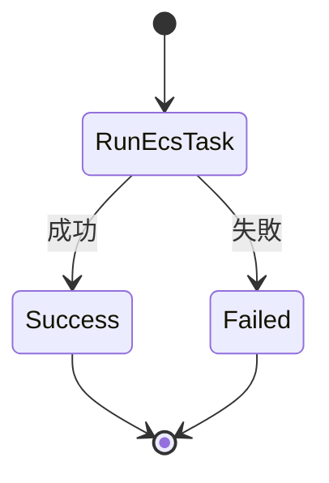
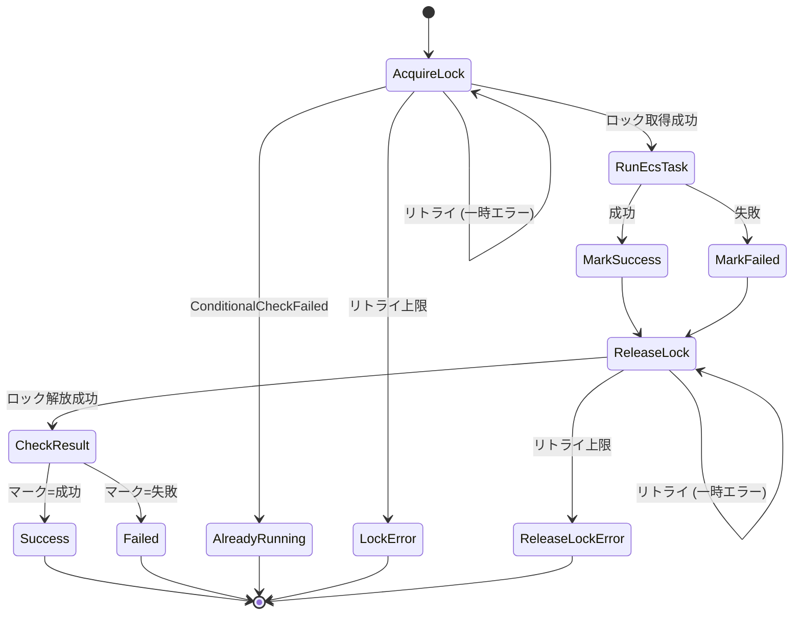

# Laravel Graceful Schedule Worker - Step Functions 実装ガイド

> **Note**: アーキテクチャ設計は [ARCHITECTURE.md](./ARCHITECTURE.md) を参照

## 目次

1. [Step Functions アーキテクチャ](#step-functions-アーキテクチャ)
2. [State Machine 設計](#state-machine-設計)
3. [重複実行の防止](#重複実行の防止)
4. [エラーハンドリング](#エラーハンドリング)
5. [タイムアウト設計](#タイムアウト設計)
6. [IAM 権限設計](#iam-権限設計)
7. [コスト最適化](#コスト最適化)
8. [監視とオブザーバビリティ](#監視とオブザーバビリティ)
9. [運用考慮事項](#運用考慮事項)

---

## Step Functions アーキテクチャ

### 責任分担

| コンポーネント | 責任 |
|--------------|------|
| Orchestrator (ECS Task) | スケジュール due 判定、Step Functions 起動、取りこぼしリカバリ |
| Step Functions | ジョブ実行の信頼性確保、リトライ、タイムアウト管理 |
| ECS Task (Worker) | 実際のジョブ処理 |

### 処理フロー

```
Orchestrator
    │
    ├─ due 判定 (ClockAware)
    │
    └─ StartExecution API
           │
           ▼
    Step Functions State Machine
           │
           ├─ ECS RunTask
           │      │
           │      ▼
           │   Worker Task (artisan command)
           │      │
           │      ▼
           │   終了 (exit code)
           │
           └─ 成功/失敗の記録
```

### 実行モデル補足

#### At-least-once セマンティック

Step Functions は「少なくとも1回実行」を保証します。以下のケースで重複実行が発生しうる：

1. **Orchestrator の再起動**: 起動時リカバリで過去分を再実行
2. **Step Functions のリトライ**: ECS Task 失敗時の自動リトライ
3. **ネットワーク障害**: StartExecution API のタイムアウト後のリトライ

**対策**: アプリケーション側で冪等性を担保する必要があります。

#### Exactly-once が必要な場合

Step Functions の Execution Name による重複防止は「同一 State Machine に対する同一 Execution Name の並行実行」を防ぎます。ただし：

- 異なる Execution Name であれば並行実行される
- Execution 終了後は同一 Name で再実行可能

完全な Exactly-once が必要な場合は、DynamoDB を使った分散ロックを State Machine に組み込むことを検討してください（後述の「DynamoDB による分散ロック」を参照）。

---

## State Machine 設計

### 設計方針

#### パターン A: シンプル構成（At-least-once）



**ステートマシン定義（ASL）**:

```json
{
  "Comment": "Simple ECS Task Execution",
  "StartAt": "RunEcsTask",
  "States": {
    "RunEcsTask": {
      "Type": "Task",
      "Resource": "arn:aws:states:::ecs:runTask.sync",
      "Parameters": {
        "LaunchType": "FARGATE",
        "Cluster": "${EcsClusterArn}",
        "TaskDefinition": "${TaskDefinitionArn}",
        "NetworkConfiguration": {
          "AwsvpcConfiguration": {
            "Subnets.$": "$.subnets",
            "SecurityGroups.$": "$.securityGroups",
            "AssignPublicIp": "DISABLED"
          }
        },
        "Overrides": {
          "ContainerOverrides": [
            {
              "Name": "worker",
              "Command.$": "States.Array('php', 'artisan', $.command)"
            }
          ]
        }
      },
      "Next": "Success",
      "Catch": [
        {
          "ErrorEquals": ["States.ALL"],
          "ResultPath": "$.error",
          "Next": "Failed"
        }
      ]
    },
    "Success": {
      "Type": "Succeed"
    },
    "Failed": {
      "Type": "Fail",
      "Error": "TaskExecutionFailed",
      "Cause": "ECS Task execution failed"
    }
  }
}
```

- 多くのケースでこれで十分
- 冪等性は Worker（アプリケーション）側で担保

#### パターン B: DynamoDB ロック付き（Exactly-once に近い保証）



**ステートマシン定義（ASL）**:

```json
{
  "Comment": "ECS Task Execution with DynamoDB Lock",
  "StartAt": "AcquireLock",
  "States": {
    "AcquireLock": {
      "Type": "Task",
      "Resource": "arn:aws:states:::dynamodb:putItem",
      "Parameters": {
        "TableName": "${LockTableName}",
        "Item": {
          "lockKey": { "S.$": "$.lockKey" },
          "executionArn": { "S.$": "$$.Execution.Id" },
          "acquiredAt": { "S.$": "$$.State.EnteredTime" }
        },
        "ConditionExpression": "attribute_not_exists(lockKey)"
      },
      "ResultPath": "$.lockResult",
      "Next": "RunEcsTask",
      "Retry": [
        {
          "ErrorEquals": ["DynamoDB.ProvisionedThroughputExceededException", "DynamoDB.ServiceUnavailable"],
          "IntervalSeconds": 2,
          "MaxAttempts": 3,
          "BackoffRate": 2
        }
      ],
      "Catch": [
        {
          "ErrorEquals": ["DynamoDB.ConditionalCheckFailedException"],
          "ResultPath": "$.error",
          "Next": "AlreadyRunning"
        },
        {
          "ErrorEquals": ["States.ALL"],
          "ResultPath": "$.error",
          "Next": "LockError"
        }
      ]
    },
    "RunEcsTask": {
      "Type": "Task",
      "Resource": "arn:aws:states:::ecs:runTask.sync",
      "Parameters": {
        "LaunchType": "FARGATE",
        "Cluster": "${EcsClusterArn}",
        "TaskDefinition": "${TaskDefinitionArn}",
        "NetworkConfiguration": {
          "AwsvpcConfiguration": {
            "Subnets.$": "$.subnets",
            "SecurityGroups.$": "$.securityGroups",
            "AssignPublicIp": "DISABLED"
          }
        },
        "Overrides": {
          "ContainerOverrides": [
            {
              "Name": "worker",
              "Command.$": "States.Array('php', 'artisan', $.command)"
            }
          ]
        }
      },
      "ResultPath": "$.taskResult",
      "Next": "MarkSuccess",
      "Catch": [
        {
          "ErrorEquals": ["States.ALL"],
          "ResultPath": "$.error",
          "Next": "MarkFailed"
        }
      ]
    },
    "MarkSuccess": {
      "Type": "Pass",
      "Result": "SUCCESS",
      "ResultPath": "$.executionResult",
      "Next": "ReleaseLock"
    },
    "MarkFailed": {
      "Type": "Pass",
      "Result": "FAILED",
      "ResultPath": "$.executionResult",
      "Next": "ReleaseLock"
    },
    "ReleaseLock": {
      "Type": "Task",
      "Resource": "arn:aws:states:::dynamodb:deleteItem",
      "Parameters": {
        "TableName": "${LockTableName}",
        "Key": {
          "lockKey": { "S.$": "$.lockKey" }
        }
      },
      "ResultPath": "$.releaseResult",
      "Next": "CheckResult",
      "Retry": [
        {
          "ErrorEquals": ["DynamoDB.ProvisionedThroughputExceededException", "DynamoDB.ServiceUnavailable"],
          "IntervalSeconds": 2,
          "MaxAttempts": 3,
          "BackoffRate": 2
        }
      ],
      "Catch": [
        {
          "ErrorEquals": ["States.ALL"],
          "ResultPath": "$.error",
          "Next": "ReleaseLockError"
        }
      ]
    },
    "CheckResult": {
      "Type": "Choice",
      "Choices": [
        {
          "Variable": "$.executionResult",
          "StringEquals": "SUCCESS",
          "Next": "Success"
        }
      ],
      "Default": "Failed"
    },
    "Success": {
      "Type": "Succeed"
    },
    "Failed": {
      "Type": "Fail",
      "Error": "TaskExecutionFailed",
      "Cause": "ECS Task execution failed"
    },
    "AlreadyRunning": {
      "Type": "Succeed",
      "Comment": "Task is already running or completed"
    },
    "LockError": {
      "Type": "Fail",
      "Error": "LockAcquisitionFailed",
      "Cause": "Failed to acquire lock after retries"
    },
    "ReleaseLockError": {
      "Type": "Fail",
      "Error": "LockReleaseFailed",
      "Cause": "Failed to release lock after retries"
    }
  }
}
```

> **Note**: TTL は DynamoDB テーブル設定で管理（推奨: 1時間）

- 金融処理など厳密な重複防止が必要な場合
- アプリケーション側で冪等性の担保が困難な場合（レガシーコード、外部 API 呼び出しなど）
- DynamoDB の条件付き書き込みでロックを実現
- Step Functions レベルで重複実行を防止するため、アプリケーションの実装負担を軽減
- 詳細は「DynamoDB による分散ロック」セクションを参照

複雑なワークフロー（分岐、並列、条件付き実行）が必要な場合は、Laravel 側で制御するか、別の State Machine として設計します。

### Task State の構成

ECS RunTask を使用する場合の考慮事項：

| 項目 | 設定指針 |
|-----|---------|
| 統合パターン | `.sync` (同期実行) - タスク完了まで待機 |
| コンテナ上書き | artisan コマンドを引数として渡す |
| 結果パス | ECS Task の終了コードを取得 |

### 入力設計

State Machine への入力として必要な情報：

```json
{
  "command": ["reports:generate"],
  "mutexName": "schedule-reports:generate",
  "dueAt": "2024-01-01T03:00:00Z",
  "lockKey": "schedule-reports-generate-1704067200",
  "expiresAt": 1704070800,
  "dispatchedAt": 1704067205,
  "timeoutSeconds": 3535
}
```

- `command`: 実行する artisan コマンド
- `mutexName`: Laravel のイベント識別子
- `dueAt`: 本来の due 時刻（冪等性チェックに使用可能）
- `lockKey`: DynamoDB のロックキー（mutexName と dueAt から生成）
- `expiresAt`: ロックの失効時刻（Unix timestamp。`dueAt + lockTtlSeconds`）
- `dispatchedAt`: 実際のディスパッチ時刻（Unix timestamp。`dispatchEvent` 実行時に Dispatcher が採取）。`AcquireLock` が `:now` として既存ロックの `expiresAt` と比較し、失効済みロックの上書きを判定する
- `timeoutSeconds`: Task のタイムアウト秒数。残りロック寿命から `stepfunctions.lock_release_buffer`（既定 60）を引いて導出する。残りが `stepfunctions.min_task_timeout`（既定 60）を下回る場合（リカバリ起動や、`withoutOverlapping` の窓がバッファと同程度のとき）はイベントが宣言した寿命にフォールバックし、その値は `expiresAt` を越えうる。常に出力されるため、`Task` ステートは `TimeoutSecondsPath: "$.timeoutSeconds"` で参照できる。[DYNAMIC_TASK_TIMEOUT.ja.md](./DYNAMIC_TASK_TIMEOUT.ja.md) を参照

---

## 重複実行の防止

### Execution Name 戦略

Execution Name は Step Functions 内で一意である必要があります。

**推奨フォーマット**:

```
{mutexName}-{dueAtTimestamp}
```

例: `schedule-reports-generate-1704067200`

**メリット**:
- 同一 due 時刻のイベントは1回だけ実行される
- Orchestrator が複数回 StartExecution を呼んでも安全
- 実行履歴から due 時刻が判別可能

**注意**:
- Execution Name は最大 80 文字
- 使用可能文字: `a-z`, `A-Z`, `0-9`, `-`, `_`
- mutexName に特殊文字が含まれる場合はハッシュ化が必要

### ExecutionAlreadyExists エラー

同一 Execution Name で StartExecution を呼ぶと `ExecutionAlreadyExists` エラーが返ります。

**対応方針**:

1. **成功として扱う**: 既に実行中/完了なので、Orchestrator は正常終了とみなす
2. **ログ記録**: 重複呼び出しが発生した事実を記録
3. **ExecutionTracker 更新**: 実行済みとしてマーク

### DynamoDB による分散ロック

Exactly-once に近い実行保証が必要な場合、DynamoDB を使った分散ロックを State Machine に組み込みます。

#### ロックテーブル設計

```
テーブル名: ScheduleExecutionLocks
パーティションキー: lockKey (String)
属性:
  - lockKey: "{mutexName}-{dueAtTimestamp}"
  - executionArn: Step Functions の実行 ARN
  - acquiredAt: ロック取得時刻（TTL 用）
  - expiresAt: 有効期限（Unix timestamp）
```

#### AcquireLock State の実装例

```json
{
  "AcquireLock": {
    "Type": "Task",
    "Resource": "arn:aws:states:::dynamodb:putItem",
    "Parameters": {
      "TableName": "ScheduleExecutionLocks",
      "Item": {
        "lockKey": {"S.$": "$.mutexName"},
        "executionArn": {"S.$": "$$.Execution.Id"},
        "acquiredAt": {"S.$": "$$.State.EnteredTime"},
        "expiresAt": {"N.$": "$.expiresAt"}
      },
      "ConditionExpression": "attribute_not_exists(lockKey)"
    },
    "Catch": [
      {
        "ErrorEquals": ["DynamoDB.ConditionalCheckFailedException"],
        "ResultPath": "$.lockError",
        "Next": "AlreadyRunning"
      }
    ],
    "Next": "RunEcsTask"
  }
}
```

#### 注意事項

- **TTL の設定**: ジョブの最大実行時間 + バッファを設定
- **異常終了時**: TTL によりロックは自動的に解放される
- **コスト**: DynamoDB のオンデマンドキャパシティで十分（低コスト）

---

## エラーハンドリング

### エラーの分類

| エラー種別 | 例 | 対応 |
|-----------|---|------|
| 一時的エラー | ECS 容量不足、ネットワークタイムアウト | リトライ |
| 永続的エラー | コンテナイメージ不正、権限エラー | リトライせず失敗 |
| アプリケーションエラー | 終了コード 1 | ビジネス要件による |

### リトライ設計

```
ECS Task 失敗
    │
    ├─ 一時的エラー → 最大 3 回リトライ（バックオフ付き）
    │
    └─ 永続的エラー → 即時失敗
```

**リトライ間隔の目安**:
- 初回: 30 秒後
- 2回目: 2 分後
- 3回目: 5 分後

### 失敗通知

Step Functions の失敗は以下の方法で検知：

1. **CloudWatch Events**: State Machine の状態変化をトリガー
2. **SNS 通知**: 失敗時にアラート
3. **CloudWatch Logs Insights**: 失敗パターンの分析

---

## タイムアウト設計

> **Note**: ジョブごとにタイムアウトを変える仕組みの設計背景は
> [DYNAMIC_TASK_TIMEOUT.ja.md](./DYNAMIC_TASK_TIMEOUT.ja.md) を参照

### タイムアウトの階層

```
DynamoDB ロック TTL (expiresAt)
    │
    └─ Task State Timeout (TimeoutSecondsPath)
           │
           └─ ECS Task Stop Timeout
                  │
                  └─ コンテナ SIGTERM → SIGKILL
```

各層のタイムアウトは外側 > 内側 の関係にします。

最外周がロック TTL である点が重要です。ECS タスクがロック TTL を超えて走ると、
再ディスパッチがロックを奪取して**同じジョブの ECS タスクが二重起動します**。
`ReleaseLock` の所有権ガード（`executionArn = :arn`）はロックの誤削除を防ぎますが、二重起動そのものは防ぎません。

ステートマシン全体の Execution Timeout がこの階層に含まれていないのは意図的です（後述）。

### 推奨設定

| 層 | 設定値 | 説明 |
|---|-------|------|
| ロック TTL（`withoutOverlapping($minutes)`） | ジョブ最大時間 + 余裕 | **アプリが設定する唯一の値**。以下はここから導出される |
| Task State Timeout（`TimeoutSecondsPath`） | 導出値 `expiresAt - dispatchedAt - buffer` | ジョブごとの値。実行入力の `timeoutSeconds` で渡す |
| Execution Timeout（トップレベル） | **設定しない** | 捕捉できず `ReleaseLock` に到達しないため |
| ECS Stop Timeout | 30秒 | graceful shutdown の猶予 |

```php
$schedule->command('batch:heavy')->hourly()->withoutOverlapping(730); // 43800秒
```

### Execution Timeout を設定しない理由

ステートマシン全体の `TimeoutSeconds` にはパス版（`TimeoutSecondsPath` に相当するもの）が存在せず、静的な値しか置けません。
Task 側だけが動的になると、アプリが指定した値によって「トップレベル > Task」の大小関係が反転しえます。

反転すると実行レベルのタイムアウトが先に発火しますが、これは **`Catch` で捕捉できない**ため
`ReleaseLock` に到達せず、ロックが `expiresAt` まで残ります。

設定しなくても実行時間は野放しになりません。

1. 全 Task ステートにタイムアウトがあり、失敗経路も `Catch` されているため、実行全体は state 単位のタイムアウトで縛られている
2. state 単位のタイムアウトは捕捉できるため、`Catch(States.ALL)` → `MarkFailed` → `ReleaseLock` でロックが回収される
3. 最終防波堤として Standard ワークフローの実行時間上限（1年）と、`expiresAt` による TTL 回収がある

トップレベルにタイムアウトが無い状態はレビュー時に設定漏れと区別が付かないため、
**`Comment` に理由を明記してください**。放置すると善意で復元され、捕捉不可能なロック漏れ経路が黙って復活します。

### 長時間ステートのリトライ

state 単位のタイムアウトは**試行ごと**に適用されるため、`MaxAttempts: 3` が効くと最悪 4 × タイムアウト値まで実行が伸びます。
`ECS.AmazonECSException` / `ECS.ServiceException` は RunTask 送信直後に発生するのが通常であり、
長時間走る `.sync` を丸ごとやり直す動作は通常意図したものではありません。長時間ステートでは `MaxAttempts` を絞ってください。

### Heartbeat について

ASL の `HeartbeatSeconds` / `HeartbeatSecondsPath` は、**タスクトークンを保持するワーカー**
（Activity、または `.waitForTaskToken` パターン）が `SendTaskHeartbeat` を送ることを前提とした仕組みです。
本ドキュメントで扱う `ecs:runTask.sync` パターンにはタスクトークンが無いため、適用できません。

DynamoDB ロックの `expiresAt` を実行中に延長する仕組み（ステートマシン側で `UpdateItem` を定期実行する構成）とは
まったくの別物です。名称が紛らわしいので混同しないでください。

---

## IAM 権限設計

### 最小権限の原則

| ロール | 必要な権限 |
|-------|----------|
| Orchestrator Task Role | `states:StartExecution`, `states:DescribeExecution` |
| Step Functions Execution Role | `ecs:RunTask`, `ecs:DescribeTask`, `logs:*` |
| Worker Task Role | アプリケーション固有の権限 |

### リソースベースの制限

- Orchestrator は特定の State Machine のみ実行可能
- Step Functions は特定の ECS クラスター/タスク定義のみ使用可能
- 条件キーで VPC やタグによる制限を追加

---

## コスト最適化

### Step Functions の料金モデル

- Standard Workflow: 状態遷移ごとに課金
- Express Workflow: 実行回数と時間で課金

**選択基準**:

| 条件 | 推奨 |
|-----|------|
| 実行時間 5 分以内 | Express（制限内かつコスト効率良） |
| 実行時間 5 分超 | Standard（Express は使用不可） |
| 実行履歴が必要 | Standard（90 日保持） |
| 高頻度実行 | Express |

※ Express Workflow の最大実行時間は5分です。これを超える場合は Standard を使用してください。

### ECS Fargate Spot の活用

リトライ可能なジョブでは Fargate Spot を検討：

- 最大 70% のコスト削減
- 中断時は Step Functions が自動リトライ
- 中断に弱いジョブには使用しない

---

## 監視とオブザーバビリティ

### メトリクス

監視すべき主要メトリクス：

| メトリクス | 意味 | アラート閾値 |
|-----------|-----|------------|
| ExecutionsFailed | 失敗した実行数 | > 0 |
| ExecutionTime | 実行時間 | 予想時間の 2 倍 |
| ExecutionsTimedOut | タイムアウト数 | > 0 |
| ThrottledEvents | スロットリング数 | > 0 |

### ログ設計

Step Functions の実行ログは CloudWatch Logs に出力可能：

- `ALL`: 全状態遷移を記録
- `ERROR`: エラーのみ
- `FATAL`: 致命的エラーのみ
- `OFF`: 無効

**推奨**: 本番環境では `ERROR` 以上、デバッグ時は `ALL`

### X-Ray トレーシング

X-Ray 統合により、以下を可視化：

- Orchestrator → Step Functions → ECS Task の呼び出しチェーン
- 各ステップのレイテンシ
- エラー発生箇所の特定

---

## 運用考慮事項

### デプロイ戦略

State Machine の更新時：

1. **バージョン管理**: State Machine には自動バージョニングがない
2. **エイリアス**: 名前付きエイリアスで本番/ステージングを分離
3. **ロールバック**: 問題発生時は Terraform/CDK で前バージョンに戻す

### 実行中のデプロイ

実行中の State Machine を更新しても、実行中のものには影響しません。新規実行から新定義が適用されます。

### クォータ管理

AWS アカウントのクォータに注意：

| リソース | デフォルト上限 |
|---------|--------------|
| 同時実行数 (Standard) | 1,000,000 |
| 状態遷移/秒 | 1,500 |
| StartExecution/秒 | Standard: 2,000（デフォルト、引き上げ可能）<br>Express: 100,000 |
| ECS RunTask/秒 | リージョンによる |

高頻度スケジュール（毎分 × 多数のイベント）では StartExecution のレート制限に注意してください。

### 障害時の対応

| 障害シナリオ | 対応 |
|------------|------|
| Orchestrator 停止 | 再起動時にリカバリ実行 |
| Step Functions 障害 | 手動で再実行、または次回 due を待つ |
| ECS 容量不足 | Capacity Provider 設定、または手動スケール |
| AWS リージョン障害 | マルチリージョン構成（要設計） |

---

**Last Updated**: 2026-01-25
**Version**: 2.0.0 (Step Functions Implementation Guide)
**Author**: Laravel Graceful Schedule Worker Team
