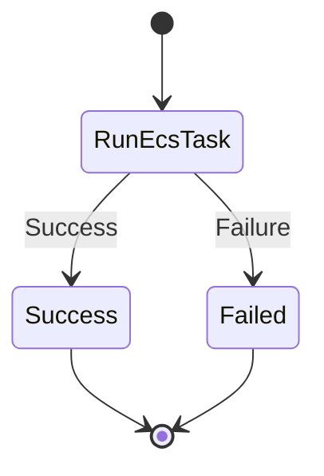
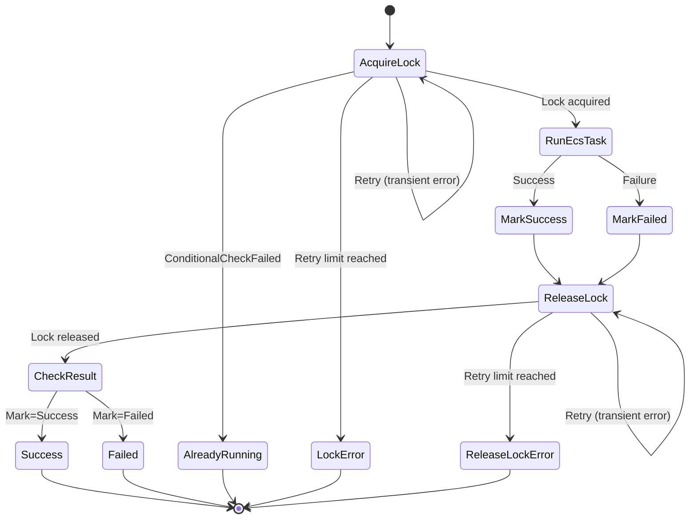

# Laravel Graceful Schedule Worker - Step Functions Implementation Guide

> **Note**: See [ARCHITECTURE.md](./ARCHITECTURE.md) for the architecture design

## Table of Contents

1. [Step Functions Architecture](#step-functions-architecture)
2. [State Machine Design](#state-machine-design)
3. [Preventing Duplicate Execution](#preventing-duplicate-execution)
4. [Error Handling](#error-handling)
5. [Timeout Design](#timeout-design)
6. [IAM Permission Design](#iam-permission-design)
7. [Cost Optimization](#cost-optimization)
8. [Monitoring and Observability](#monitoring-and-observability)
9. [Operational Considerations](#operational-considerations)

---

## Step Functions Architecture

### Responsibility Distribution

| Component | Responsibility |
|-----------|---------------|
| Orchestrator (ECS Task) | Schedule due determination, Step Functions invocation, missed execution recovery |
| Step Functions | Ensuring job execution reliability, retries, timeout management |
| ECS Task (Worker) | Actual job processing |

### Processing Flow

```
Orchestrator
    |
    +-- Due determination (ClockAware)
    |
    +-- StartExecution API
           |
           v
    Step Functions State Machine
           |
           +-- ECS RunTask
           |      |
           |      v
           |   Worker Task (artisan command)
           |      |
           |      v
           |   Exit (exit code)
           |
           +-- Record success/failure
```

### Execution Model Details

#### At-least-once Semantics

Step Functions guarantees "at least one execution." Duplicate execution can occur in the following cases:

1. **Orchestrator restart**: Re-execution of past tasks during startup recovery
2. **Step Functions retry**: Automatic retry on ECS Task failure
3. **Network failure**: Retry after StartExecution API timeout

**Countermeasure**: Idempotency must be ensured on the application side.

#### When Exactly-once Is Required

Duplicate prevention through Step Functions Execution Name prevents "concurrent execution with the same Execution Name for the same State Machine." However:

- Different Execution Names allow concurrent execution
- After an Execution completes, it can be re-executed with the same Name

If complete exactly-once is required, consider incorporating a distributed lock using DynamoDB into the State Machine (see the "Distributed Lock with DynamoDB" section below).

---

## State Machine Design

### Design Approach

#### Pattern A: Simple Configuration (At-least-once)



**State Machine Definition (ASL)**:

```json
{
  "Comment": "Simple ECS Task Execution",
  "StartAt": "RunEcsTask",
  "States": {
    "RunEcsTask": {
      "Type": "Task",
      "Resource": "arn:aws:states:::ecs:runTask.sync",
      "Parameters": {
        "LaunchType": "FARGATE",
        "Cluster": "${EcsClusterArn}",
        "TaskDefinition": "${TaskDefinitionArn}",
        "NetworkConfiguration": {
          "AwsvpcConfiguration": {
            "Subnets.$": "$.subnets",
            "SecurityGroups.$": "$.securityGroups",
            "AssignPublicIp": "DISABLED"
          }
        },
        "Overrides": {
          "ContainerOverrides": [
            {
              "Name": "worker",
              "Command.$": "States.Array('php', 'artisan', $.command)"
            }
          ]
        }
      },
      "Next": "Success",
      "Catch": [
        {
          "ErrorEquals": ["States.ALL"],
          "ResultPath": "$.error",
          "Next": "Failed"
        }
      ]
    },
    "Success": {
      "Type": "Succeed"
    },
    "Failed": {
      "Type": "Fail",
      "Error": "TaskExecutionFailed",
      "Cause": "ECS Task execution failed"
    }
  }
}
```

- Sufficient for most use cases
- Idempotency is ensured on the Worker (application) side

#### Pattern B: With DynamoDB Lock (Near Exactly-once Guarantee)



**State Machine Definition (ASL)**:

```json
{
  "Comment": "ECS Task Execution with DynamoDB Lock",
  "StartAt": "AcquireLock",
  "States": {
    "AcquireLock": {
      "Type": "Task",
      "Resource": "arn:aws:states:::dynamodb:putItem",
      "Parameters": {
        "TableName": "${LockTableName}",
        "Item": {
          "lockKey": { "S.$": "$.lockKey" },
          "executionArn": { "S.$": "$$.Execution.Id" },
          "acquiredAt": { "S.$": "$$.State.EnteredTime" }
        },
        "ConditionExpression": "attribute_not_exists(lockKey)"
      },
      "ResultPath": "$.lockResult",
      "Next": "RunEcsTask",
      "Retry": [
        {
          "ErrorEquals": ["DynamoDB.ProvisionedThroughputExceededException", "DynamoDB.ServiceUnavailable"],
          "IntervalSeconds": 2,
          "MaxAttempts": 3,
          "BackoffRate": 2
        }
      ],
      "Catch": [
        {
          "ErrorEquals": ["DynamoDB.ConditionalCheckFailedException"],
          "ResultPath": "$.error",
          "Next": "AlreadyRunning"
        },
        {
          "ErrorEquals": ["States.ALL"],
          "ResultPath": "$.error",
          "Next": "LockError"
        }
      ]
    },
    "RunEcsTask": {
      "Type": "Task",
      "Resource": "arn:aws:states:::ecs:runTask.sync",
      "Parameters": {
        "LaunchType": "FARGATE",
        "Cluster": "${EcsClusterArn}",
        "TaskDefinition": "${TaskDefinitionArn}",
        "NetworkConfiguration": {
          "AwsvpcConfiguration": {
            "Subnets.$": "$.subnets",
            "SecurityGroups.$": "$.securityGroups",
            "AssignPublicIp": "DISABLED"
          }
        },
        "Overrides": {
          "ContainerOverrides": [
            {
              "Name": "worker",
              "Command.$": "States.Array('php', 'artisan', $.command)"
            }
          ]
        }
      },
      "ResultPath": "$.taskResult",
      "Next": "MarkSuccess",
      "Catch": [
        {
          "ErrorEquals": ["States.ALL"],
          "ResultPath": "$.error",
          "Next": "MarkFailed"
        }
      ]
    },
    "MarkSuccess": {
      "Type": "Pass",
      "Result": "SUCCESS",
      "ResultPath": "$.executionResult",
      "Next": "ReleaseLock"
    },
    "MarkFailed": {
      "Type": "Pass",
      "Result": "FAILED",
      "ResultPath": "$.executionResult",
      "Next": "ReleaseLock"
    },
    "ReleaseLock": {
      "Type": "Task",
      "Resource": "arn:aws:states:::dynamodb:deleteItem",
      "Parameters": {
        "TableName": "${LockTableName}",
        "Key": {
          "lockKey": { "S.$": "$.lockKey" }
        }
      },
      "ResultPath": "$.releaseResult",
      "Next": "CheckResult",
      "Retry": [
        {
          "ErrorEquals": ["DynamoDB.ProvisionedThroughputExceededException", "DynamoDB.ServiceUnavailable"],
          "IntervalSeconds": 2,
          "MaxAttempts": 3,
          "BackoffRate": 2
        }
      ],
      "Catch": [
        {
          "ErrorEquals": ["States.ALL"],
          "ResultPath": "$.error",
          "Next": "ReleaseLockError"
        }
      ]
    },
    "CheckResult": {
      "Type": "Choice",
      "Choices": [
        {
          "Variable": "$.executionResult",
          "StringEquals": "SUCCESS",
          "Next": "Success"
        }
      ],
      "Default": "Failed"
    },
    "Success": {
      "Type": "Succeed"
    },
    "Failed": {
      "Type": "Fail",
      "Error": "TaskExecutionFailed",
      "Cause": "ECS Task execution failed"
    },
    "AlreadyRunning": {
      "Type": "Succeed",
      "Comment": "Task is already running or completed"
    },
    "LockError": {
      "Type": "Fail",
      "Error": "LockAcquisitionFailed",
      "Cause": "Failed to acquire lock after retries"
    },
    "ReleaseLockError": {
      "Type": "Fail",
      "Error": "LockReleaseFailed",
      "Cause": "Failed to release lock after retries"
    }
  }
}
```

> **Note**: TTL is managed through DynamoDB table settings (recommended: 1 hour)

- For financial processing or other cases requiring strict duplicate prevention
- When ensuring idempotency on the application side is difficult (legacy code, external API calls, etc.)
- Uses DynamoDB conditional writes to implement locking
- Prevents duplicate execution at the Step Functions level, reducing the implementation burden on the application
- See the "Distributed Lock with DynamoDB" section for details

For complex workflows (branching, parallel execution, conditional execution), control them on the Laravel side or design them as separate State Machines.

### Task State Configuration

Considerations when using ECS RunTask:

| Item | Configuration Guideline |
|------|------------------------|
| Integration pattern | `.sync` (synchronous execution) - waits for task completion |
| Container override | Pass the artisan command as arguments |
| Result path | Retrieve the ECS Task exit code |

### Input Design

Information required as input to the State Machine:

```json
{
  "command": "reports:generate",
  "mutexName": "schedule-reports:generate",
  "dueAt": "2024-01-01T03:00:00Z",
  "lockKey": "schedule-reports-generate-1704067200",
  "ttl": 3600
}
```

- `command`: The artisan command to execute
- `mutexName`: Laravel event identifier
- `dueAt`: The original due time (can be used for idempotency checks)
- `lockKey`: DynamoDB lock key (generated from mutexName and dueAt)
- `ttl`: Lock TTL in seconds

---

## Preventing Duplicate Execution

### Execution Name Strategy

The Execution Name must be unique within Step Functions.

**Recommended format**:

```
{mutexName}-{dueAtTimestamp}
```

Example: `schedule-reports-generate-1704067200`

**Benefits**:
- Events with the same due time are executed only once
- Safe even if the Orchestrator calls StartExecution multiple times
- Due time can be determined from execution history

**Notes**:
- Execution Name maximum length is 80 characters
- Allowed characters: `a-z`, `A-Z`, `0-9`, `-`, `_`
- Hashing is required if mutexName contains special characters

### ExecutionAlreadyExists Error

Calling StartExecution with the same Execution Name returns an `ExecutionAlreadyExists` error.

**Response strategy**:

1. **Treat as success**: Since it's already running/completed, the Orchestrator considers it a normal completion
2. **Log recording**: Record the fact that a duplicate call occurred
3. **ExecutionTracker update**: Mark as executed

### Distributed Lock with DynamoDB

When near exactly-once execution guarantees are required, incorporate a distributed lock using DynamoDB into the State Machine.

#### Lock Table Design

```
Table name: ScheduleExecutionLocks
Partition key: lockKey (String)
Attributes:
  - lockKey: "{mutexName}-{dueAtTimestamp}"
  - executionArn: Step Functions execution ARN
  - acquiredAt: Lock acquisition time (for TTL)
  - ttl: Expiration time (Unix timestamp)
```

#### AcquireLock State Implementation Example

```json
{
  "AcquireLock": {
    "Type": "Task",
    "Resource": "arn:aws:states:::dynamodb:putItem",
    "Parameters": {
      "TableName": "ScheduleExecutionLocks",
      "Item": {
        "lockKey": {"S.$": "$.mutexName"},
        "executionArn": {"S.$": "$$.Execution.Id"},
        "acquiredAt": {"S.$": "$$.State.EnteredTime"},
        "ttl": {"N": "<calculated_ttl>"}
      },
      "ConditionExpression": "attribute_not_exists(lockKey)"
    },
    "Catch": [
      {
        "ErrorEquals": ["DynamoDB.ConditionalCheckFailedException"],
        "ResultPath": "$.lockError",
        "Next": "AlreadyRunning"
      }
    ],
    "Next": "RunEcsTask"
  }
}
```

#### Notes

- **TTL setting**: Set to job maximum execution time + buffer
- **Abnormal termination**: Lock is automatically released via TTL
- **Cost**: DynamoDB on-demand capacity is sufficient (low cost)

---

## Error Handling

### Error Classification

| Error Type | Examples | Response |
|-----------|----------|----------|
| Transient error | ECS capacity shortage, network timeout | Retry |
| Permanent error | Invalid container image, permission error | Fail without retry |
| Application error | Exit code 1 | Depends on business requirements |

### Retry Design

```
ECS Task failure
    |
    +-- Transient error -> Maximum 3 retries (with backoff)
    |
    +-- Permanent error -> Immediate failure
```

**Retry interval guidelines**:
- 1st retry: 30 seconds later
- 2nd retry: 2 minutes later
- 3rd retry: 5 minutes later

### Failure Notification

Step Functions failures can be detected by:

1. **CloudWatch Events**: Trigger on State Machine state changes
2. **SNS notifications**: Alert on failure
3. **CloudWatch Logs Insights**: Analysis of failure patterns

---

## Timeout Design

### Timeout Hierarchy

```
Step Functions Execution Timeout
    |
    +-- Task State Timeout
           |
           +-- ECS Task Stop Timeout
                  |
                  +-- Container SIGTERM -> SIGKILL
```

Each layer's timeout should follow the relationship: outer > inner.

### Recommended Settings

| Layer | Setting | Description |
|-------|---------|-------------|
| Execution Timeout | Max job time + 5 minutes | Overall limit including retries |
| Task Timeout | Max job time + 1 minute | Single execution limit |
| ECS Stop Timeout | 30 seconds | Graceful shutdown allowance |
| Heartbeat | Every 5 minutes | Liveness check for long-running jobs |

### Using Heartbeat

Use Heartbeat for long-running jobs:

- Periodically send `SendTaskHeartbeat` from within the ECS Task
- Heartbeat stop = detected as anomaly
- Auto-cancel on `HeartbeatTimeout` exceeded

---

## IAM Permission Design

### Principle of Least Privilege

| Role | Required Permissions |
|------|---------------------|
| Orchestrator Task Role | `states:StartExecution`, `states:DescribeExecution` |
| Step Functions Execution Role | `ecs:RunTask`, `ecs:DescribeTask`, `logs:*` |
| Worker Task Role | Application-specific permissions |

### Resource-based Restrictions

- Orchestrator can only execute specific State Machines
- Step Functions can only use specific ECS clusters/task definitions
- Add restrictions by VPC or tags using condition keys

---

## Cost Optimization

### Step Functions Pricing Model

- Standard Workflow: Charged per state transition
- Express Workflow: Charged by execution count and duration

**Selection criteria**:

| Condition | Recommendation |
|-----------|----------------|
| Execution time within 5 minutes | Express (within limits and cost-efficient) |
| Execution time over 5 minutes | Standard (Express cannot be used) |
| Execution history required | Standard (90-day retention) |
| High-frequency execution | Express |

*Note: Express Workflow has a maximum execution time of 5 minutes. Use Standard for anything exceeding this limit.*

### Using ECS Fargate Spot

Consider Fargate Spot for retryable jobs:

- Up to 70% cost reduction
- Step Functions automatically retries on interruption
- Do not use for jobs sensitive to interruption

---

## Monitoring and Observability

### Metrics

Key metrics to monitor:

| Metric | Meaning | Alert Threshold |
|--------|---------|----------------|
| ExecutionsFailed | Number of failed executions | > 0 |
| ExecutionTime | Execution duration | 2x expected time |
| ExecutionsTimedOut | Number of timeouts | > 0 |
| ThrottledEvents | Number of throttling events | > 0 |

### Log Design

Step Functions execution logs can be output to CloudWatch Logs:

- `ALL`: Record all state transitions
- `ERROR`: Errors only
- `FATAL`: Fatal errors only
- `OFF`: Disabled

**Recommendation**: `ERROR` or above in production, `ALL` for debugging

### X-Ray Tracing

X-Ray integration enables visualization of:

- Orchestrator -> Step Functions -> ECS Task call chain
- Latency at each step
- Error location identification

---

## Operational Considerations

### Deployment Strategy

When updating a State Machine:

1. **Version control**: State Machines do not have automatic versioning
2. **Aliases**: Separate production/staging with named aliases
3. **Rollback**: Revert to the previous version using Terraform/CDK if issues arise

### Deploying During Execution

Updating a State Machine while executions are in progress does not affect running executions. The new definition applies from new executions onward.

### Quota Management

Be aware of AWS account quotas:

| Resource | Default Limit |
|----------|---------------|
| Concurrent executions (Standard) | 1,000,000 |
| State transitions/second | 1,500 |
| StartExecution/second | Standard: 2,000 (default, can be increased)<br>Express: 100,000 |
| ECS RunTask/second | Region-dependent |

For high-frequency schedules (every minute x many events), watch for StartExecution rate limits.

### Failure Response

| Failure Scenario | Response |
|-----------------|----------|
| Orchestrator stops | Recovery execution on restart |
| Step Functions failure | Manual re-execution, or wait for the next due time |
| ECS capacity shortage | Capacity Provider configuration, or manual scaling |
| AWS region failure | Multi-region setup (requires design) |

---

**Last Updated**: 2026-01-25
**Version**: 2.0.0 (Step Functions Implementation Guide)
**Author**: Laravel Graceful Schedule Worker Team
